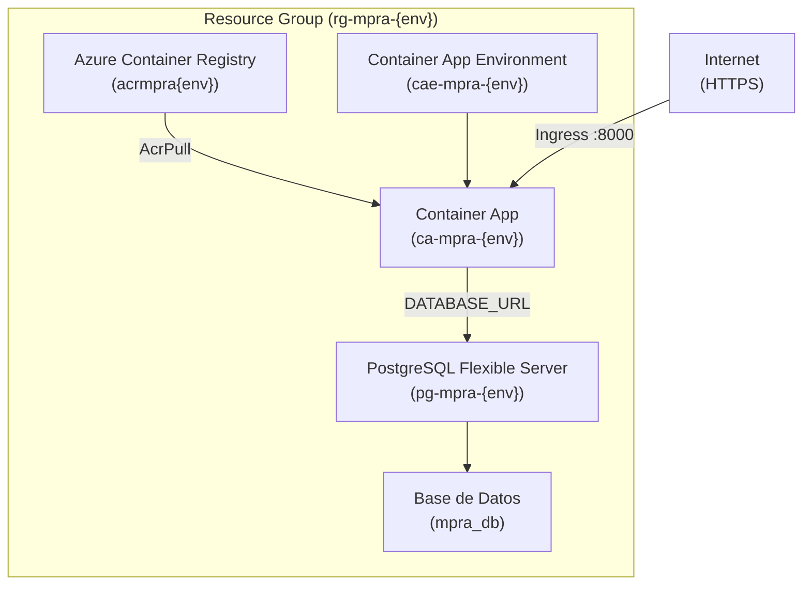
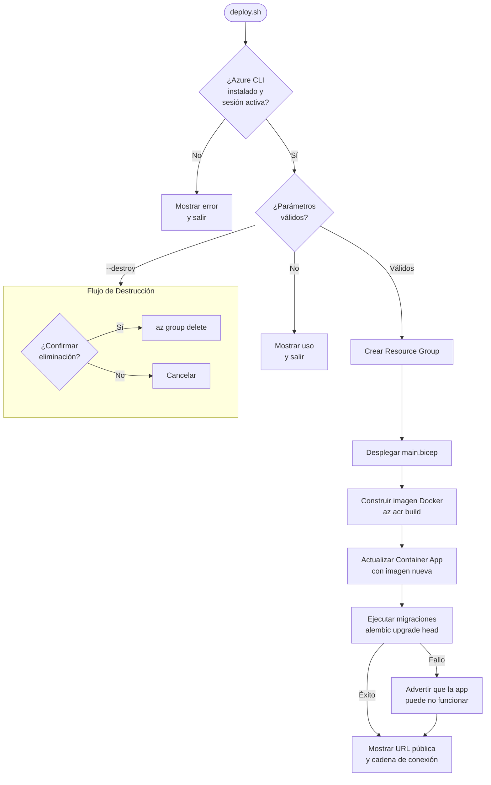

# Documento de Diseño — Despliegue IaC en Azure

## Visión General

Este diseño describe la infraestructura como código (IaC) necesaria para desplegar la aplicación MPRA (Modelo Predictivo de Riesgo Académico) en Microsoft Azure de forma completamente automatizada. La solución utiliza **Azure Bicep** como lenguaje declarativo para definir los recursos y un **script Bash (`deploy.sh`)** para orquestar el proceso completo de aprovisionamiento, construcción de imagen Docker y despliegue.

### Decisiones de Diseño Clave

1. **Bicep sobre ARM JSON**: Bicep ofrece sintaxis más legible, tipado fuerte y soporte nativo de módulos. Compila a ARM JSON, por lo que no hay pérdida de funcionalidad.
2. **Archivo Bicep único (`main.bicep`)**: Dado el número reducido de recursos (5 tipos), un solo archivo con secciones bien organizadas es más mantenible que múltiples módulos para este caso.
3. **Azure Container Apps sobre App Service**: Container Apps ofrece escalado a cero (ahorro de costos), soporte nativo de contenedores y configuración más simple para cargas de trabajo containerizadas.
4. **PostgreSQL Flexible Server sobre Single Server**: Flexible Server es la opción recomendada por Microsoft, con mejor relación costo/rendimiento y soporte activo.
5. **Firewall rules sobre VNet integration**: Para la configuración inicial (SKU Burstable), las reglas de firewall son más simples y no requieren SKU superiores. Se puede migrar a VNet en el futuro.
6. **Migraciones vía `az containerapp exec`**: Ejecutar Alembic dentro del contenedor desplegado garantiza que el entorno de ejecución sea idéntico al de producción y que la conectividad a la BD esté resuelta.

### Alcance

- Directorio `infra/` con `main.bicep` y `deploy.sh`
- Documentación en `infra/README.md`
- Soporte para creación y destrucción completa del entorno

## Arquitectura

### Diagrama de Recursos Azure



### Diagrama de Flujo del Script de Despliegue



### Convención de Nombres de Recursos

| Recurso | Patrón | Ejemplo (env=dev) |
|---------|--------|--------------------|
| Resource Group | `rg-mpra-{env}` | `rg-mpra-dev` |
| Container Registry | `acrmpra{env}` | `acrmpradev` |
| Container App Environment | `cae-mpra-{env}` | `cae-mpra-dev` |
| Container App | `ca-mpra-{env}` | `ca-mpra-dev` |
| PostgreSQL Server | `pg-mpra-{env}` | `pg-mpra-dev` |
| Base de Datos | `mpra_db` | `mpra_db` |

> **Nota**: ACR no permite guiones en el nombre, por eso se usa `acrmpra{env}` sin separador.

## Componentes e Interfaces

### 1. `infra/main.bicep` — Plantilla de Infraestructura

Archivo Bicep principal que define todos los recursos de Azure. Acepta parámetros y produce outputs necesarios para el script de despliegue.

**Parámetros de entrada:**

| Parámetro | Tipo | Requerido | Descripción |
|-----------|------|-----------|-------------|
| `environmentName` | string | Sí | Nombre del entorno (dev, staging, prod) |
| `location` | string | No | Región de Azure (default: resourceGroup().location) |
| `dbAdminPassword` | string (secure) | Sí | Contraseña del administrador de PostgreSQL |
| `jwtSecretKey` | string (secure) | Sí | Clave secreta para firmar tokens JWT |
| `dbName` | string | No | Nombre de la base de datos (default: mpra_db) |
| `dbAdminUser` | string | No | Usuario administrador de PostgreSQL (default: mpraadmin) |

**Outputs:**

| Output | Descripción |
|--------|-------------|
| `containerAppFqdn` | FQDN público del Container App |
| `acrLoginServer` | URL del login server del ACR |
| `acrName` | Nombre del ACR |
| `postgresHost` | FQDN del servidor PostgreSQL |
| `containerAppName` | Nombre del Container App |
| `containerAppEnvironmentName` | Nombre del Container App Environment |

**Recursos definidos:**

1. **Azure Container Registry** — SKU Basic, admin user deshabilitado
2. **Container App Environment** — Log Analytics workspace integrado
3. **PostgreSQL Flexible Server** — v16, SKU Burstable B1ms, backup 7 días
4. **PostgreSQL Database** — Base de datos `mpra_db` con charset UTF-8
5. **PostgreSQL Firewall Rule** — Permitir acceso desde servicios de Azure (0.0.0.0)
6. **Container App** — Imagen inicial placeholder, ingress externo en puerto 8000, health probe, secretos y variables de entorno
7. **Role Assignment** — AcrPull para la identidad del Container App sobre el ACR

### 2. `infra/deploy.sh` — Script de Despliegue

Script Bash que orquesta todo el proceso. Interfaz CLI con los siguientes modos:

**Uso:**
```bash
# Despliegue completo
./infra/deploy.sh -e <env> -r <region> -p <db-password> -j <jwt-secret>

# Destrucción de recursos
./infra/deploy.sh -e <env> --destroy

# Mostrar ayuda
./infra/deploy.sh
```

**Parámetros:**

| Flag | Largo | Requerido | Descripción |
|------|-------|-----------|-------------|
| `-e` | `--env` | Sí | Nombre del entorno (dev, staging, prod) |
| `-r` | `--region` | Sí (deploy) | Región de Azure (ej: eastus, westeurope) |
| `-p` | `--db-password` | Sí (deploy) | Contraseña del administrador de PostgreSQL |
| `-j` | `--jwt-secret` | Sí (deploy) | Clave secreta JWT |
| | `--destroy` | No | Eliminar todos los recursos del entorno |

**Flujo de ejecución (despliegue):**

1. Validar prerrequisitos (Azure CLI instalado, sesión activa)
2. Parsear y validar argumentos
3. Crear Resource Group (`az group create`)
4. Desplegar Bicep (`az deployment group create`)
5. Obtener outputs del despliegue (ACR name, FQDN, etc.)
6. Construir y publicar imagen Docker (`az acr build`)
7. Actualizar Container App con la imagen nueva (`az containerapp update`)
8. Ejecutar migraciones Alembic (`az containerapp exec`)
9. Mostrar resumen: URL pública, cadena de conexión (sin contraseña)

**Flujo de ejecución (destrucción):**

1. Validar prerrequisitos
2. Solicitar confirmación interactiva
3. Eliminar Resource Group completo (`az group delete`)
4. Confirmar eliminación exitosa

### 3. `infra/README.md` — Documentación del Despliegue

Documento Markdown con:

- Prerrequisitos (Azure CLI ≥ 2.50, suscripción activa, Docker)
- Instrucciones paso a paso para despliegue desde cero
- Tabla de variables de entorno configurables con valores por defecto
- Instrucciones de limpieza (cleanup)
- Estimación de costos mensuales para la configuración base

## Modelos de Datos

Este feature no introduce modelos de datos nuevos en la aplicación. Los modelos de datos relevantes son los de configuración de infraestructura definidos en Bicep.

### Estructura de Parámetros Bicep

```
main.bicep
├── Parameters
│   ├── environmentName: string
│   ├── location: string = resourceGroup().location
│   ├── dbAdminPassword: @secure() string
│   ├── jwtSecretKey: @secure() string
│   ├── dbName: string = 'mpra_db'
│   └── dbAdminUser: string = 'mpraadmin'
├── Variables (derivadas)
│   ├── acrName: 'acrmpra${environmentName}'
│   ├── containerAppEnvName: 'cae-mpra-${environmentName}'
│   ├── containerAppName: 'ca-mpra-${environmentName}'
│   ├── postgresServerName: 'pg-mpra-${environmentName}'
│   └── databaseUrl: construida a partir de los parámetros
└── Outputs
    ├── containerAppFqdn
    ├── acrLoginServer
    ├── acrName
    ├── postgresHost
    ├── containerAppName
    └── containerAppEnvironmentName
```

### Mapeo de Variables de Entorno del Contenedor

| Variable | Tipo en Container App | Origen |
|----------|----------------------|--------|
| `DATABASE_URL` | Secret | Construida: `postgresql+asyncpg://{user}:{pass}@{host}:5432/{db}?sslmode=require` |
| `JWT_SECRET_KEY` | Secret | Parámetro `jwtSecretKey` |
| `HOST` | Env var | `0.0.0.0` |
| `PORT` | Env var | `8000` |
| `LOG_LEVEL` | Env var | `info` |
| `CORS_ORIGINS` | Env var | `*` |
| `MODEL_PATH` | Env var | `ml_models/modelo_logistico.joblib` |
| `SCALER_PATH` | Env var | `ml_models/scaler.joblib` |
| `DATASET_PATH` | Env var | `datasets/dataset_estudiantes_decimal.csv` |

## Manejo de Errores

### Script de Despliegue (`deploy.sh`)

El script utiliza `set -euo pipefail` para fallar inmediatamente ante cualquier error. Además, implementa manejo explícito en cada paso:

| Paso | Error Posible | Manejo |
|------|---------------|--------|
| Validación de prerrequisitos | Azure CLI no instalado | Mensaje descriptivo, exit 1 |
| Validación de prerrequisitos | Sesión no activa (`az account show` falla) | Mensaje pidiendo `az login`, exit 1 |
| Parseo de argumentos | Parámetros faltantes | Mostrar uso completo, exit 1 |
| Crear Resource Group | Región inválida o permisos insuficientes | Mensaje de error de Azure CLI, exit 1 |
| Desplegar Bicep | Error de validación de plantilla | Mensaje de error de Bicep, exit 1 |
| Construir imagen Docker | Dockerfile inválido o build falla | Mensaje de error de ACR build, exit 1 |
| Actualizar Container App | Imagen no encontrada en ACR | Mensaje de error, exit 1 |
| Ejecutar migraciones | Alembic falla (esquema incompatible, etc.) | **Advertencia** (no exit), la app puede no funcionar |
| Destrucción | Confirmación rechazada | Cancelar operación, exit 0 |
| Destrucción | Resource Group no existe | Mensaje informativo, exit 0 |

### Plantilla Bicep (`main.bicep`)

Bicep maneja errores a nivel declarativo:

- **Parámetros `@secure()`**: Las contraseñas y claves nunca se exponen en logs ni outputs
- **Dependencias implícitas**: Bicep resuelve el orden de creación automáticamente (ej: la BD se crea después del servidor PostgreSQL)
- **Validaciones de parámetros**: Se pueden agregar decoradores `@minLength()`, `@maxLength()` y `@allowed()` para validar inputs

## Estrategia de Testing

### Evaluación de Property-Based Testing

Este feature consiste en **Infraestructura como Código (IaC)** — plantillas Bicep y scripts Bash. PBT **no es apropiado** para este tipo de feature por las siguientes razones:

1. **Bicep es configuración declarativa**, no una función con inputs/outputs variables. No hay propiedades universales que verificar con generación aleatoria de inputs.
2. **El script Bash orquesta llamadas a Azure CLI**, que son operaciones de infraestructura externa. Probar con 100+ iteraciones no aporta valor y tendría un costo prohibitivo.
3. **Los criterios de aceptación son verificables mediante smoke tests e integration tests** con 1-2 ejecuciones contra Azure real o validación estática de las plantillas.

Por lo tanto, **se omite la sección de Correctness Properties** y se utiliza una estrategia de testing basada en validación estática, unit tests para el script, e integration tests contra Azure.

### Estrategia de Testing Recomendada

#### 1. Validación Estática de Bicep (Lint + Build)

- **Herramienta**: `az bicep build` + `az bicep lint`
- **Qué valida**: Sintaxis correcta, referencias válidas entre recursos, tipos de parámetros
- **Cuándo ejecutar**: En CI/CD antes de cualquier despliegue
- **Ejemplo**:
  ```bash
  az bicep build --file infra/main.bicep
  ```

#### 2. Validación What-If del Despliegue

- **Herramienta**: `az deployment group what-if`
- **Qué valida**: Que el despliegue crearía los recursos esperados sin ejecutarlo realmente
- **Cuándo ejecutar**: Como paso de revisión antes de aplicar cambios

#### 3. Unit Tests del Script Bash

- **Herramienta**: Validación manual o `shellcheck` para análisis estático
- **Qué valida**: Sintaxis del script, manejo de argumentos, flujo de errores
- **Ejemplo**:
  ```bash
  shellcheck infra/deploy.sh
  ```

#### 4. Smoke Tests Post-Despliegue

- **Qué valida**: Que la infraestructura desplegada funciona correctamente
- **Tests**:
  - `curl https://{fqdn}/health` retorna HTTP 200 con `"status": "healthy"`
  - La base de datos acepta conexiones desde el Container App
  - Las migraciones de Alembic se ejecutaron correctamente (tablas existen)
- **Cuándo ejecutar**: Después de cada despliegue exitoso

#### 5. Test de Destrucción

- **Qué valida**: Que `--destroy` elimina todos los recursos
- **Test**: Ejecutar `--destroy` y verificar que el Resource Group ya no existe
- **Cuándo ejecutar**: Al final del ciclo de testing en entornos efímeros
