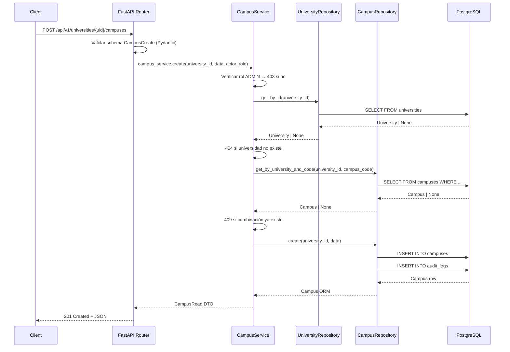
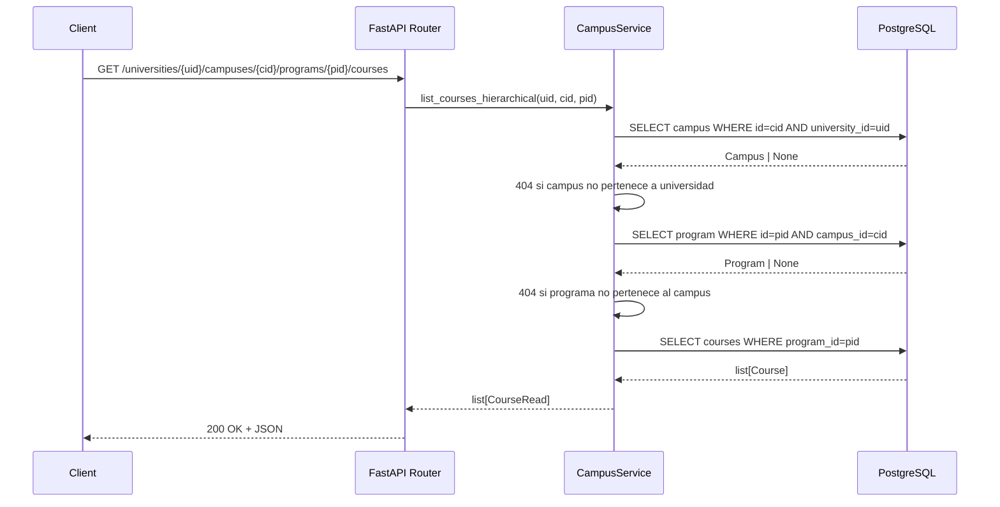
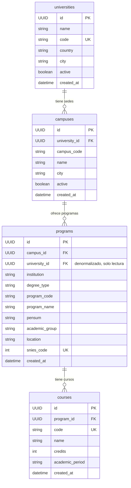

# Documento de Diseño — Campus Hierarchy

## Visión General

El MPRA actualmente organiza la jerarquía académica como `University → Program → Course`, donde el campo `campus` en el modelo `Program` es un simple campo de texto sin relación formal. Esta funcionalidad introduce la entidad `Campus` como nivel intermedio, transformando la jerarquía en `University → Campus → Program → Course`.

El cambio principal consiste en:
1. Crear una nueva tabla `campuses` con campos descriptivos y una restricción de unicidad compuesta `(university_id, campus_code)`.
2. Reemplazar el campo de texto `campus` en `Program` por una FK `campus_id` hacia la nueva tabla.
3. Mantener `university_id` en `Program` como campo denormalizado de solo lectura para compatibilidad.
4. Exponer endpoints CRUD para campus anidados bajo universidades y endpoints jerárquicos completos.
5. Proveer una migración Alembic reversible que transforme los datos existentes.

### Alcance del cambio

- **Nueva entidad `Campus`** con CRUD completo bajo `/api/v1/universities/{university_id}/campuses`.
- **Migración `0005`** que crea la tabla `campuses`, migra datos textuales existentes, y reestructura las FK y constraints de `programs`.
- **Endpoints jerárquicos** ampliados: `universities/{id}/campuses/{id}/programs` y `universities/{id}/campuses/{id}/programs/{id}/courses`.
- **Compatibilidad retroactiva** del endpoint `GET /api/v1/universities/{id}/programs` que sigue retornando todos los programas de todos los campus.
- **Aislamiento de datos por campus** en todas las consultas filtradas.

---

## Arquitectura

El diseño sigue la Clean Architecture ya establecida en el proyecto:

```
┌─────────────────────────────────────────────────────────────┐
│  API Layer  (app/api/v1/endpoints/)                         │
│  FastAPI routers — validación HTTP, auth, serialización     │
├─────────────────────────────────────────────────────────────┤
│  Application Layer  (app/application/)                      │
│  Services — lógica de negocio, orquestación, autorización   │
│  Schemas  — DTOs Pydantic v2 (Create / Read / Update)       │
├─────────────────────────────────────────────────────────────┤
│  Domain Layer  (app/domain/)                                │
│  Interfaces de repositorio (ABC), enums                     │
├─────────────────────────────────────────────────────────────┤
│  Infrastructure Layer  (app/infrastructure/)                │
│  SQLModel ORM models, repositorios async, Alembic           │
└─────────────────────────────────────────────────────────────┘
```

### Flujo de una solicitud típica (crear campus)



### Flujo de consulta jerárquica (cursos de un programa en un campus)



---

## Componentes e Interfaces

### Nuevos archivos a crear

| Capa | Archivo | Responsabilidad |
|------|---------|-----------------|
| Domain | `app/domain/interfaces/campus_repository.py` | Interfaz ABC para persistencia de campus |
| Infrastructure/Models | `app/infrastructure/models/campus.py` | Modelo SQLModel `Campus` |
| Infrastructure/Repos | `app/infrastructure/repositories/campus_repository.py` | Implementación async del repositorio |
| Application/Schemas | `app/application/schemas/campus.py` | DTOs `CampusCreate`, `CampusRead`, `CampusUpdate` |
| Application/Services | `app/application/services/campus_service.py` | Lógica de negocio y autorización |
| API | `app/api/v1/endpoints/campuses.py` | Router FastAPI para campus y endpoints jerárquicos |
| Migration | `alembic/versions/0005_add_campus_hierarchy.py` | Migración Alembic con data migration |

### Archivos a modificar

| Archivo | Cambio |
|---------|--------|
| `app/infrastructure/models/program.py` | Agregar `campus_id` (FK), eliminar `campus` (text), cambiar UniqueConstraint |
| `app/application/schemas/program.py` | Reemplazar `campus: str` por `campus_id: UUID` en `ProgramRead` |
| `app/api/v1/endpoints/universities.py` | Mantener endpoint legacy `/universities/{id}/programs` con query a través de campus |
| `app/infrastructure/repositories/course_repository.py` | Agregar método `listar_por_campus_y_programa()` |
| `app/domain/interfaces/course_repository.py` | Agregar método abstracto para nueva consulta |
| `app/main.py` | Registrar router de campus |

### Interfaz del repositorio de campus

```python
# app/domain/interfaces/campus_repository.py
from __future__ import annotations
from abc import ABC, abstractmethod
from typing import TYPE_CHECKING
from uuid import UUID

if TYPE_CHECKING:
    from app.application.schemas.campus import CampusCreate, CampusUpdate
    from app.infrastructure.models.campus import Campus

class ICampusRepository(ABC):
    """Interface for campus persistence operations."""

    @abstractmethod
    async def create(self, university_id: UUID, data: CampusCreate) -> Campus: ...

    @abstractmethod
    async def get_by_id(self, campus_id: UUID) -> Campus | None: ...

    @abstractmethod
    async def get_by_university_and_code(
        self, university_id: UUID, campus_code: str
    ) -> Campus | None: ...

    @abstractmethod
    async def list_by_university(
        self, university_id: UUID, skip: int, limit: int
    ) -> list[Campus]: ...

    @abstractmethod
    async def count_by_university(self, university_id: UUID) -> int: ...

    @abstractmethod
    async def update(self, campus_id: UUID, data: CampusUpdate) -> Campus | None: ...
```

### Servicio de campus

```python
# app/application/services/campus_service.py
class CampusService:
    def __init__(
        self,
        campus_repo: ICampusRepository,
        university_repo: IUniversityRepository,
    ) -> None: ...

    async def create(
        self, university_id: UUID, data: CampusCreate, actor_role: RoleEnum
    ) -> CampusRead:
        # 1. Verificar rol ADMIN → 403 si no
        # 2. Verificar que university_id existe → 404 si no
        # 3. Verificar unicidad (university_id, campus_code) → 409 si duplicado
        # 4. Delegar a campus_repo.create()
        # 5. Registrar audit log

    async def list_by_university(
        self, university_id: UUID, skip: int, limit: int
    ) -> PaginatedResponse[CampusRead]: ...

    async def get(
        self, university_id: UUID, campus_id: UUID
    ) -> CampusRead:
        # Verificar existencia + pertenencia a universidad → 404

    async def update(
        self, university_id: UUID, campus_id: UUID, data: CampusUpdate, actor_role: RoleEnum
    ) -> CampusRead:
        # 1. Verificar rol ADMIN → 403
        # 2. Verificar existencia + pertenencia → 404
        # 3. Actualizar solo campos provistos

    async def list_programs_by_campus(
        self, university_id: UUID, campus_id: UUID, skip: int, limit: int
    ) -> PaginatedResponse[ProgramRead]:
        # Validar campus pertenece a universidad → 404

    async def list_courses_by_campus_and_program(
        self, university_id: UUID, campus_id: UUID, program_id: UUID
    ) -> list[CourseRead]:
        # Validar cadena completa: universidad → campus → programa → 404 en cada nivel
```

### Endpoints

```
POST   /api/v1/universities/{university_id}/campuses                                          → 201 CampusRead
GET    /api/v1/universities/{university_id}/campuses                                          → 200 PaginatedResponse[CampusRead]
GET    /api/v1/universities/{university_id}/campuses/{campus_id}                              → 200 CampusRead | 404
PATCH  /api/v1/universities/{university_id}/campuses/{campus_id}                              → 200 CampusRead | 403 | 404

GET    /api/v1/universities/{university_id}/campuses/{campus_id}/programs                     → 200 PaginatedResponse[ProgramRead]
GET    /api/v1/universities/{university_id}/campuses/{campus_id}/programs/{program_id}/courses → 200 list[CourseRead] | 404

GET    /api/v1/universities/{university_id}/programs                                          → 200 PaginatedResponse[ProgramRead]  (compatibilidad)
```

---

## Modelos de Datos

### Diagrama ER (estado post-migración)



### Modelo SQLModel `Campus`

```python
# app/infrastructure/models/campus.py
import uuid
from datetime import datetime, timezone

import sqlalchemy as sa
from sqlalchemy import UniqueConstraint
from sqlmodel import Field, SQLModel


class Campus(SQLModel, table=True):
    __tablename__ = "campuses"
    __table_args__ = (
        UniqueConstraint("university_id", "campus_code", name="uq_university_campus_code"),
    )

    id: uuid.UUID = Field(default_factory=uuid.uuid4, primary_key=True)
    university_id: uuid.UUID = Field(
        foreign_key="universities.id", nullable=False, index=True
    )
    campus_code: str = Field(nullable=False, index=True)
    name: str = Field(nullable=False)
    city: str = Field(nullable=False)
    active: bool = Field(default=True, nullable=False)
    created_at: datetime = Field(
        default_factory=lambda: datetime.now(timezone.utc),
        sa_column=sa.Column(sa.DateTime(timezone=True), nullable=False),
    )
```

### Cambios en modelos existentes

**`Program`** — agregar `campus_id`, eliminar `campus`, cambiar UniqueConstraint:

```python
# app/infrastructure/models/program.py (estado final)
class Program(SQLModel, table=True):
    __tablename__ = "programs"
    __table_args__ = (
        UniqueConstraint("program_code", "campus_id", name="uq_program_code_campus"),
    )

    id: uuid.UUID = Field(default_factory=uuid.uuid4, primary_key=True)
    campus_id: uuid.UUID = Field(
        foreign_key="campuses.id", nullable=False, index=True
    )
    university_id: uuid.UUID = Field(
        foreign_key="universities.id", nullable=False, index=True
    )  # Denormalizado — derivado de campus.university_id, solo lectura
    institution: str = Field(nullable=False)
    # campo "campus" (texto) ELIMINADO
    degree_type: str = Field(nullable=False)
    program_code: str = Field(nullable=False, index=True)
    program_name: str = Field(nullable=False)
    pensum: str = Field(nullable=False)
    academic_group: str = Field(nullable=False)
    location: str = Field(nullable=False)
    snies_code: int = Field(unique=True, nullable=False, index=True)
    created_at: datetime = Field(
        default_factory=lambda: datetime.now(timezone.utc),
        sa_column=sa.Column(sa.DateTime(timezone=True), nullable=False),
    )
```

### Schemas Pydantic

```python
# app/application/schemas/campus.py
from datetime import datetime
from uuid import UUID
from pydantic import BaseModel, Field


class CampusCreate(BaseModel):
    campus_code: str = Field(..., description="Código alfanumérico de la sede (ej. MED, BOG)")
    name: str = Field(..., description="Nombre descriptivo de la sede")
    city: str = Field(..., description="Ciudad donde se ubica la sede")
    active: bool = Field(default=True, description="Estado activo/inactivo de la sede")


class CampusUpdate(BaseModel):
    name: str | None = Field(default=None, description="Nombre descriptivo de la sede")
    city: str | None = Field(default=None, description="Ciudad donde se ubica la sede")
    active: bool | None = Field(default=None, description="Estado activo/inactivo de la sede")


class CampusRead(BaseModel):
    id: UUID
    university_id: UUID
    campus_code: str
    name: str
    city: str
    active: bool
    created_at: datetime

    model_config = {"from_attributes": True}
```

**`ProgramRead` actualizado** — reemplaza `campus: str` por `campus_id: UUID`:

```python
# app/application/schemas/program.py (estado final)
class ProgramRead(BaseModel):
    id: UUID
    university_id: UUID
    campus_id: UUID            # NUEVO — FK a campuses
    institution: str
    # campus: str              # ELIMINADO
    degree_type: str
    program_code: str
    program_name: str
    pensum: str
    academic_group: str
    location: str
    snies_code: int
    created_at: datetime

    model_config = {"from_attributes": True}
```

### Migración `0005_add_campus_hierarchy`

La migración sigue una secuencia cuidadosa para preservar la integridad de los datos:

**`upgrade()`:**
1. Crear tabla `campuses` con su esquema completo (campos, índices, UniqueConstraint).
2. Agregar columna `campus_id` a `programs` como `nullable=True` inicialmente.
3. Ejecutar data migration:
   a. `SELECT DISTINCT university_id, campus FROM programs` para obtener combinaciones únicas.
   b. Para cada combinación, `INSERT INTO campuses` con `campus_code = campus` (valor textual), `name = campus`, `city = 'Por definir'`.
   c. `UPDATE programs SET campus_id = (SELECT id FROM campuses WHERE campuses.university_id = programs.university_id AND campuses.campus_code = programs.campus)`.
4. Alterar `campus_id` a `NOT NULL`.
5. Eliminar el UniqueConstraint `uq_program_code_university` de `programs`.
6. Crear el nuevo UniqueConstraint `uq_program_code_campus` en `("program_code", "campus_id")`.
7. Eliminar la columna `campus` (texto) de `programs`.
8. Crear índice en `programs.campus_id`.

**`downgrade()`:**
1. Agregar columna `campus` (texto, nullable) a `programs`.
2. Repoblar: `UPDATE programs SET campus = (SELECT campus_code FROM campuses WHERE campuses.id = programs.campus_id)`.
3. Alterar `campus` a `NOT NULL`.
4. Eliminar UniqueConstraint `uq_program_code_campus`.
5. Crear UniqueConstraint `uq_program_code_university` en `("program_code", "university_id")`.
6. Eliminar columna `campus_id` de `programs`.
7. Eliminar tabla `campuses`.

**Caso especial:** Si la base de datos no tiene programas existentes (vacía), los pasos 3a-3c del `upgrade()` simplemente no generan registros, y la migración completa sin errores dejando el esquema en el estado esperado.

---

