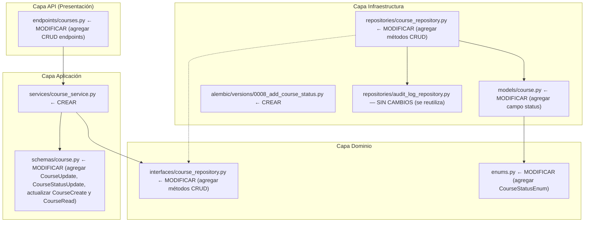
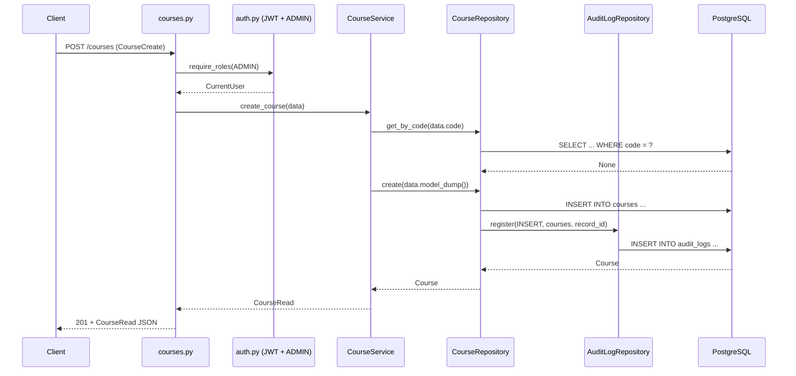
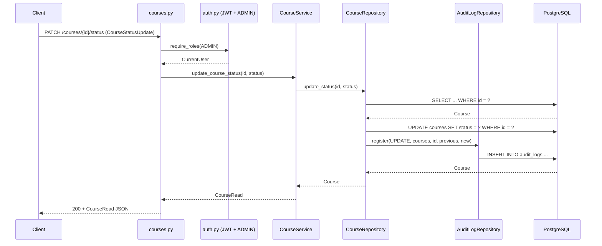
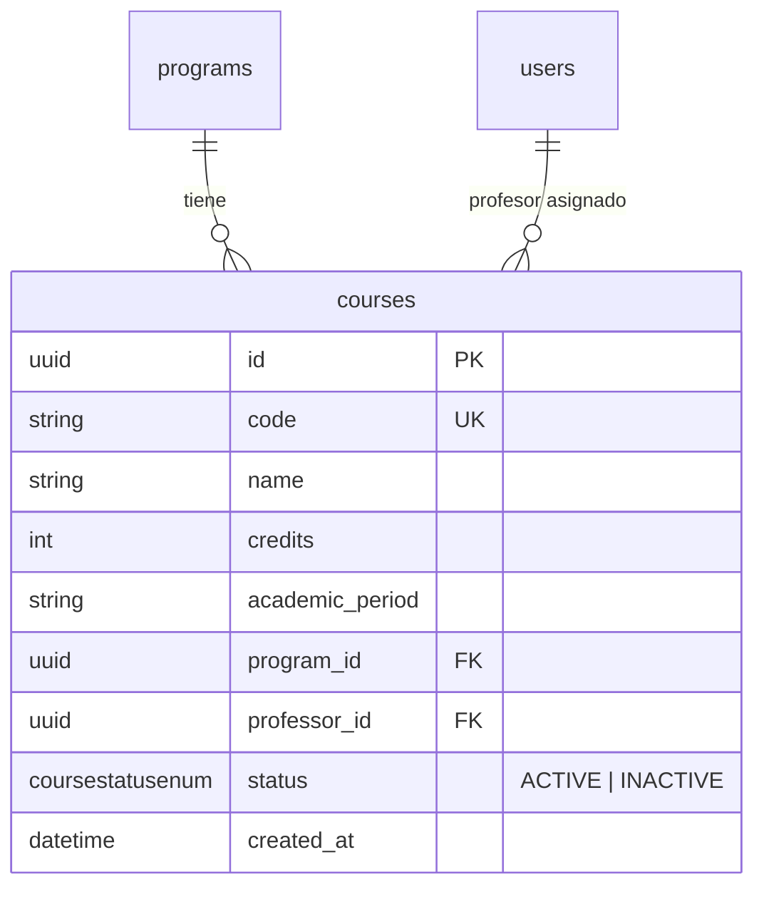
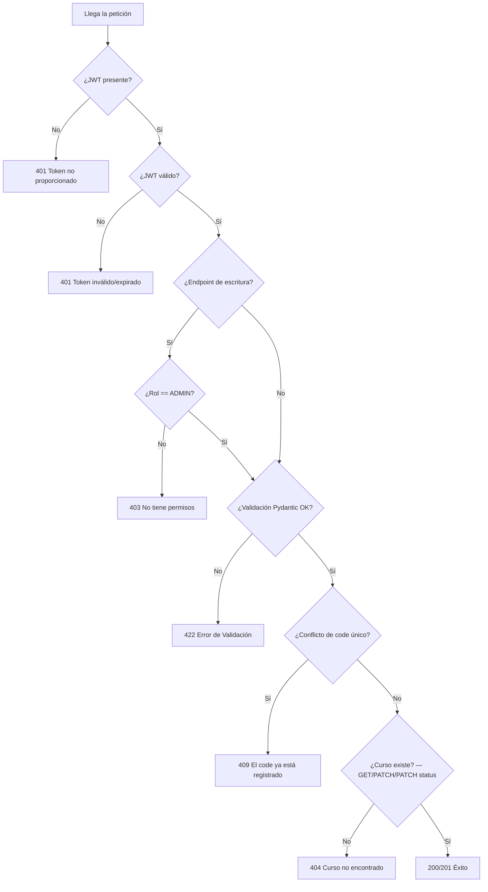

# Documento de Diseño — Endpoints CRUD de Cursos (Materias)

## Resumen

Este diseño agrega los endpoints CRUD completos al recurso de cursos (materias): listado con paginación (`GET /courses`), obtención por ID (`GET /courses/{course_id}`), creación (`POST /courses`), actualización parcial (`PATCH /courses/{course_id}`) y cambio de estado vía soft delete (`PATCH /courses/{course_id}/status`). La implementación sigue el patrón de Clean Architecture establecido por el CRUD de programas y usuarios: Interfaces de dominio → Repositorios de infraestructura → Servicios de aplicación → Endpoints API.

Los nuevos endpoints permiten a usuarios ADMIN gestionar el ciclo de vida completo de cursos, con validación de unicidad en el campo `code`, registro atómico de auditoría por cada operación de escritura, soft delete mediante `CourseStatusEnum` (ACTIVE/INACTIVE) siguiendo el patrón de `UserStatusEnum`, y autenticación JWT con restricción de rol.

### Decisiones de Diseño

1. **Seguir los patrones existentes**: Replicar la arquitectura de `ProgramService` / `ProgramRepository` / `programs.py` y el patrón de soft delete de `UserService` / `UserRepository` / `users.py` para mantener consistencia y reducir carga cognitiva.
2. **Extender, no reemplazar**: Los componentes existentes `ICourseRepository`, `CourseRepository` y `courses.py` ya manejan operaciones de asignación profesor-curso y listado de estudiantes. Se extienden con métodos CRUD sin alterar los existentes.
3. **Validación de unicidad solo en `code`**: A diferencia de programas (que validan `program_code` y `snies_code`), los cursos solo tienen un campo único: `code`. La validación ocurre en `CourseService`.
4. **Soft delete con `CourseStatusEnum`**: Se agrega un campo `status` al modelo `Course` con valores `ACTIVE`/`INACTIVE`, siguiendo exactamente el patrón de `UserStatusEnum`. Requiere nueva migración Alembic.
5. **Filtro por status con default ACTIVE**: `list_all` y `count_all` aceptan un parámetro `status` opcional. `CourseService` aplica `status=ACTIVE` como default cuando no se especifica, igual que `UserService`.
6. **Auditoría atómica**: Cada operación de escritura (INSERT/UPDATE) registra una entrada `AuditLog` en la misma sesión de base de datos, usando el `AuditLogRepository` existente.
7. **`professor_id` excluido del CRUD**: El campo `professor_id` se gestiona exclusivamente por el flujo de asignación profesor-curso existente (`POST /courses/{course_id}/professor`), no por los endpoints CRUD.
8. **Reutilización de `PaginatedResponse`**: Se reutiliza el genérico `PaginatedResponse[T]` definido en `app/application/schemas/user.py` para la respuesta paginada de cursos.

## Arquitectura

El sistema sigue Clean Architecture con tres capas. Los cambios afectan las capas de Dominio (interfaz + enums), Infraestructura (modelo + repositorio + migración) y Aplicación (servicio + schemas), además de la capa API (nuevos endpoints):



### Flujo de Datos — POST /courses



### Flujo de Datos — PATCH /courses/{course_id}/status



### Responsabilidades por Capa

| Capa | Componente | Responsabilidad |
|------|-----------|-----------------|
| **API** | `courses.py` | Ruteo HTTP, serialización request/response, inyección de dependencias |
| **Auth** | `auth.py` | Extracción JWT, enforcement de rol (ADMIN para escritura, autenticado para lectura) |
| **Aplicación** | `CourseService` | Lógica de negocio: validación de unicidad, default de status, orquestación |
| **Aplicación** | `CourseCreate`, `CourseUpdate`, `CourseStatusUpdate`, `CourseRead` | Schemas Pydantic v2 para validación de entrada y serialización de salida |
| **Dominio** | `ICourseRepository` | Interfaz abstracta que define el contrato del repositorio |
| **Dominio** | `CourseStatusEnum` | Enumeración de estados del curso (ACTIVE/INACTIVE) |
| **Infraestructura** | `CourseRepository` | Queries async SQLAlchemy, registro de audit log |
| **Infraestructura** | `Course` (SQLModel) | Modelo ORM mapeado a la tabla `courses` |
| **Infraestructura** | Migración Alembic | Agrega columna `status` y tipo enum `coursestatusenum` |

## Componentes e Interfaces

### Componentes a Crear

| Capa | Archivo | Componente |
|------|---------|------------|
| Aplicación / Servicios | `app/application/services/course_service.py` | Clase `CourseService` |
| Infraestructura / Migraciones | `alembic/versions/0008_add_course_status.py` | Migración Alembic |

### Componentes a Modificar

#### 1. Enums de Dominio (`app/domain/enums.py`)

**Estado actual**: Define `RoleEnum`, `OperationEnum`, `UserStatusEnum`.

**Estado objetivo**: Se agrega `CourseStatusEnum` siguiendo el patrón de `UserStatusEnum`:

```python
class CourseStatusEnum(str, Enum):
    ACTIVE = "ACTIVE"
    INACTIVE = "INACTIVE"
```

#### 2. Schemas Pydantic (`app/application/schemas/course.py`)

**Estado actual**: Existe `CourseCreate` (sin `Field(description=...)`) y `CourseRead` (sin `program_id` ni `status`).

**Estado objetivo**: Se actualizan los schemas existentes y se agregan `CourseUpdate` y `CourseStatusUpdate`:

```python
class CourseCreate(BaseModel):
    """Schema de entrada para POST /courses. Todos los campos requeridos."""
    code: str = Field(..., description="Código único del curso (ej. MAT101)")
    name: str = Field(..., description="Nombre del curso")
    credits: int = Field(..., description="Número de créditos del curso")
    academic_period: str = Field(..., description="Período académico (ej. 2024-1)")
    program_id: UUID = Field(..., description="ID del programa al que pertenece el curso")

class CourseUpdate(BaseModel):
    """Schema de entrada para PATCH /courses/{course_id}. Todos los campos opcionales."""
    code: str | None = None
    name: str | None = None
    credits: int | None = None
    academic_period: str | None = None
    program_id: UUID | None = None

class CourseStatusUpdate(BaseModel):
    """Schema de entrada para PATCH /courses/{course_id}/status."""
    status: CourseStatusEnum = Field(..., description="Nuevo estado del curso (ACTIVE o INACTIVE)")

class CourseRead(BaseModel):
    """Schema de salida para respuestas de curso."""
    id: UUID
    code: str
    name: str
    credits: int
    academic_period: str
    program_id: UUID
    professor_id: UUID | None = None
    status: CourseStatusEnum
    created_at: datetime

    model_config = {"from_attributes": True}
```

#### 3. Interfaz de Dominio (`app/domain/interfaces/course_repository.py`)

**Estado actual**: Define `crear`, `obtener_por_id`, `listar_por_docente`, `listar_estudiantes_inscritos`, `listar_por_programa`.

**Estado objetivo**: Se agregan 6 métodos abstractos nuevos para las operaciones CRUD:

```python
class ICourseRepository(ABC):
    # --- Métodos existentes (sin cambios) ---
    @abstractmethod
    async def crear(self, asignatura: CourseCreate) -> Course: ...

    @abstractmethod
    async def obtener_por_id(self, id: UUID) -> Course | None: ...

    @abstractmethod
    async def listar_por_docente(self, docente_id: UUID) -> list[Course]: ...

    @abstractmethod
    async def listar_estudiantes_inscritos(self, course_id: UUID) -> list[User]: ...

    @abstractmethod
    async def listar_por_programa(self, program_id: UUID) -> list[Course]: ...

    # --- Métodos nuevos ---
    @abstractmethod
    async def create(self, data: dict) -> Course: ...

    @abstractmethod
    async def update(self, course_id: UUID, data: CourseUpdate) -> Course | None: ...

    @abstractmethod
    async def get_by_code(self, code: str) -> Course | None: ...

    @abstractmethod
    async def list_all(self, skip: int, limit: int, status: CourseStatusEnum | None = None) -> list[Course]: ...

    @abstractmethod
    async def count_all(self, status: CourseStatusEnum | None = None) -> int: ...

    @abstractmethod
    async def update_status(self, course_id: UUID, status: CourseStatusEnum) -> Course | None: ...
```

#### 4. Modelo ORM (`app/infrastructure/models/course.py`)

**Estado actual**: No tiene campo `status`.

**Estado objetivo**: Se agrega el campo `status` siguiendo el patrón de `User`:

```python
class Course(SQLModel, table=True):
    __tablename__ = "courses"

    # ... campos existentes sin cambios ...

    status: CourseStatusEnum = Field(
        default=CourseStatusEnum.ACTIVE,
        nullable=False,
        sa_column_kwargs={"server_default": "ACTIVE"},
    )
```

#### 5. Repositorio de Infraestructura (`app/infrastructure/repositories/course_repository.py`)

**Estado actual**: Implementa `crear`, `obtener_por_id`, `listar_por_docente`, `listar_estudiantes_inscritos`, `listar_por_programa`. Ya tiene soporte de `AuditLogRepository`.

**Estado objetivo**: Se agregan 6 métodos nuevos. Cada operación de escritura registra un `AuditLog` atómicamente en la misma sesión:

```python
class CourseRepository(ICourseRepository):
    # --- Métodos existentes (sin cambios) ---
    # crear, obtener_por_id, listar_por_docente, listar_estudiantes_inscritos, listar_por_programa

    # --- Métodos nuevos ---

    async def create(self, data: dict) -> Course:
        """
        Persiste un nuevo Course y registra un audit log INSERT.
        Pseudocódigo:
          1. course = Course(**data)
          2. session.add(course)
          3. session.flush() + refresh()
          4. audit.register(INSERT, "courses", course.id, new_data=data)
          5. return course
        """
        ...

    async def update(self, course_id: UUID, data: CourseUpdate) -> Course | None:
        """
        Aplica actualización parcial y registra un audit log UPDATE.
        Pseudocódigo:
          1. course = obtener_por_id(course_id)
          2. if None → return None
          3. previous = snapshot de los campos actuales
          4. updates = data.model_dump(exclude_unset=True)
          5. for field, value in updates: setattr(course, field, value)
          6. session.add(course) + flush() + refresh()
          7. audit.register(UPDATE, "courses", course_id, previous, updates)
          8. return course
        """
        ...

    async def get_by_code(self, code: str) -> Course | None:
        """SELECT ... WHERE code = :code"""
        ...

    async def list_all(self, skip: int, limit: int, status: CourseStatusEnum | None = None) -> list[Course]:
        """
        SELECT ... FROM courses [WHERE status = :status] OFFSET :skip LIMIT :limit
        Filtra por status cuando se proporciona.
        """
        ...

    async def count_all(self, status: CourseStatusEnum | None = None) -> int:
        """
        SELECT COUNT(*) FROM courses [WHERE status = :status]
        Filtra por status cuando se proporciona.
        """
        ...

    async def update_status(self, course_id: UUID, status: CourseStatusEnum) -> Course | None:
        """
        Actualiza solo el campo status y registra un audit log UPDATE.
        Sigue el patrón de UserRepository.update_status.
        Pseudocódigo:
          1. course = obtener_por_id(course_id)
          2. if None → return None
          3. previous_status = course.status
          4. course.status = status
          5. session.add(course) + flush() + refresh()
          6. audit.register(UPDATE, "courses", course_id, {"status": previous_status}, {"status": status})
          7. return course
        """
        ...
```

#### 6. Servicio de Aplicación (`app/application/services/course_service.py`)

**Archivo nuevo**. Encapsula la lógica de negocio de cursos, recibiendo `ICourseRepository` por inyección de constructor (DIP). Sigue el patrón combinado de `ProgramService` (unicidad) y `UserService` (paginación con default de status):

```python
class CourseService:
    """
    Lógica de negocio para operaciones CRUD de cursos.
    Recibe ICourseRepository vía inyección de constructor (DIP).
    """

    def __init__(self, repo: ICourseRepository) -> None:
        self._repo = repo

    async def create_course(self, data: CourseCreate) -> CourseRead:
        """
        Crea un nuevo curso con validación de unicidad en code.
        Pseudocódigo:
          1. existing = repo.get_by_code(data.code)
             if existing → raise HTTPException(409, "El code ya está registrado")
          2. course = repo.create(data.model_dump())
          3. return CourseRead.model_validate(course)
        """
        ...

    async def get_course(self, course_id: UUID) -> CourseRead:
        """
        Obtiene un curso por ID.
        Lanza HTTPException(404) si no existe.
        """
        ...

    async def list_courses(
        self,
        status: CourseStatusEnum | None,
        skip: int,
        limit: int,
    ) -> PaginatedResponse[CourseRead]:
        """
        Lista cursos con paginación y filtro de status.
        Aplica status=ACTIVE como default cuando status es None.
        Ejecuta list_all y count_all en paralelo con asyncio.gather.
        """
        ...

    async def update_course(self, course_id: UUID, data: CourseUpdate) -> CourseRead:
        """
        Actualiza parcialmente un curso con validación de unicidad en code.
        Pseudocódigo:
          1. if data.code está definido:
               existing = repo.get_by_code(data.code)
               if existing and existing.id != course_id:
                 raise HTTPException(409, "El code ya está registrado")
          2. course = repo.update(course_id, data)
             if None → raise HTTPException(404, "Curso no encontrado")
          3. return CourseRead.model_validate(course)
        """
        ...

    async def update_course_status(self, course_id: UUID, status: CourseStatusEnum) -> CourseRead:
        """
        Actualiza el status de un curso (soft delete / reactivación).
        Lanza HTTPException(404) si no existe.
        """
        ...
```

#### 7. Endpoints API (`app/api/v1/endpoints/courses.py`)

**Estado actual**: Solo tiene endpoints de asignación profesor-curso y listado de estudiantes.

**Estado objetivo**: Se agrega helper de dependencia para `CourseService` y 5 endpoints nuevos. Los endpoints existentes permanecen sin cambios:

```python
def _get_course_service(session: AsyncSession = Depends(get_session)) -> CourseService:
    return CourseService(CourseRepository(session))

# GET /courses — Autenticado (cualquier rol)
@router.get(
    "/courses",
    response_model=PaginatedResponse[CourseRead],
    status_code=200,
    summary="Listar cursos con paginación",
    description="Retorna una lista paginada de cursos. Por defecto solo muestra cursos ACTIVE.",
    tags=["Cursos"],
)
async def list_courses(
    status: CourseStatusEnum | None = None,
    skip: int = Query(0, ge=0),
    limit: int = Query(20, ge=1, le=100),
    current_user: CurrentUser = Depends(get_current_user),
    service: CourseService = Depends(_get_course_service),
) -> PaginatedResponse[CourseRead]: ...

# GET /courses/{course_id} — Autenticado (cualquier rol)
@router.get(
    "/courses/{course_id}",
    response_model=CourseRead,
    status_code=200,
    summary="Obtener un curso por ID",
    description="Retorna los datos de un curso específico, o 404 si no existe.",
    tags=["Cursos"],
)
async def get_course(
    course_id: UUID,
    current_user: CurrentUser = Depends(get_current_user),
    service: CourseService = Depends(_get_course_service),
) -> CourseRead: ...

# POST /courses — ADMIN only
@router.post(
    "/courses",
    response_model=CourseRead,
    status_code=201,
    summary="Crear un curso",
    description="Crea un nuevo curso. Requiere rol ADMIN. Valida unicidad de code.",
    tags=["Cursos"],
)
async def create_course(
    body: CourseCreate,
    current_user: CurrentUser = Depends(require_roles(RoleEnum.ADMIN)),
    service: CourseService = Depends(_get_course_service),
) -> CourseRead: ...

# PATCH /courses/{course_id} — ADMIN only
@router.patch(
    "/courses/{course_id}",
    response_model=CourseRead,
    status_code=200,
    summary="Actualizar parcialmente un curso",
    description="Actualiza los campos proporcionados de un curso existente. "
                "Requiere rol ADMIN. Valida unicidad de code.",
    tags=["Cursos"],
)
async def update_course(
    course_id: UUID,
    body: CourseUpdate,
    current_user: CurrentUser = Depends(require_roles(RoleEnum.ADMIN)),
    service: CourseService = Depends(_get_course_service),
) -> CourseRead: ...

# PATCH /courses/{course_id}/status — ADMIN only
@router.patch(
    "/courses/{course_id}/status",
    response_model=CourseRead,
    status_code=200,
    summary="Cambiar estado de un curso (soft delete / reactivación)",
    description="Cambia el estado de un curso a ACTIVE o INACTIVE. Requiere rol ADMIN.",
    tags=["Cursos"],
)
async def update_course_status(
    course_id: UUID,
    body: CourseStatusUpdate,
    current_user: CurrentUser = Depends(require_roles(RoleEnum.ADMIN)),
    service: CourseService = Depends(_get_course_service),
) -> CourseRead: ...
```

#### 8. Migración Alembic (`alembic/versions/0008_add_course_status.py`)

Nueva migración que agrega el tipo enum `coursestatusenum` y la columna `status` a la tabla `courses`, siguiendo el patrón de `0002_add_user_status.py`:

```python
def upgrade() -> None:
    op.execute("CREATE TYPE coursestatusenum AS ENUM ('ACTIVE', 'INACTIVE')")
    op.add_column(
        "courses",
        sa.Column(
            "status",
            sa.Enum("ACTIVE", "INACTIVE", name="coursestatusenum"),
            nullable=False,
            server_default="ACTIVE",
        ),
    )

def downgrade() -> None:
    op.drop_column("courses", "status")
    op.execute("DROP TYPE IF EXISTS coursestatusenum")
```

## Modelos de Datos

### Modelo Course (modificado)

El modelo `Course` de SQLModel se extiende con el campo `status`:

```python
class Course(SQLModel, table=True):
    __tablename__ = "courses"

    id: uuid.UUID = Field(default_factory=uuid.uuid4, primary_key=True)
    code: str = Field(unique=True, nullable=False, index=True)
    name: str = Field(nullable=False)
    credits: int = Field(nullable=False)
    academic_period: str = Field(nullable=False)
    program_id: uuid.UUID = Field(
        foreign_key="programs.id", nullable=False, index=True
    )
    professor_id: uuid.UUID | None = Field(
        default=None, foreign_key="users.id", nullable=True, index=True
    )
    status: CourseStatusEnum = Field(
        default=CourseStatusEnum.ACTIVE,
        nullable=False,
        sa_column_kwargs={"server_default": "ACTIVE"},
    )
    created_at: datetime = Field(
        default_factory=lambda: datetime.now(timezone.utc),
        sa_column=sa.Column(sa.DateTime(timezone=True), nullable=False),
    )
```

Restricciones:
- `code`: `unique=True`, `index=True` — ya existente
- `program_id`: FK → `programs.id`, `index=True` — ya existente
- `professor_id`: FK → `users.id`, nullable — ya existente
- `status`: `nullable=False`, `server_default="ACTIVE"` — **NUEVO**

### Diagrama ER (cambios)



### Entradas de AuditLog

Para operaciones de **creación** (`create`):
```json
{
  "table_name": "courses",
  "operation": "INSERT",
  "record_id": "<uuid_del_nuevo_curso>",
  "previous_data": null,
  "new_data": { "code": "MAT101", "name": "Cálculo I", "credits": 4, ... }
}
```

Para operaciones de **actualización** (`update`):
```json
{
  "table_name": "courses",
  "operation": "UPDATE",
  "record_id": "<uuid_del_curso>",
  "previous_data": { "name": "Cálculo I", ... },
  "new_data": { "name": "Cálculo Diferencial" }
}
```

Para operaciones de **cambio de estado** (`update_status`):
```json
{
  "table_name": "courses",
  "operation": "UPDATE",
  "record_id": "<uuid_del_curso>",
  "previous_data": { "status": "ACTIVE" },
  "new_data": { "status": "INACTIVE" }
}
```


## Propiedades de Correctitud

*Una propiedad es una característica o comportamiento que debe cumplirse en todas las ejecuciones válidas de un sistema — esencialmente, una declaración formal sobre lo que el sistema debe hacer. Las propiedades sirven como puente entre especificaciones legibles por humanos y garantías de correctitud verificables por máquina.*

### Propiedad 1: CourseCreate rechaza entrada incompleta

*Para cualquier* diccionario al que le falte uno o más de los campos requeridos (`code`, `name`, `credits`, `academic_period`, `program_id`), construir una instancia de `CourseCreate` debe lanzar un `ValidationError`.

**Valida: Requerimientos 1.1, 1.2**

### Propiedad 2: Actualización parcial preserva campos omitidos

*Para cualquier* curso existente y *cualquier* subconjunto no vacío de campos de `CourseUpdate`, llamar a `update_course` debe modificar solo los campos proporcionados y dejar todos los campos omitidos sin cambios.

**Valida: Requerimientos 2.2, 5.3**

### Propiedad 3: Round-trip de creación y búsqueda por code

*Para cualquier* dato de curso válido, llamar a `create` y luego a `get_by_code(course.code)` debe retornar un curso con el mismo `id` y los mismos valores en todos los campos proporcionados en la creación.

**Valida: Requerimientos 5.1, 5.6**

### Propiedad 4: Operaciones de escritura registran audit log correcto

*Para cualquier* operación de escritura (create, update, update_status) sobre un curso, el repositorio debe registrar una entrada `AuditLog` con `table_name="courses"`, la operación correcta (`INSERT` para create, `UPDATE` para update y update_status), y los datos correspondientes (`new_data` para create, `previous_data` + `new_data` para update y update_status).

**Valida: Requerimientos 5.2, 5.4, 5.11**

### Propiedad 5: Listado y conteo filtran por status consistentemente

*Para cualquier* conjunto de cursos con estados mixtos (ACTIVE/INACTIVE), llamar a `list_all(status=S)` y `count_all(status=S)` debe retornar solo cursos con status `S`, y `count_all(status=S)` debe ser igual a la longitud de `list_all(status=S)` (sin paginación). Cuando no se especifica status, `CourseService` debe aplicar `ACTIVE` como default.

**Valida: Requerimientos 5.7, 5.8, 6.8, 7.3**

### Propiedad 6: Creación rechaza code duplicado

*Para cualquier* `code` que ya pertenezca a un curso existente, llamar a `create_course` con ese mismo `code` debe lanzar un `HTTPException` con código de estado 409 y detalle "El code ya está registrado".

**Valida: Requerimientos 6.2, 6.3, 12.1**

### Propiedad 7: Validación de unicidad en actualización

*Para cualesquiera* dos cursos distintos A y B, llamar a `update_course(A.id, CourseUpdate(code=B.code))` debe lanzar un `HTTPException` con código 409. Sin embargo, llamar a `update_course(A.id, CourseUpdate(code=A.code))` debe tener éxito sin lanzar error de conflicto.

**Valida: Requerimientos 6.5, 6.6, 12.2, 12.3**

### Propiedad 8: Rechazo de rol no-ADMIN en endpoints de escritura

*Para cualquier* usuario autenticado cuyo rol no sea `ADMIN`, enviar una petición `POST /courses`, `PATCH /courses/{id}` o `PATCH /courses/{id}/status` debe retornar un código de estado 403.

**Valida: Requerimientos 9.4, 9.6, 10.5, 10.7, 11.5, 11.7**

## Manejo de Errores

### Errores de la API

| Escenario | Código HTTP | Mensaje | Capa |
|-----------|-------------|---------|------|
| Campo requerido faltante en `CourseCreate` | 422 | Error de validación Pydantic (automático) | API (FastAPI) |
| Sin token JWT Bearer | 401 | "Token no proporcionado" | Dependencia Auth |
| Token JWT expirado o inválido | 401 | "Token expirado" / "Token inválido" | Dependencia Auth |
| Usuario autenticado no es ADMIN (endpoints de escritura) | 403 | "No tiene permisos para esta acción" | Dependencia Auth |
| `code` duplicado en creación o actualización | 409 | "El code ya está registrado" | CourseService |
| Curso no encontrado (GET, PATCH, PATCH /status) | 404 | "Curso no encontrado" | CourseService |
| Fallo de conexión a base de datos | 500 | Internal Server Error (no manejado) | Infraestructura |

### Flujo de Errores



## Estrategia de Testing

### Enfoque Dual: Tests Unitarios + Tests de Propiedades

El proyecto usa **Hypothesis** como librería de property-based testing (ya configurada, evidenciado por el directorio `.hypothesis/` y los tests existentes en `tests/property/`).

### Tests de Propiedades (PBT)

Cada propiedad del documento de diseño se implementará como un test basado en propiedades usando Hypothesis:

- **Mínimo 100 iteraciones** por test de propiedad
- Cada test debe referenciar la propiedad del documento de diseño
- Formato de tag: **Feature: course-crud-endpoints, Property {número}: {texto}**
- Archivo: `tests/property/test_course_crud_property.py`

| Propiedad | Estrategia de Generación |
|-----------|--------------------------|
| P1: Schema rechaza entrada incompleta | Generar subconjuntos aleatorios de los 5 campos requeridos (omitiendo al menos uno), verificar `ValidationError` |
| P2: Actualización parcial preserva omitidos | Mock de repo, generar cursos aleatorios + subconjuntos aleatorios de campos de `CourseUpdate`, verificar campos omitidos sin cambios |
| P3: Round-trip creación + búsqueda por code | Mock de session + audit repo, crear curso con datos aleatorios, buscar por code, verificar coincidencia de campos |
| P4: Audit log correcto por operación de escritura | Mock de session + audit repo, ejecutar create/update/update_status con datos aleatorios, verificar `register` llamado con operación y datos correctos |
| P5: List y count filtran por status | Mock de session con cursos de estados mixtos, verificar que list_all y count_all retornan resultados consistentes por status |
| P6: Creación rechaza code duplicado | Mock de repo retornando curso existente para `get_by_code`, generar codes aleatorios, verificar 409 |
| P7: Unicidad en actualización | Mock de repo retornando curso diferente (409) o mismo curso (éxito) para `get_by_code`, generar pares de cursos aleatorios |
| P8: Rechazo de no-ADMIN | Generar roles no-ADMIN (STUDENT, PROFESSOR), enviar peticiones a endpoints de escritura, verificar 403 |

### Tests Unitarios

- **Archivo**: `tests/unit/test_course_service.py`
- `test_create_course_success` — camino feliz con datos válidos
- `test_create_course_duplicate_code_returns_409` — verificación exacta del mensaje de error
- `test_get_course_success` — obtención por ID existente
- `test_get_course_not_found_returns_404` — ID inexistente
- `test_update_course_success` — camino feliz de actualización parcial
- `test_update_course_not_found_returns_404` — ID inexistente
- `test_update_course_duplicate_code_different_course_returns_409` — code de otro curso
- `test_update_course_same_code_no_conflict` — auto-actualización con mismo code
- `test_update_course_status_success` — cambio de estado exitoso
- `test_update_course_status_not_found_returns_404` — ID inexistente
- `test_list_courses_default_status_active` — verifica que status=None se convierte en ACTIVE

### Tests de Integración

- **Archivo**: `tests/integration/test_course_endpoints.py`
- `test_get_courses_returns_200` — listado con auth válida
- `test_get_courses_default_active_filter` — solo cursos ACTIVE sin parámetro status
- `test_get_course_by_id_returns_200` — obtención por ID con auth válida
- `test_get_course_by_id_not_found_returns_404` — ID inexistente
- `test_post_courses_returns_201` — creación válida con auth ADMIN
- `test_post_courses_duplicate_code_returns_409` — code duplicado
- `test_post_courses_missing_field_returns_422` — campo requerido faltante
- `test_post_courses_no_auth_returns_401` — JWT faltante
- `test_post_courses_non_admin_returns_403` — rol STUDENT/PROFESSOR
- `test_patch_course_returns_200` — actualización válida con auth ADMIN
- `test_patch_course_not_found_returns_404` — curso inexistente
- `test_patch_course_status_returns_200` — cambio de estado exitoso
- `test_patch_course_status_not_found_returns_404` — curso inexistente
- `test_patch_course_status_no_auth_returns_401` — JWT faltante
- `test_patch_course_status_non_admin_returns_403` — rol no-ADMIN

### Dependencias de Testing

- **Hypothesis** — generación de tests basados en propiedades (ya en el proyecto)
- **pytest-anyio** — soporte de tests async (ya en el proyecto)
- **unittest.mock / AsyncMock** — mocking para tests unitarios (stdlib)
- **httpx.AsyncClient** — cliente HTTP para tests de integración (ya en el proyecto)
