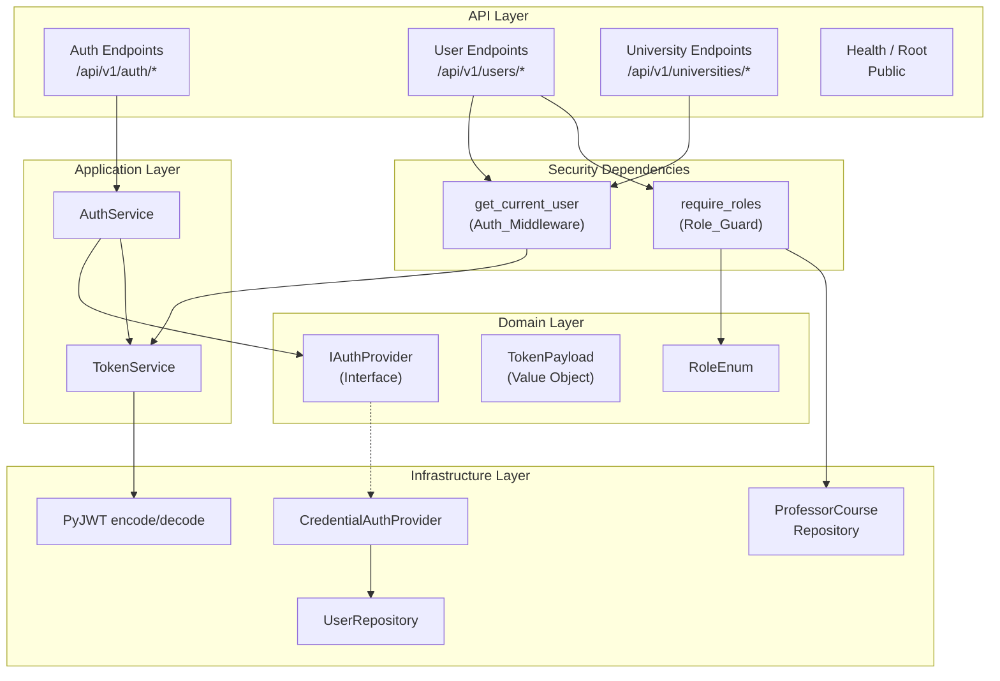
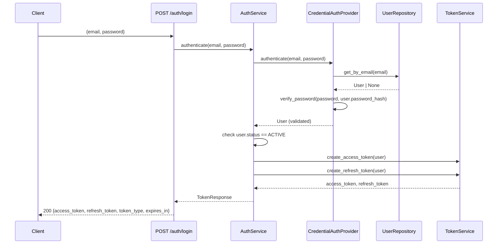
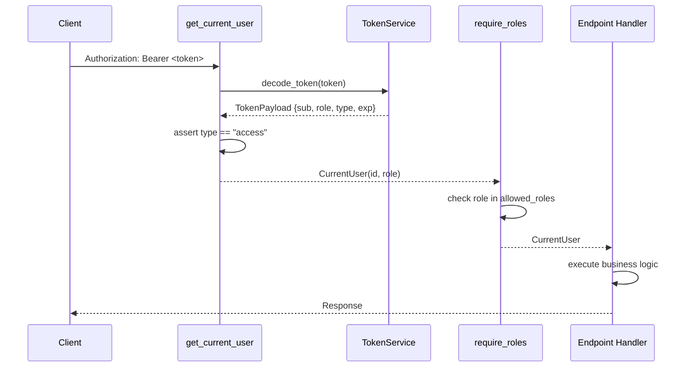

# Design Document: JWT Role-Based Authentication

## Overview

Este diseño describe la implementación de autenticación JWT con autorización por roles para el sistema MPRA. El sistema emitirá pares de tokens (access + refresh) tras autenticación por credenciales, validará tokens en cada petición protegida mediante middleware de FastAPI, y aplicará control de acceso basado en los roles existentes (STUDENT, PROFESSOR, ADMIN).

La arquitectura sigue los principios de Clean Architecture ya establecidos en el proyecto, añadiendo componentes en cada capa:
- **Dominio**: Interfaces y value objects para tokens y autenticación.
- **Aplicación**: Servicios de autenticación y token, schemas de request/response.
- **Infraestructura**: Implementación JWT con PyJWT, dependencias de FastAPI para middleware y guards.

### Decisiones de Diseño Clave

1. **PyJWT como librería JWT**: Es la librería estándar de Python para JWT, ligera y sin dependencias pesadas. `python-jose` es una alternativa pero PyJWT es más mantenida y suficiente para HS256.
2. **Stateless tokens**: No se almacenan tokens en base de datos. La seguridad se basa en tokens de corta duración y firma criptográfica. Esto simplifica la implementación y es coherente con el Requisito 9 (logout stateless).
3. **Strategy pattern para autenticación**: Se define una interfaz `IAuthProvider` que permite añadir proveedores SSO (Microsoft, Google) sin modificar la lógica existente (Requisito 8).
4. **FastAPI Dependencies para middleware**: Se usan `Depends()` en lugar de middleware global, lo que permite control granular por endpoint y es idiomático en FastAPI.

## Architecture

### Diagrama de Componentes



### Flujo de Autenticación (Login)



### Flujo de Validación (Protected Request)



## Components and Interfaces

### Domain Layer

#### `app/domain/interfaces/auth_provider.py`

```python
class IAuthProvider(ABC):
    """Interface for authentication providers (Strategy pattern)."""

    @abstractmethod
    async def authenticate(self, **kwargs) -> User:
        """Authenticate a user and return the User entity.
        Raises AuthenticationError on failure."""
        ...
```

#### `app/domain/value_objects/token.py`

```python
@dataclass(frozen=True)
class TokenPayload:
    """Value object representing the JWT payload claims."""
    sub: str          # User UUID as string
    role: RoleEnum
    type: str         # "access" or "refresh"
    exp: datetime
    iat: datetime
```

### Application Layer

#### `app/application/services/token_service.py`

```python
class TokenService:
    """Creates and decodes JWT tokens using PyJWT."""

    def __init__(self, secret_key: str, algorithm: str,
                 access_expire_minutes: int, refresh_expire_days: int): ...

    def create_access_token(self, user_id: UUID, role: RoleEnum) -> str: ...
    def create_refresh_token(self, user_id: UUID, role: RoleEnum) -> str: ...
    def decode_token(self, token: str) -> TokenPayload: ...
```

**Responsabilidades**:
- Codificar/decodificar tokens JWT con PyJWT.
- Incluir claims `sub`, `role`, `type`, `exp`, `iat` en cada token.
- Firmar con HS256 usando `JWT_SECRET_KEY`.
- Lanzar excepciones tipadas (`TokenExpiredError`, `InvalidTokenError`) en caso de fallo.

#### `app/application/services/auth_service.py`

```python
class AuthService:
    """Orchestrates authentication flow using pluggable providers."""

    def __init__(self, provider: IAuthProvider, token_service: TokenService,
                 user_repo: IUserRepository): ...

    async def login(self, email: str, password: str) -> TokenResponse: ...
    async def refresh(self, refresh_token: str) -> TokenResponse: ...
    def logout(self) -> dict: ...
```

**Responsabilidades**:
- Delegar autenticación al `IAuthProvider` correspondiente.
- Verificar que el usuario esté activo (`status == ACTIVE`).
- Orquestar la generación de tokens vía `TokenService`.
- Manejar el flujo de refresh: decodificar refresh token, verificar tipo, emitir nuevos tokens.

### Infrastructure Layer

#### `app/infrastructure/auth/credential_provider.py`

```python
class CredentialAuthProvider(IAuthProvider):
    """Authenticates users via email + password against the database."""

    def __init__(self, user_repo: IUserRepository): ...

    async def authenticate(self, email: str, password: str) -> User: ...
```

**Responsabilidades**:
- Buscar usuario por email.
- Verificar password usando `bcrypt` (funciones existentes en `app/core/security.py`).
- Lanzar `AuthenticationError` si el usuario no existe, la contraseña es incorrecta, o no tiene `password_hash`.

#### `app/api/v1/dependencies/auth.py`

```python
class CurrentUser(BaseModel):
    """Represents the authenticated user extracted from the JWT."""
    id: UUID
    role: RoleEnum

async def get_current_user(
    authorization: str = Header(..., alias="Authorization"),
    token_service: TokenService = Depends(get_token_service),
) -> CurrentUser: ...

def require_roles(*roles: RoleEnum) -> Callable:
    """Factory that returns a dependency checking the user's role."""
    async def _guard(
        current_user: CurrentUser = Depends(get_current_user),
    ) -> CurrentUser: ...
    return _guard

async def require_self_or_roles(
    user_id: UUID,
    current_user: CurrentUser,
    *roles: RoleEnum,
    session: AsyncSession,
) -> CurrentUser:
    """Allows access if user is accessing own data, has an allowed role,
    or is a PROFESSOR with the student in their courses (RB-04)."""
    ...
```

### Auth Endpoints

#### `app/api/v1/endpoints/auth.py`

| Endpoint | Method | Auth | Description |
|----------|--------|------|-------------|
| `/api/v1/auth/login` | POST | Public | Authenticate with email + password |
| `/api/v1/auth/refresh` | POST | Public | Refresh access token |
| `/api/v1/auth/logout` | POST | Bearer | Stateless logout confirmation |

### Configuration Extension

#### `app/core/config.py` (additions)

```python
# JWT Configuration
JWT_SECRET_KEY: str = Field(..., description="Secret key for JWT signing")
JWT_ALGORITHM: str = Field(default="HS256", description="JWT signing algorithm")
ACCESS_TOKEN_EXPIRE_MINUTES: int = Field(default=30, description="Access token TTL in minutes")
REFRESH_TOKEN_EXPIRE_DAYS: int = Field(default=7, description="Refresh token TTL in days")
```

`JWT_SECRET_KEY` has no default — the application will fail to start if it's not set (Requirement 7.5).

## Data Models

### Token Schemas (Pydantic)

#### `app/application/schemas/auth.py`

```python
class LoginRequest(BaseModel):
    email: EmailStr = Field(..., description="Correo electrónico del usuario")
    password: str = Field(..., min_length=1, description="Contraseña del usuario")

class RefreshRequest(BaseModel):
    refresh_token: str = Field(..., description="Refresh token JWT")

class TokenResponse(BaseModel):
    access_token: str = Field(..., description="JWT access token")
    refresh_token: str = Field(..., description="JWT refresh token")
    token_type: str = Field(default="bearer", description="Token type")
    expires_in: int = Field(..., description="Access token TTL in seconds")

class LogoutResponse(BaseModel):
    message: str = Field(default="Sesión cerrada exitosamente")
```

### JWT Payload Structure

```json
{
  "sub": "550e8400-e29b-41d4-a716-446655440000",
  "role": "PROFESSOR",
  "type": "access",
  "exp": 1700000000,
  "iat": 1699998200
}
```

### Existing Models (No Changes Required)

- **User** (`app/infrastructure/models/user.py`): Already has `password_hash`, `microsoft_oid`, `google_oid`, `status`, and `role` fields. No schema migration needed.
- **ProfessorCourse** (`app/infrastructure/models/professor_course.py`): Used by `Role_Guard` for RB-04 enforcement. No changes needed.
- **Enrollment** (`app/infrastructure/models/enrollment.py`): Used in JOIN for RB-04 professor→student visibility. No changes needed.

### Endpoint Protection Matrix

| Endpoint | Method | Required Roles | Notes |
|----------|--------|---------------|-------|
| `POST /api/v1/auth/login` | POST | Public | — |
| `POST /api/v1/auth/refresh` | POST | Public | — |
| `POST /api/v1/auth/logout` | POST | Any authenticated | — |
| `GET /health` | GET | Public | — |
| `GET /` | GET | Public | — |
| `POST /api/v1/users` | POST | ADMIN | — |
| `GET /api/v1/users` | GET | ADMIN, PROFESSOR | PROFESSOR filtered by RB-04 |
| `GET /api/v1/users/{id}` | GET | ADMIN, self, PROFESSOR (RB-04) | — |
| `PATCH /api/v1/users/{id}` | PATCH | ADMIN | — |
| `PATCH /api/v1/users/{id}/status` | PATCH | ADMIN | — |
| `POST /api/v1/predict` | POST | Any authenticated | — |
| `/api/v1/universities/*` | ALL | Varies per endpoint | Existing logic preserved |


## Correctness Properties

*A property is a characteristic or behavior that should hold true across all valid executions of a system — essentially, a formal statement about what the system should do. Properties serve as the bridge between human-readable specifications and machine-verifiable correctness guarantees.*

### Property 1: JWT Encode-Decode Round Trip

*For any* valid TokenPayload (with any valid UUID as `sub`, any RoleEnum value as `role`, any token type "access" or "refresh", and any valid expiration/issued-at timestamps), encoding the payload into a JWT string and then decoding it back SHALL produce an equivalent TokenPayload with the same `sub`, `role`, `type`, `exp`, and `iat` values.

**Validates: Requirements 2.6**

### Property 2: Token Claims Completeness

*For any* valid user (with any UUID and any RoleEnum), when the TokenService creates an access token, the decoded payload SHALL contain exactly the fields `sub` (matching the user UUID), `role` (matching the user's role), `type` (equal to "access"), `exp`, and `iat`. When creating a refresh token, the `type` field SHALL be "refresh". No other token types SHALL be produced.

**Validates: Requirements 2.1, 2.5**

### Property 3: Token Expiration Matches Configuration

*For any* positive integer value of `access_expire_minutes` and any positive integer value of `refresh_expire_days`, when the TokenService creates an access token, the difference between `exp` and `iat` SHALL equal `access_expire_minutes * 60` seconds. When creating a refresh token, the difference SHALL equal `refresh_expire_days * 86400` seconds.

**Validates: Requirements 2.3, 2.4**

### Property 4: Invalid Tokens Are Always Rejected

*For any* string that is not a valid JWT signed with the configured `JWT_SECRET_KEY` (including random strings, tokens signed with a different key, and structurally malformed tokens), the TokenService.decode_token SHALL raise an InvalidTokenError.

**Validates: Requirements 3.4, 3.6**

### Property 5: Role Guard Grants Access If and Only If Authorized

*For any* RoleEnum value and any set of allowed roles for an endpoint, the Role_Guard SHALL allow the request if and only if the user's role is in the allowed set OR the user's role is ADMIN. Conversely, if the user's role is not in the allowed set and is not ADMIN, the Role_Guard SHALL return HTTP 403.

**Validates: Requirements 5.1, 5.2, 5.4**

### Property 6: RB-04 Professor Student Visibility

*For any* professor and any student, the professor SHALL be able to access the student's data if and only if the student is enrolled in at least one course assigned to that professor via the professor_courses table. If no such enrollment-course-assignment relationship exists, access SHALL be denied.

**Validates: Requirements 5.5**

### Property 7: Student Self-Access Restriction

*For any* two distinct user IDs where the requesting user has role STUDENT, the system SHALL allow access to user data only when the requested user ID matches the requesting user's own ID. Access to any other user's data SHALL be denied with HTTP 403.

**Validates: Requirements 5.6**

### Property 8: Valid Credentials Produce Token Pair

*For any* active user with a valid password_hash, when the correct email and password are submitted to the AuthService, the response SHALL contain both a non-empty `access_token` and a non-empty `refresh_token`, and the decoded access token's `sub` SHALL match the user's UUID.

**Validates: Requirements 1.1**

### Property 9: Inactive Users Cannot Authenticate

*For any* user with status INACTIVE, regardless of whether the email and password are correct, the AuthService SHALL reject the authentication attempt with HTTP 403.

**Validates: Requirements 1.4**

### Property 10: Valid Refresh Token Produces New Token Pair

*For any* valid refresh token (with type "refresh", valid signature, and non-expired), submitting it to the refresh endpoint SHALL produce a new access_token and a new refresh_token, both with valid signatures and correct claims.

**Validates: Requirements 4.1**

## Error Handling

### Authentication Errors

| Scenario | HTTP Code | Message | Requirement |
|----------|-----------|---------|-------------|
| Non-existent email | 401 | "Credenciales inválidas" | 1.2 |
| Wrong password | 401 | "Credenciales inválidas" | 1.3 |
| SSO-only user (no password_hash) | 401 | "Credenciales inválidas" | 1.5 |
| Inactive user | 403 | "Cuenta desactivada" | 1.4 |

**Design rationale**: Non-existent email and wrong password return the same generic message to prevent user enumeration attacks.

### Token Validation Errors

| Scenario | HTTP Code | Message | Requirement |
|----------|-----------|---------|-------------|
| Missing Authorization header | 401 | "Token no proporcionado" | 3.2 |
| Expired access token | 401 | "Token expirado" | 3.3 |
| Malformed/tampered token | 401 | "Token inválido" | 3.4 |
| Refresh token used as access | 401 | "Token inválido" | 3.5 |
| Wrong signature | 401 | "Token inválido" | 3.6 |

### Refresh Errors

| Scenario | HTTP Code | Message | Requirement |
|----------|-----------|---------|-------------|
| Expired refresh token | 401 | "Refresh token expirado" | 4.2 |
| Access token used as refresh | 401 | "Token inválido" | 4.3 |
| Invalid signature | 401 | "Token inválido" | 4.4 |

### Authorization Errors

| Scenario | HTTP Code | Message | Requirement |
|----------|-----------|---------|-------------|
| Unauthorized role | 403 | "No tiene permisos para esta acción" | 5.2 |

### Custom Exception Classes

```python
# app/domain/exceptions.py
class AuthenticationError(Exception):
    """Raised when authentication fails (wrong credentials, inactive user, etc.)."""
    def __init__(self, message: str, status_code: int = 401):
        self.message = message
        self.status_code = status_code

class TokenExpiredError(Exception):
    """Raised when a JWT token has expired."""
    pass

class InvalidTokenError(Exception):
    """Raised when a JWT token is malformed, tampered, or has wrong type."""
    pass

class AuthorizationError(Exception):
    """Raised when an authenticated user lacks permission for an action."""
    pass
```

These exceptions are caught by FastAPI exception handlers registered in `app/main.py` and converted to appropriate HTTP responses.

## Testing Strategy

### Property-Based Testing (Hypothesis)

The project already uses Hypothesis for property-based testing. Each correctness property maps to a property-based test in `tests/property/`.

**Library**: `hypothesis` (already in `requirements.txt` at `>=6.100.0`)
**Minimum iterations**: 100 per property test
**Tag format**: `# Feature: jwt-role-authentication, Property {N}: {title}`

| Property | Test File | What Varies |
|----------|-----------|-------------|
| P1: JWT Round Trip | `test_jwt_roundtrip_property.py` | UUID, RoleEnum, timestamps |
| P2: Token Claims Completeness | `test_jwt_roundtrip_property.py` | UUID, RoleEnum (combined with P1) |
| P3: Expiration Matches Config | `test_token_expiration_property.py` | expire_minutes, expire_days |
| P4: Invalid Tokens Rejected | `test_token_validation_property.py` | Random strings, random keys |
| P5: Role Guard Access | `test_role_guard_property.py` | RoleEnum, allowed role sets |
| P6: RB-04 Visibility | `test_rb04_visibility_property.py` | Professor-course-student relationships |
| P7: Student Self-Access | `test_student_access_property.py` | Pairs of student UUIDs |
| P8: Valid Credentials → Tokens | `test_auth_login_property.py` | Email, password, role |
| P9: Inactive User Rejected | `test_auth_login_property.py` | User with INACTIVE status |
| P10: Refresh → New Tokens | `test_token_refresh_property.py` | User data, refresh tokens |

### Unit Tests (pytest)

Located in `tests/unit/`. Focus on specific examples and edge cases identified in prework:

- `test_token_service.py`: Token creation with specific values, expired token handling, wrong token type
- `test_auth_service.py`: Login with non-existent email, wrong password, SSO-only user, inactive user
- `test_auth_dependencies.py`: Missing Authorization header, malformed bearer format
- `test_config_jwt.py`: JWT config defaults, missing JWT_SECRET_KEY validation

### Integration Tests (pytest + AsyncClient)

Located in `tests/integration/`. Test the full HTTP flow:

- `test_auth_endpoints.py`: Login, refresh, logout endpoint integration
- `test_protected_endpoints.py`: Verify all protected endpoints reject unauthenticated requests
- `test_role_protection.py`: Verify endpoint-specific role restrictions (Req 6.1–6.7)

### Test Dependencies

Add to `requirements.txt`:
```
PyJWT>=2.8.0
```

No additional test dependencies needed — `pytest`, `pytest-asyncio`, `hypothesis`, and `httpx` are already present.
