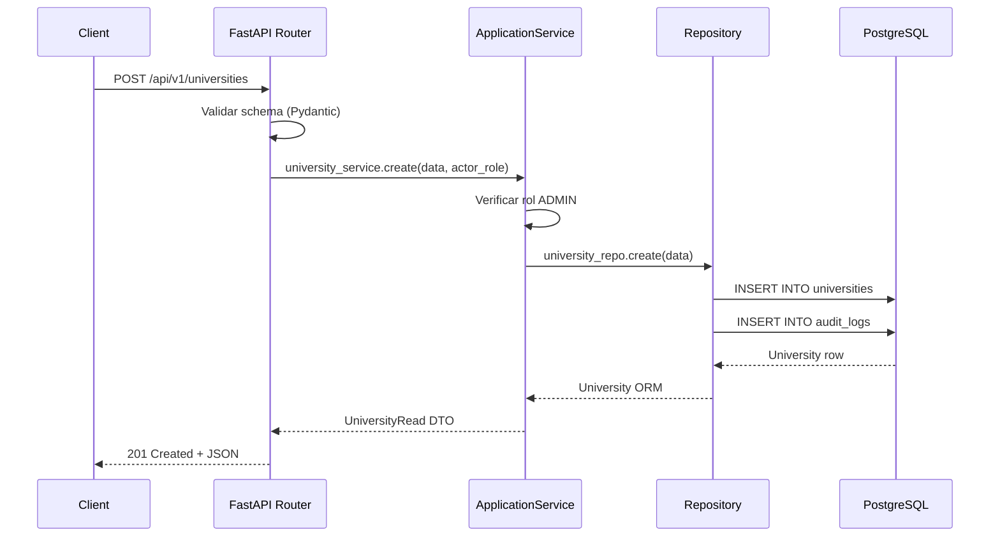

# Design Document — Multi-University Support

## Visión General

El MPRA actualmente opera con una jerarquía plana donde los programas y cursos no tienen una institución universitaria explícita como raíz. Esta funcionalidad introduce la entidad `University` como raíz de la jerarquía académica, formalizando la cadena `University → Programs → Courses → Enrollments`.

El objetivo principal es permitir que el sistema soporte múltiples universidades con aislamiento completo de datos entre ellas, mientras se refuerza la regla de negocio RB-04 (los docentes solo pueden ver datos de estudiantes inscritos en sus cursos asignados) y se formaliza la restricción de un único profesor por curso.

### Alcance del cambio

1. **Nueva entidad `University`** con CRUD completo bajo `/api/v1/universities`.
2. **Migración `0004`** que crea la tabla `universities`, agrega `university_id NOT NULL` a `programs` (con asignación a universidad por defecto para datos existentes), y convierte `program_id` en `NOT NULL` en `courses`.
3. **Restricción de unicidad** en `professor_courses.course_id` (un curso → un profesor activo).
4. **Unicidad de `program_code` por universidad** (scoped unique constraint).
5. **Endpoints de jerarquía** anidados: `/universities/{id}/programs`, `/programs/{id}/courses`, `/universities/{id}/programs/{id}/courses`.
6. **Control de acceso** por universidad para administradores y por cursos asignados para profesores.

---

## Arquitectura

El diseño sigue estrictamente la Clean Architecture ya establecida en el proyecto:

```
┌─────────────────────────────────────────────────────────────┐
│  API Layer  (app/api/v1/endpoints/)                         │
│  FastAPI routers — validación HTTP, auth, serialización     │
├─────────────────────────────────────────────────────────────┤
│  Application Layer  (app/application/)                      │
│  Services — lógica de negocio, orquestación, autorización   │
│  Schemas  — DTOs Pydantic v2 (Create / Read / Update)       │
├─────────────────────────────────────────────────────────────┤
│  Domain Layer  (app/domain/)                                │
│  Interfaces de repositorio (ABC), enums                     │
├─────────────────────────────────────────────────────────────┤
│  Infrastructure Layer  (app/infrastructure/)                │
│  SQLModel ORM models, repositorios async, Alembic           │
└─────────────────────────────────────────────────────────────┘
```

### Flujo de una solicitud típica



---

## Componentes e Interfaces

### Nuevos archivos a crear

| Capa | Archivo | Responsabilidad |
|------|---------|-----------------|
| Domain | `app/domain/interfaces/university_repository.py` | Interfaz ABC para persistencia de universidades |
| Infrastructure/Models | `app/infrastructure/models/university.py` | Modelo SQLModel `University` |
| Infrastructure/Repos | `app/infrastructure/repositories/university_repository.py` | Implementación async del repositorio |
| Application/Schemas | `app/application/schemas/university.py` | DTOs `UniversityCreate`, `UniversityRead`, `UniversityUpdate` |
| Application/Services | `app/application/services/university_service.py` | Lógica de negocio y autorización |
| API | `app/api/v1/endpoints/universities.py` | Router FastAPI |
| Migration | `alembic/versions/0004_add_university_and_multi_university_support.py` | Migración Alembic |

### Archivos a modificar

| Archivo | Cambio |
|---------|--------|
| `app/infrastructure/models/program.py` | Agregar `university_id: UUID` (FK, NOT NULL) |
| `app/infrastructure/models/course.py` | Cambiar `program_id` a NOT NULL |
| `app/infrastructure/models/professor_course.py` | Cambiar `UniqueConstraint` de `(professor_id, course_id)` a `(course_id,)` |
| `app/application/schemas/course.py` | Agregar `program_id` como campo requerido en `CourseCreate` |
| `app/domain/interfaces/course_repository.py` | Agregar métodos para listar por programa y por universidad |
| `app/infrastructure/repositories/course_repository.py` | Implementar nuevos métodos |
| `app/core/config.py` | Agregar `DEFAULT_UNIVERSITY_ID: UUID | None` |
| `app/main.py` | Registrar router de universidades |

### Interfaz del repositorio de universidades

```python
# app/domain/interfaces/university_repository.py
from abc import ABC, abstractmethod
from uuid import UUID
from app.application.schemas.university import UniversityCreate, UniversityUpdate
from app.infrastructure.models.university import University

class IUniversityRepository(ABC):

    @abstractmethod
    async def create(self, data: UniversityCreate) -> University: ...

    @abstractmethod
    async def get_by_id(self, id: UUID) -> University | None: ...

    @abstractmethod
    async def get_by_code(self, code: str) -> University | None: ...

    @abstractmethod
    async def list(self, skip: int, limit: int) -> list[University]: ...

    @abstractmethod
    async def count(self) -> int: ...

    @abstractmethod
    async def update(self, id: UUID, data: UniversityUpdate) -> University | None: ...
```

### Servicio de universidades

```python
# app/application/services/university_service.py
class UniversityService:
    def __init__(self, repo: IUniversityRepository) -> None: ...

    async def create(self, data: UniversityCreate, actor_role: RoleEnum) -> UniversityRead:
        # Verifica rol ADMIN → 403 si no
        # Verifica unicidad de code → 409 si duplicado
        # Delega a repo.create()

    async def list(self, skip: int, limit: int) -> PaginatedResponse[UniversityRead]: ...

    async def get(self, id: UUID) -> UniversityRead:
        # 404 si no existe

    async def update(self, id: UUID, data: UniversityUpdate, actor_role: RoleEnum) -> UniversityRead:
        # Verifica rol ADMIN → 403
        # 404 si no existe
```

### Endpoints de universidades

```
POST   /api/v1/universities                                    → 201 UniversityRead
GET    /api/v1/universities                                    → 200 PaginatedResponse[UniversityRead]
GET    /api/v1/universities/{university_id}                    → 200 UniversityRead | 404
PATCH  /api/v1/universities/{university_id}                    → 200 UniversityRead | 403 | 404

GET    /api/v1/universities/{university_id}/programs           → 200 PaginatedResponse[ProgramRead]
GET    /api/v1/programs/{program_id}/courses                   → 200 list[CourseRead]
GET    /api/v1/universities/{university_id}/programs/{program_id}/courses → 200 list[CourseRead] | 404

POST   /api/v1/courses/{course_id}/professor                   → 200 ProfessorCourseRead
GET    /api/v1/courses/{course_id}/professor                   → 200 UserRead | 404
GET    /api/v1/professors/{professor_id}/courses               → 200 list[CourseRead]
GET    /api/v1/courses/{course_id}/students                    → 200 list[UserRead] | 403
```

---

## Modelos de Datos

### Diagrama ER completo (estado post-migración)

```mermaid
erDiagram
    universities {
        UUID id PK
        string name
        string code UK
        string country
        string city
        boolean active
        datetime created_at
    }

    programs {
        UUID id PK
        UUID university_id FK
        string institution
        string campus
        string degree_type
        string program_code
        string program_name
        string pensum
        string academic_group
        string location
        int snies_code UK
        datetime created_at
    }

    courses {
        UUID id PK
        UUID program_id FK
        string code UK
        string name
        int credits
        string academic_period
        datetime created_at
    }

    users {
        UUID id PK
        string email UK
        string institutional_email UK
        string full_name
        RoleEnum role
        string microsoft_oid UK
        string password_hash
        boolean ml_consent
        UserStatusEnum status
        datetime created_at
        datetime updated_at
    }

    enrollments {
        UUID id PK
        UUID student_id FK
        UUID course_id FK
        datetime enrollment_date
    }

    professor_courses {
        UUID id PK
        UUID professor_id FK
        UUID course_id FK UK
    }

    student_profiles {
        UUID id PK
        UUID user_id FK UK
        UUID program_id FK
        string student_institutional_id UK
        string document_type
        string document_number
        date birth_date
        string gender
        int socioeconomic_stratum
        int semester
        datetime created_at
        datetime updated_at
    }

    audit_logs {
        UUID id PK
        string table_name
        OperationEnum operation
        UUID record_id
        UUID user_id FK
        json previous_data
        json new_data
        datetime timestamp
    }

    universities ||--o{ programs : "tiene"
    programs ||--o{ courses : "tiene"
    programs ||--o{ student_profiles : "pertenece a"
    users ||--o{ enrollments : "estudiante inscrito en"
    courses ||--o{ enrollments : "tiene inscritos"
    users ||--o{ professor_courses : "profesor asignado a"
    courses ||--|| professor_courses : "tiene exactamente un profesor"
    users ||--o| student_profiles : "tiene perfil"
    users ||--o{ audit_logs : "genera"
```

### Modelo SQLModel `University`

```python
# app/infrastructure/models/university.py
import uuid
from datetime import datetime, timezone
from sqlmodel import Field, SQLModel

class University(SQLModel, table=True):
    __tablename__ = "universities"

    id: uuid.UUID = Field(default_factory=uuid.uuid4, primary_key=True)
    name: str = Field(nullable=False)
    code: str = Field(unique=True, nullable=False, index=True)
    country: str = Field(nullable=False)
    city: str = Field(nullable=False)
    active: bool = Field(default=True, nullable=False)
    created_at: datetime = Field(
        default_factory=lambda: datetime.now(timezone.utc)
    )
```

### Cambios en modelos existentes

**`Program`** — agregar `university_id`:
```python
university_id: uuid.UUID = Field(
    foreign_key="universities.id", nullable=False, index=True
)
```
La restricción de unicidad de `program_code` cambia de global a scoped por universidad mediante un `UniqueConstraint("program_code", "university_id")` en `__table_args__`, eliminando el `unique=True` del campo.

**`Course`** — `program_id` pasa de `nullable=True` a `nullable=False`:
```python
program_id: uuid.UUID = Field(
    foreign_key="programs.id", nullable=False, index=True
)
```

**`ProfessorCourse`** — cambio de constraint:
```python
# Antes: UniqueConstraint("professor_id", "course_id")
# Después: UniqueConstraint("course_id")  ← un curso tiene exactamente un profesor
__table_args__ = (UniqueConstraint("course_id"),)
```

### Schemas Pydantic

```python
# app/application/schemas/university.py
class UniversityCreate(BaseModel):
    name: str = Field(..., description="Nombre oficial de la universidad")
    code: str = Field(..., description="Código único alfanumérico")
    country: str = Field(..., description="País de la institución")
    city: str = Field(..., description="Ciudad sede principal")
    active: bool = Field(default=True, description="Estado activo/inactivo")

class UniversityUpdate(BaseModel):
    name: str | None = None
    country: str | None = None
    city: str | None = None
    active: bool | None = None

class UniversityRead(BaseModel):
    id: UUID
    name: str
    code: str
    country: str
    city: str
    active: bool
    created_at: datetime
    model_config = {"from_attributes": True}
```

### Migración `0004`

La migración sigue el patrón establecido en `0003`. Puntos clave:

1. Crea tabla `universities`.
2. Agrega `university_id` a `programs` como `nullable=True` inicialmente.
3. Ejecuta `UPDATE programs SET university_id = :default_id` usando `DEFAULT_UNIVERSITY_ID` del entorno (falla con error descriptivo si no está configurado).
4. Altera `university_id` a `NOT NULL`.
5. Elimina el `UniqueConstraint("program_code")` global y crea `UniqueConstraint("program_code", "university_id")`.
6. Altera `courses.program_id` de `nullable=True` a `nullable=False` (solo si no hay cursos huérfanos).
7. Elimina `UniqueConstraint("professor_id", "course_id")` en `professor_courses` y crea `UniqueConstraint("course_id")`.

El `downgrade()` revierte todos los pasos en orden inverso, restaurando los constraints originales.

### Variable de entorno nueva

```python
# app/core/config.py — agregar en Settings
DEFAULT_UNIVERSITY_ID: uuid.UUID | None = Field(
    default=None,
    description="UUID de la universidad por defecto para migración de datos existentes"
)
```

---

## Propiedades de Corrección

*Una propiedad es una característica o comportamiento que debe ser verdadero en todas las ejecuciones válidas del sistema — esencialmente, una declaración formal sobre lo que el sistema debe hacer. Las propiedades sirven como puente entre las especificaciones legibles por humanos y las garantías de corrección verificables por máquina.*

### Propiedad 1: Creación de universidad con datos válidos siempre retorna el recurso creado

*Para cualquier* payload válido de universidad (name, code, country, city únicos), el endpoint `POST /api/v1/universities` SHALL retornar `201 Created` con un recurso cuyo contenido sea equivalente al payload enviado.

**Valida: Requisito 1.2**

---

### Propiedad 2: Listado paginado es consistente con el total

*Para cualquier* conjunto de universidades en la base de datos y cualquier combinación válida de `skip` y `limit`, la suma de los tamaños de todas las páginas debe ser igual al campo `total` retornado, y ninguna universidad debe aparecer en más de una página.

**Valida: Requisito 1.4**

---

### Propiedad 3: Round-trip de universidad por ID

*Para cualquier* universidad creada en el sistema, hacer `GET /api/v1/universities/{id}` debe retornar un objeto con los mismos campos que el recurso creado originalmente.

**Valida: Requisito 1.5**

---

### Propiedad 4: Actualización parcial no modifica campos no provistos

*Para cualquier* universidad existente y cualquier subconjunto de campos actualizables (name, country, city, active), hacer `PATCH` con ese subconjunto debe resultar en que solo esos campos cambien; todos los demás campos (incluyendo `id`, `code`, `created_at`) deben permanecer idénticos.

**Valida: Requisito 1.6**

---

### Propiedad 5: Usuarios no-ADMIN no pueden escribir universidades

*Para cualquier* usuario con rol `STUDENT` o `PROFESSOR`, cualquier operación de escritura (POST, PATCH) sobre el recurso `/api/v1/universities` debe retornar `403 Forbidden`.

**Valida: Requisito 1.7**

---

### Propiedad 6: Aislamiento de programas por universidad

*Para cualquier* universidad U, el endpoint `GET /api/v1/universities/{U.id}/programs` debe retornar únicamente programas cuyo `university_id` sea igual a `U.id`. Nunca debe retornar programas de otra universidad, independientemente de cuántas universidades y programas existan en el sistema.

**Valida: Requisito 2.4, 6.1, 6.3**

---

### Propiedad 7: Unicidad de program_code dentro de una universidad

*Para cualquier* par de programas con el mismo `program_code`, si ambos pertenecen a la misma universidad, el segundo intento de creación debe retornar `409 Conflict`. Si pertenecen a universidades distintas, ambas creaciones deben tener éxito.

**Valida: Requisito 2.5**

---

### Propiedad 8: Aislamiento de cursos por programa

*Para cualquier* programa P, el endpoint `GET /api/v1/programs/{P.id}/courses` debe retornar únicamente cursos cuyo `program_id` sea igual a `P.id`. Nunca debe retornar cursos de otro programa.

**Valida: Requisito 3.4, 6.3**

---

### Propiedad 9: Validación jerárquica universidad→programa→cursos

*Para cualquier* par `(university_id, program_id)` donde el programa NO pertenece a esa universidad, el endpoint `GET /api/v1/universities/{university_id}/programs/{program_id}/courses` debe retornar `404 Not Found`. Solo cuando el programa pertenece a la universidad debe retornar los cursos.

**Valida: Requisito 3.5, 6.3**

---

### Propiedad 10: Un curso tiene exactamente un profesor asignado (idempotencia de asignación)

*Para cualquier* curso C, si se asigna el profesor A y luego se asigna el profesor B al mismo curso, el resultado final debe ser que solo B está asignado a C. La operación de asignación es idempotente en el sentido de que siempre resulta en exactamente una asignación activa por curso.

**Valida: Requisito 4.1, 4.2**

---

### Propiedad 11: Round-trip de asignación profesor-curso

*Para cualquier* profesor P asignado a un curso C, el endpoint `GET /api/v1/courses/{C.id}/professor` debe retornar los datos de P. Asimismo, `GET /api/v1/professors/{P.id}/courses` debe incluir a C en su lista.

**Valida: Requisito 4.5, 4.6**

---

### Propiedad 12: RB-04 — Profesor solo ve estudiantes de sus cursos asignados

*Para cualquier* profesor P y cualquier estudiante S, P puede acceder a los datos de S si y solo si existe al menos un curso C tal que P está asignado a C y S está inscrito en C. Para cualquier estudiante S que no cumpla esta condición respecto a P, cualquier intento de P de acceder a los datos de S debe retornar `403 Forbidden`.

**Valida: Requisito 5.1, 5.3, 5.4**

---

### Propiedad 13: Escritura de notas en curso no asignado retorna 403

*Para cualquier* profesor P y cualquier curso C al que P NO está asignado, cualquier operación de escritura de notas sobre C por parte de P debe retornar `403 Forbidden`.

**Valida: Requisito 5.2**

---

### Propiedad 14: Toda escritura de notas genera entrada en audit_log

*Para cualquier* operación de escritura de notas realizada por un profesor, debe existir exactamente una entrada en `audit_logs` con los campos `professor_id`, `course_id`, `student_id`, `timestamp` y tipo de operación correctamente registrados.

**Valida: Requisito 5.5**

---

### Propiedad 15: Confluencia del filtro por universidad

*Para cualquier* `university_id` U, el conjunto de cursos obtenido mediante la ruta `universities/{U}/programs/{P}/courses` debe ser idéntico al conjunto obtenido filtrando todos los cursos por `program_id` ∈ {programas de U}. El orden de aplicación de los filtros de jerarquía no debe afectar el resultado.

**Valida: Requisito 6.4**

---

### Propiedad 16: Reversibilidad de la migración

*Para cualquier* estado de base de datos con datos en `programs` y `courses`, aplicar la migración `0004` y luego revertirla con `downgrade()` debe restaurar el esquema al estado previo sin pérdida de registros en `programs` ni `courses`.

**Valida: Requisito 7.4**

---

## Manejo de Errores

### Tabla de errores por operación

| Operación | Condición | Código HTTP | Mensaje |
|-----------|-----------|-------------|---------|
| POST /universities | `code` duplicado | 409 | "El código de universidad ya existe" |
| POST /universities | Rol no ADMIN | 403 | "Se requiere rol ADMIN" |
| GET /universities/{id} | ID no existe | 404 | "Universidad no encontrada" |
| PATCH /universities/{id} | Rol no ADMIN | 403 | "Se requiere rol ADMIN" |
| POST /programs | `university_id` no existe | 422 | "La universidad referenciada no existe" |
| POST /programs | `program_code` duplicado en misma universidad | 409 | "El código de programa ya existe en esta universidad" |
| POST /courses | `program_id` no existe | 422 | "El programa referenciado no existe" |
| POST /courses/{id}/professor | `professor_id` no tiene rol PROFESSOR | 422 | "El usuario indicado no tiene rol de profesor" |
| POST /courses/{id}/professor | `course_id` no existe | 404 | "Curso no encontrado" |
| GET /universities/{uid}/programs/{pid}/courses | Programa no pertenece a universidad | 404 | "El programa no pertenece a la universidad indicada" |
| Escritura de notas | Profesor no asignado al curso | 403 | "No tiene permiso para operar en este curso" |
| Acceso a datos de estudiante | Estudiante no inscrito en cursos del profesor | 403 | "Acceso denegado: el estudiante no está inscrito en sus cursos" |
| Migración 0004 | `DEFAULT_UNIVERSITY_ID` no configurado | Error de migración | "DEFAULT_UNIVERSITY_ID no está configurado. Configure esta variable de entorno antes de ejecutar la migración." |

### Estrategia de manejo de errores

- Todos los errores de negocio se lanzan como `HTTPException` desde la capa de servicio.
- La capa de repositorio lanza `IntegrityError` de SQLAlchemy para violaciones de constraints; los servicios los capturan y los convierten en `HTTPException` con el código apropiado.
- La migración `0004` verifica `DEFAULT_UNIVERSITY_ID` al inicio del `upgrade()` y lanza `SystemExit` con mensaje descriptivo antes de realizar cualquier cambio si no está configurado.
- Los errores de validación de Pydantic (campos faltantes, tipos incorrectos) son manejados automáticamente por FastAPI y retornan `422 Unprocessable Entity`.

---

## Estrategia de Testing

### Enfoque dual: tests de ejemplo + tests de propiedad

El proyecto usa `pytest` con `hypothesis` (ya presente en `.hypothesis/`) para property-based testing. Cada propiedad del diseño se implementa como un test de Hypothesis con mínimo 100 iteraciones.

### Librería de PBT

**Hypothesis** (Python) — ya instalada en el proyecto (evidenciado por el directorio `.hypothesis/`).

### Organización de tests

```
tests/
├── unit/
│   ├── test_university_service.py       # Tests de ejemplo para servicios
│   ├── test_program_service.py
│   └── test_course_service.py
├── integration/
│   ├── test_university_endpoints.py     # Tests de integración con DB real
│   ├── test_program_endpoints.py
│   └── test_migration_0004.py           # Tests de migración
└── property/
    ├── test_university_properties.py    # Propiedades 1–5
    ├── test_hierarchy_properties.py     # Propiedades 6–9, 15
    ├── test_professor_properties.py     # Propiedades 10–11
    ├── test_access_control_properties.py # Propiedades 12–13
    ├── test_audit_properties.py         # Propiedad 14
    └── test_migration_properties.py     # Propiedad 16
```

### Configuración de Hypothesis

```python
from hypothesis import given, settings, HealthCheck
from hypothesis import strategies as st

@settings(
    max_examples=100,
    suppress_health_check=[HealthCheck.too_slow],
)
@given(
    name=st.text(min_size=1, max_size=200),
    code=st.from_regex(r"[A-Z0-9]{3,20}", fullmatch=True),
    country=st.text(min_size=1, max_size=100),
    city=st.text(min_size=1, max_size=100),
)
async def test_university_creation_round_trip(name, code, country, city):
    # Feature: multi-university-support, Property 3: Round-trip de universidad por ID
    ...
```

### Tests de ejemplo (unit)

- Verificar que `UniversityService.create()` lanza `HTTPException(409)` cuando el código ya existe.
- Verificar que `UniversityService.create()` lanza `HTTPException(403)` para roles no-ADMIN.
- Verificar que `ProfessorCourse` con `UniqueConstraint("course_id")` rechaza una segunda asignación sin reemplazo.
- Verificar que la migración falla con mensaje descriptivo cuando `DEFAULT_UNIVERSITY_ID` no está configurado.

### Tests de integración

- Ejecutar migración `0004` sobre una base de datos con datos existentes y verificar que todos los programas tienen `university_id = DEFAULT_UNIVERSITY_ID`.
- Ejecutar `upgrade()` + `downgrade()` y verificar que el esquema vuelve al estado `0003`.
- Verificar que `GET /universities/{id}/programs` nunca retorna programas de otra universidad (con datos reales en DB).

### Cobertura esperada

- Todas las propiedades del diseño deben tener al menos un test de propiedad con 100 iteraciones.
- Los edge cases (409, 422, 404, 403) deben tener tests de ejemplo específicos.
- La migración debe tener tests de integración para los escenarios: DB vacía, DB con datos, sin `DEFAULT_UNIVERSITY_ID`.
