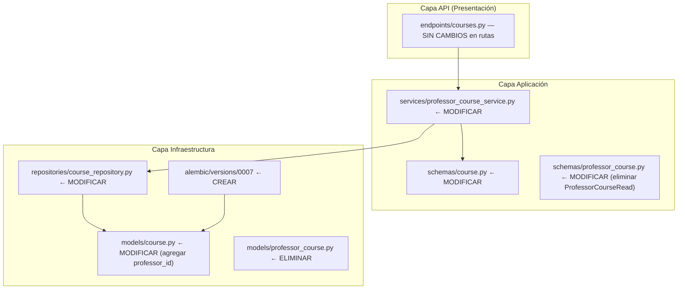
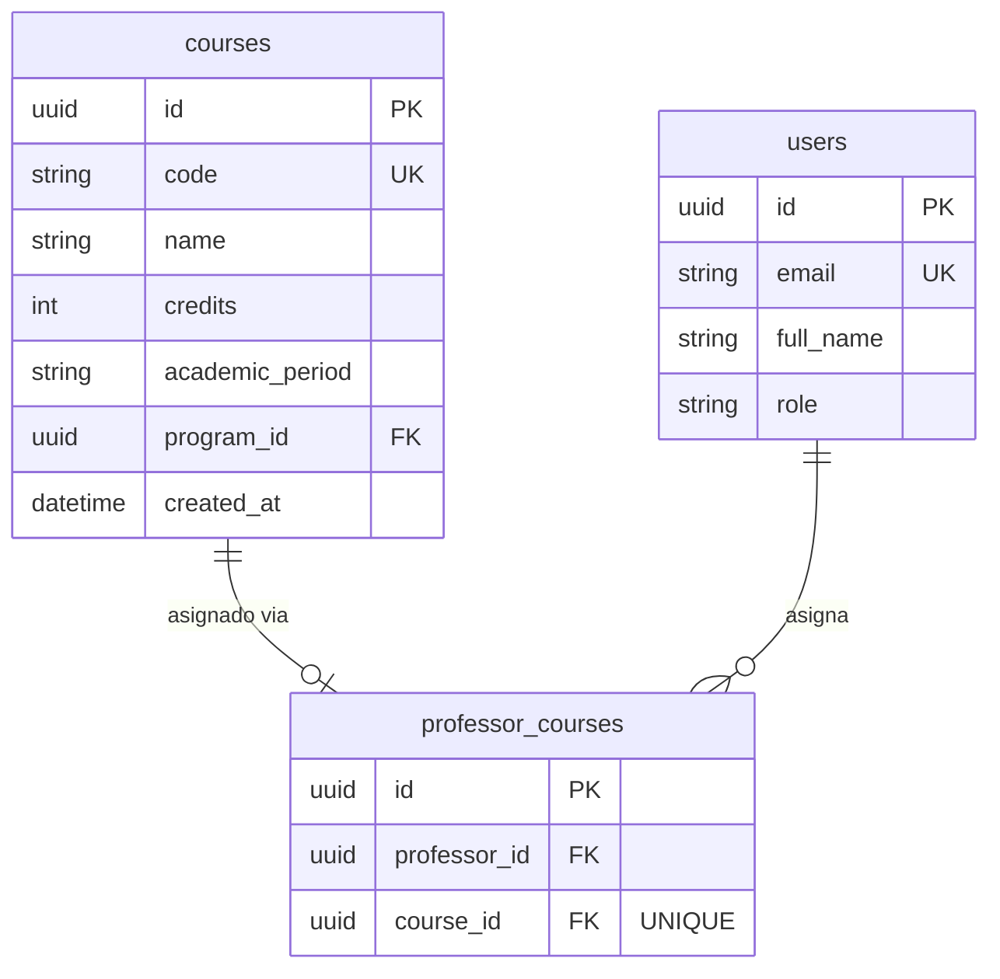
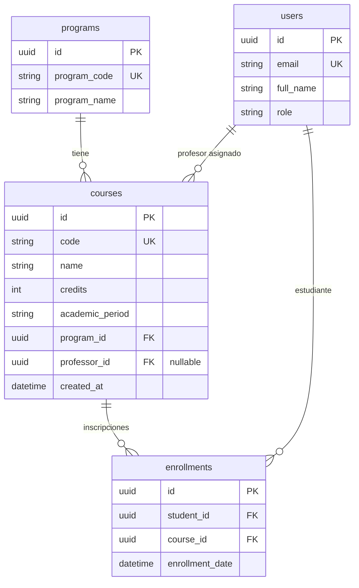

# Documento de Diseño — Simplificación Profesor-Curso: Eliminar tabla intermedia

## Resumen

Este diseño describe la simplificación de la relación profesor-curso en el sistema MPRA, pasando de una tabla intermedia `professor_courses` con columnas `(id, professor_id, course_id)` a una columna `professor_id` (FK nullable → `users.id`) directamente en la tabla `courses`. La simplificación es segura porque la relación ya es 1:1 (la tabla intermedia tiene `UNIQUE(course_id)`).

La refactorización implica:

1. **Migración de base de datos** (0007): agregar `professor_id` a `courses`, migrar datos desde `professor_courses`, eliminar la tabla intermedia.
2. **Eliminación de infraestructura**: modelo ORM `ProfessorCourse`, schema `ProfessorCourseRead`, y todas las referencias a la tabla intermedia.
3. **Simplificación de queries**: eliminar JOINs con `professor_courses` en el repositorio y servicio, reemplazándolos por acceso directo a `Course.professor_id`.
4. **Preservación del contrato API**: mismas rutas, métodos HTTP, y formas de respuesta.
5. **Preservación de RB-04**: el control de acceso profesor→estudiantes usa `Course.professor_id` en lugar de la tabla intermedia.
6. **Auditoría**: las operaciones de asignación referencian `table_name="courses"` en lugar de `"professor_courses"`.

## Arquitectura

El sistema sigue Clean Architecture con tres capas. La simplificación afecta las capas de Infraestructura y Aplicación, sin cambios en la capa API (mismas rutas y contratos):



### Decisiones de Diseño

1. **`professor_id` es nullable**: Un curso puede existir sin profesor asignado. Esto preserva el comportamiento actual donde la ausencia de fila en `professor_courses` significaba "sin profesor".

2. **El endpoint `POST /courses/{course_id}/professor` sigue retornando `{id, professor_id, course_id}`**: Para mantener compatibilidad con el contrato actual, el servicio construye un objeto de respuesta con estos tres campos. El `id` será el `id` del curso (ya que no existe un registro separado de asignación). Esto es un cambio interno transparente para los clientes.

3. **`ProfessorCourseRead` se elimina, se reemplaza por un DTO de compatibilidad**: El servicio retornará un nuevo schema `ProfessorAssignmentRead` con los mismos campos `(id, professor_id, course_id)` para mantener el contrato. Alternativamente, se puede mantener `ProfessorCourseRead` renombrado conceptualmente pero con los mismos campos — la decisión es mantener el schema con los mismos campos pero construirlo desde `Course` en lugar de desde `ProfessorCourse`.

4. **Migración 0007 es reversible**: el `downgrade()` recrea la tabla `professor_courses`, migra los datos de vuelta desde `courses.professor_id`, y elimina la columna. Los cursos sin profesor asignado (`professor_id IS NULL`) no generan filas en la tabla recreada.

5. **Audit log cambia `table_name` de `"professor_courses"` a `"courses"`**: Refleja que la operación ahora modifica directamente la tabla `courses`.

## Componentes e Interfaces

### Componentes a Eliminar

| Capa | Archivo | Componente |
|------|---------|------------|
| Infraestructura / Modelos | `app/infrastructure/models/professor_course.py` | Clase `ProfessorCourse` + archivo completo |
| Aplicación / Schemas | `app/application/schemas/professor_course.py` | Clase `ProfessorCourseRead` (se elimina del archivo) |

### Componentes a Modificar

#### 1. Modelo ORM `Course` (`app/infrastructure/models/course.py`)

**Estado actual**: sin campo `professor_id`.

**Estado objetivo**:
```python
class Course(SQLModel, table=True):
    __tablename__ = "courses"

    id: uuid.UUID = Field(default_factory=uuid.uuid4, primary_key=True)
    code: str = Field(unique=True, nullable=False, index=True)
    name: str = Field(nullable=False)
    credits: int = Field(nullable=False)
    academic_period: str = Field(nullable=False)
    program_id: uuid.UUID = Field(
        foreign_key="programs.id", nullable=False, index=True
    )
    professor_id: uuid.UUID | None = Field(
        default=None, foreign_key="users.id", nullable=True, index=True
    )  # FK → users.id (profesor asignado, nullable)
    created_at: datetime = Field(...)
```

Campo nuevo: `professor_id` (UUID nullable, FK → `users.id`, indexado).

#### 2. Schema `CourseRead` (`app/application/schemas/course.py`)

**Estado actual**: sin campo `professor_id`.

**Estado objetivo**:
```python
class CourseRead(BaseModel):
    id: UUID
    code: str
    name: str
    credits: int
    academic_period: str
    professor_id: UUID | None = None
    created_at: datetime

    model_config = {"from_attributes": True}
```

Campo nuevo: `professor_id: UUID | None = None`.

`CourseCreate` permanece sin cambios (la asignación de profesor se hace por endpoint dedicado).

#### 3. Schema `ProfessorAssign` (`app/application/schemas/professor_course.py`)

**Sin cambios** — mantiene el campo `professor_id: UUID`. Se elimina `ProfessorCourseRead` del archivo. Se agrega un nuevo schema de respuesta de compatibilidad:

```python
class ProfessorAssignmentRead(BaseModel):
    """Respuesta de compatibilidad para POST /courses/{course_id}/professor."""
    id: UUID
    professor_id: UUID
    course_id: UUID

    model_config = {"from_attributes": False}
```

Este schema reemplaza a `ProfessorCourseRead` y se construye manualmente en el servicio usando `course.id`, `course.professor_id`, y `course_id`.

#### 4. Servicio `ProfessorCourseService` (`app/application/services/professor_course_service.py`)

**Cambios principales**:

- **Eliminar** import de `ProfessorCourse`.
- **Eliminar** import de `ProfessorCourseRead`, reemplazar por `ProfessorAssignmentRead`.
- **`assign_professor`**: en lugar de crear/actualizar un registro en `professor_courses`, actualiza directamente `course.professor_id`. Retorna `ProfessorAssignmentRead(id=course.id, professor_id=professor_id, course_id=course.id)`.
- **`get_course_professor`**: en lugar de JOIN con `professor_courses`, lee `course.professor_id` y hace JOIN con `users`.
- **`verify_professor_assigned_to_course`**: en lugar de buscar en `professor_courses`, verifica `course.professor_id == professor_id`.
- **Audit log**: cambia `table_name` de `"professor_courses"` a `"courses"`, y `record_id` usa `course.id`.

#### 5. Repositorio `CourseRepository` (`app/infrastructure/repositories/course_repository.py`)

**Cambios principales**:

- **Eliminar** import de `ProfessorCourse`.
- **`listar_por_docente`**: reemplazar JOIN con `professor_courses` por filtro directo `Course.professor_id == docente_id`.

**Estado objetivo de `listar_por_docente`**:
```python
async def listar_por_docente(self, docente_id: UUID) -> list[Course]:
    stmt = select(Course).where(Course.professor_id == docente_id)
    result = await self._session.execute(stmt)
    return list(result.scalars().all())
```

#### 6. Interfaz `ICourseRepository` (`app/domain/interfaces/course_repository.py`)

**Sin cambios en la interfaz** — el método `listar_por_docente` mantiene la misma firma. Solo cambia la implementación interna.

#### 7. `app/infrastructure/models/__init__.py`

**Eliminar** import y export de `ProfessorCourse`.

#### 8. Endpoint `courses.py` (`app/api/v1/endpoints/courses.py`)

**Cambio mínimo**: actualizar import de `ProfessorCourseRead` a `ProfessorAssignmentRead` en el `response_model` del endpoint `POST /courses/{course_id}/professor`.

## Modelos de Datos

### Diagrama ER — Estado Actual vs. Estado Objetivo

**Estado actual**:


**Estado objetivo**:


### Migración 0007: `simplify_professor_course_model`

**Revisión padre**: `0006`

#### Función `upgrade()`

Orden de operaciones:

1. Agregar columna `professor_id` (UUID, nullable) a la tabla `courses`.
2. Crear FK `fk_courses_professor_id` desde `courses.professor_id` hacia `users.id`.
3. Crear índice `ix_courses_professor_id` sobre `courses.professor_id`.
4. Ejecutar SQL de migración de datos:
   ```sql
   UPDATE courses
   SET professor_id = pc.professor_id
   FROM professor_courses pc
   WHERE courses.id = pc.course_id
   ```
5. Eliminar tabla `professor_courses` (incluye sus índices y constraints).

#### Función `downgrade()`

Orden de operaciones:

1. Recrear tabla `professor_courses` con columnas `(id UUID PK, professor_id UUID FK → users.id, course_id UUID FK → courses.id)` y `UNIQUE(course_id)`.
2. Ejecutar SQL de migración inversa:
   ```sql
   INSERT INTO professor_courses (id, professor_id, course_id)
   SELECT gen_random_uuid(), professor_id, id
   FROM courses
   WHERE professor_id IS NOT NULL
   ```
3. Eliminar índice `ix_courses_professor_id`.
4. Eliminar FK `fk_courses_professor_id`.
5. Eliminar columna `professor_id` de `courses`.

> **Nota**: El `downgrade()` genera nuevos UUIDs para los registros recreados en `professor_courses`, ya que los IDs originales se pierden. Esto es aceptable para el MVP.

## Propiedades de Correctitud

*Una propiedad es una característica o comportamiento que debe cumplirse en todas las ejecuciones válidas de un sistema — esencialmente, una declaración formal sobre lo que el sistema debe hacer. Las propiedades sirven como puente entre especificaciones legibles por humanos y garantías de correctitud verificables por máquina.*

### Propiedad 1: Idempotencia de asignación — el último profesor gana

*Para cualquier* curso y *para cualquier* secuencia de profesores válidos `[P1, P2, ..., Pn]` asignados secuencialmente al curso, después de todas las asignaciones, `Course.professor_id` debe ser igual a `Pn` (el último profesor asignado), y cada asignación intermedia debe retornar una respuesta con `professor_id` igual al profesor recién asignado y `course_id` igual al curso.

**Valida: Requerimientos 4.1, 4.2**

### Propiedad 2: Round-trip de asignación profesor-curso

*Para cualquier* profesor P asignado a un curso C: (1) `assign_professor(C, P)` retorna una respuesta con `professor_id == P` y `course_id == C`; (2) `get_course_professor(C)` retorna un `UserRead` con `id == P`; (3) `list_professor_courses(P)` retorna una lista que contiene C. Las tres vistas del estado son consistentes entre sí.

**Valida: Requerimientos 5.1, 5.3, 5.4, 7.6**

### Propiedad 3: Validación de rol — usuarios no-profesor son rechazados

*Para cualquier* usuario que no tenga rol `PROFESSOR` (incluyendo usuarios inexistentes), intentar asignarlo a cualquier curso debe resultar en un error HTTP 422, y el `professor_id` del curso debe permanecer sin cambios.

**Valida: Requerimientos 4.3**

### Propiedad 4: Control de acceso RB-04 — acceso condicionado a Course.professor_id

*Para cualquier* par (profesor, curso), el acceso a la lista de estudiantes del curso se concede si y solo si `Course.professor_id` coincide con el ID del profesor. Si no coincide, el servicio retorna HTTP 403. Esta propiedad aplica tanto para listar estudiantes como para registrar notas.

**Valida: Requerimientos 6.1, 6.2, 6.3**

### Propiedad 5: Guarda de inscripción — notas denegadas para estudiantes no inscritos

*Para cualquier* estudiante que no esté inscrito en un curso (sin registro en `enrollments`), intentar registrar una nota para ese estudiante en ese curso debe resultar en un error HTTP 403, incluso si el profesor está correctamente asignado al curso.

**Valida: Requerimientos 6.4**

### Propiedad 6: Correctitud del audit trail — operaciones referencian tabla "courses"

*Para cualquier* operación de asignación de profesor a un curso: si el curso no tenía profesor asignado, el audit log debe registrar una operación `INSERT` con `table_name="courses"` y `new_data` conteniendo `professor_id` y `course_id`; si el curso ya tenía profesor, el audit log debe registrar una operación `UPDATE` con `table_name="courses"`, `previous_data` conteniendo el `professor_id` anterior, y `new_data` conteniendo el nuevo `professor_id` y `course_id`.

**Valida: Requerimientos 4.5, 8.1, 8.2, 8.3**

## Manejo de Errores

### Errores de la API

| Escenario | Código HTTP | Mensaje |
|-----------|-------------|---------|
| Asignar profesor a curso inexistente | 404 | "Curso no encontrado" |
| Asignar usuario sin rol PROFESSOR | 422 | "El usuario indicado no tiene rol de profesor" |
| Consultar profesor de curso sin asignación | 404 | "El curso no tiene profesor asignado" |
| Profesor no asignado intenta listar estudiantes | 403 | "No tiene permiso para operar en este curso" |
| Profesor intenta registrar nota de estudiante no inscrito | 403 | "Acceso denegado: el estudiante no está inscrito en sus cursos" |

### Errores de Migración

| Escenario | Comportamiento |
|-----------|---------------|
| Migración 0007 falla a mitad de ejecución | Alembic hace rollback automático de la transacción DDL |
| `downgrade()` ejecutado después de `upgrade()` | Recrea tabla `professor_courses` con datos migrados de vuelta; cursos sin profesor no generan filas |
| FK violation durante migración de datos | No puede ocurrir — los `professor_id` en `professor_courses` ya referencian `users.id` válidos |

### Errores de Integridad de Datos

- **Cursos sin profesor**: Válido — `professor_id` es nullable. Representa un curso sin profesor asignado.
- **Profesor eliminado con cursos asignados**: La FK `fk_courses_professor_id` previene la eliminación del usuario. Se requiere desasignar primero.

## Estrategia de Testing

### Enfoque Dual: Tests Unitarios + Tests de Propiedades

El proyecto usa **Hypothesis** como librería de property-based testing (ya configurada, evidenciado por el directorio `.hypothesis/` y los tests existentes en `tests/property/`).

### Tests de Propiedades (PBT)

Cada propiedad del documento de diseño se implementará como un test basado en propiedades usando Hypothesis:

- **Mínimo 100 iteraciones** por test de propiedad
- Cada test debe referenciar la propiedad del documento de diseño
- Formato de tag: **Feature: professor-course-simplification, Property {número}: {texto}**
- Archivo: `tests/property/test_professor_course_simplification_property.py`

| Propiedad | Estrategia de Generación |
|-----------|--------------------------|
| 1: Idempotencia de asignación | Generar listas de 2-5 UUIDs de profesores y un UUID de curso. Asignar secuencialmente, verificar que el último gana. |
| 2: Round-trip asignación | Generar un profesor y un curso con datos aleatorios. Asignar, luego consultar por ambas vías (get professor, list courses). |
| 3: Validación de rol | Generar usuarios con roles aleatorios (STUDENT, ADMIN, None). Intentar asignar, verificar 422. |
| 4: RB-04 acceso | Generar pares (profesor, curso) donde algunos coinciden en professor_id y otros no. Verificar 403 vs acceso. |
| 5: Guarda de inscripción | Generar tríos (profesor, curso, estudiante) donde el estudiante no está inscrito. Verificar 403. |
| 6: Audit trail | Generar asignaciones nuevas y reemplazos. Verificar que el audit log recibe los parámetros correctos. |

### Tests Unitarios

- **Archivo**: `tests/unit/test_course_model.py` (nuevo o extender existente)
- Verificar que `Course` tiene campo `professor_id` con tipo correcto y nullable
- Verificar que `CourseRead` incluye `professor_id: UUID | None`
- Verificar que `CourseCreate` no incluye `professor_id`
- Verificar que `ProfessorAssign` mantiene su estructura
- Verificar que `ProfessorCourseRead` ya no existe
- Verificar que `CourseRepository` no importa `ProfessorCourse`

### Tests de Integración

- **Archivo**: `tests/integration/test_course_repository.py` (extender existente)
- `POST /courses/{course_id}/professor` retorna 200 con `{id, professor_id, course_id}`
- `GET /courses/{course_id}/professor` retorna `UserRead` correcto
- `GET /professors/{professor_id}/courses` retorna `list[CourseRead]` con `professor_id` incluido
- `GET /courses/{course_id}/students` sigue funcionando con RB-04

### Tests de Migración (Smoke)

- **Archivo**: `tests/integration/test_migration_0007.py` (nuevo)
- Verificar que la migración 0007 se ejecuta sin errores
- Verificar que la tabla `professor_courses` no existe después del upgrade
- Verificar que la columna `professor_id` existe en `courses` después del upgrade
- Verificar que el índice `ix_courses_professor_id` existe
- Verificar que la FK `fk_courses_professor_id` existe
- Verificar round-trip: upgrade → downgrade restaura el esquema original
