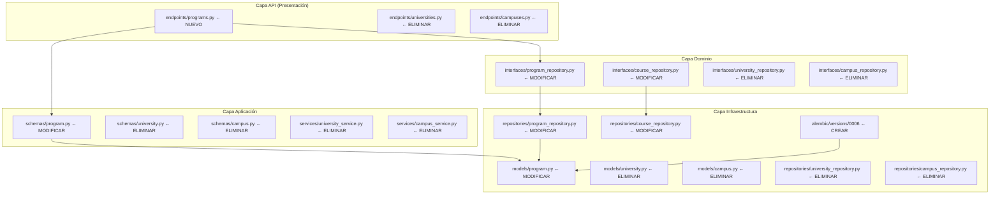
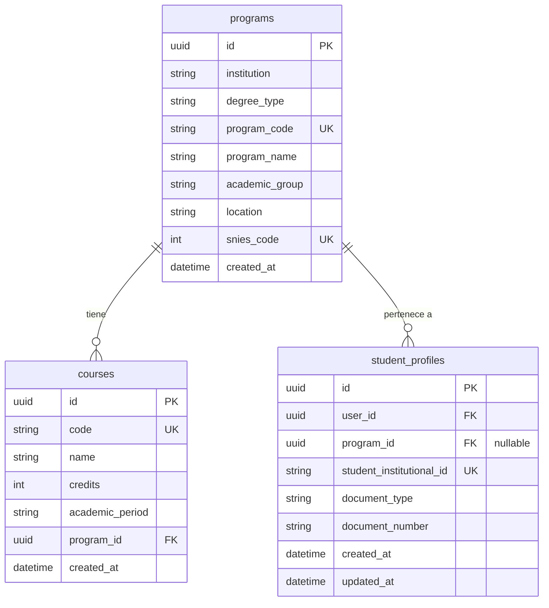

# Documento de Diseño — Simplificación del Modelo de Datos: Programa → Curso

## Resumen

Este diseño describe la simplificación del modelo de datos del sistema MPRA, pasando de una jerarquía de cuatro niveles (Universidad → Campus → Programa → Curso) a una relación directa de dos niveles (Programa → Curso). La simplificación implica:

1. **Migración de base de datos** (0006): eliminar columnas `campus_id` y `university_id` de `programs`, eliminar tablas `campuses` y `universities`, restaurar unicidad global de `program_code`.
2. **Eliminación de infraestructura**: modelos ORM, repositorios, interfaces de dominio, servicios, schemas Pydantic y endpoints API de University y Campus.
3. **Simplificación del modelo Program**: autónomo, sin FKs a tablas externas de jerarquía.
4. **Preservación de relaciones existentes**: `Course.program_id` y `StudentProfile.program_id` permanecen intactos.

## Arquitectura

El sistema sigue Clean Architecture con tres capas. La simplificación afecta todas las capas:



### Decisiones de Diseño

1. **Endpoint `GET /programs/{program_id}/courses` se reubica**: actualmente vive en `universities.py`. Se moverá a un nuevo archivo `programs.py` o se integrará en el router existente que sea más apropiado. Dado que los endpoints de profesor-curso (`/courses/{course_id}/professor`, `/professors/{professor_id}/courses`, `/courses/{course_id}/students`) actualmente viven en `universities.py`, estos se reubicarán a un archivo dedicado o se mantendrán en su lugar lógico.

2. **Migración 0006 es destructiva pero reversible**: el `downgrade()` recrea las tablas y columnas eliminadas, aunque los datos originales de universidades y campus se pierden (aceptable para MVP).

3. **`program_code` vuelve a ser globalmente único**: se elimina el scope por campus/universidad, restaurando la restricción original de la migración 0003.

4. **No se crea un servicio `ProgramService` completo**: los endpoints de programa son de solo lectura (GET) para el MVP, por lo que la lógica se mantiene simple en el endpoint con acceso directo al repositorio.

## Componentes e Interfaces

### Componentes a Eliminar

| Capa | Archivo | Componente |
|------|---------|------------|
| Infraestructura / Modelos | `app/infrastructure/models/university.py` | Clase `University` |
| Infraestructura / Modelos | `app/infrastructure/models/campus.py` | Clase `Campus` |
| Infraestructura / Repositorios | `app/infrastructure/repositories/university_repository.py` | Clase `UniversityRepository` |
| Infraestructura / Repositorios | `app/infrastructure/repositories/campus_repository.py` | Clase `CampusRepository` |
| Dominio / Interfaces | `app/domain/interfaces/university_repository.py` | Clase `IUniversityRepository` |
| Dominio / Interfaces | `app/domain/interfaces/campus_repository.py` | Clase `ICampusRepository` |
| Aplicación / Servicios | `app/application/services/university_service.py` | Clase `UniversityService` |
| Aplicación / Servicios | `app/application/services/campus_service.py` | Clase `CampusService` |
| Aplicación / Schemas | `app/application/schemas/university.py` | `UniversityCreate`, `UniversityUpdate`, `UniversityRead` |
| Aplicación / Schemas | `app/application/schemas/campus.py` | `CampusCreate`, `CampusUpdate`, `CampusRead` |
| API / Endpoints | `app/api/v1/endpoints/universities.py` | Router completo |
| API / Endpoints | `app/api/v1/endpoints/campuses.py` | Router completo |

### Componentes a Modificar

#### 1. Modelo ORM `Program` (`app/infrastructure/models/program.py`)

**Estado actual**: tiene `campus_id` (FK → campuses), `university_id` (FK → universities), y `UniqueConstraint("program_code", "campus_id")`.

**Estado objetivo**:
```python
class Program(SQLModel, table=True):
    __tablename__ = "programs"

    id: uuid.UUID = Field(default_factory=uuid.uuid4, primary_key=True)
    institution: str = Field(nullable=False)
    degree_type: str = Field(nullable=False)
    program_code: str = Field(unique=True, nullable=False, index=True)
    program_name: str = Field(nullable=False)
    academic_group: str = Field(nullable=False)
    location: str = Field(nullable=False)
    snies_code: int = Field(unique=True, nullable=False, index=True)
    created_at: datetime = Field(...)
```

Campos eliminados: `campus_id`, `university_id`.
Restricción cambiada: `UniqueConstraint("program_code", "campus_id")` → `unique=True` en `program_code`.

#### 2. Schema `ProgramRead` (`app/application/schemas/program.py`)

**Estado objetivo**:
```python
class ProgramRead(BaseModel):
    id: UUID
    institution: str
    degree_type: str
    program_code: str
    program_name: str
    academic_group: str
    location: str
    snies_code: int
    created_at: datetime
    model_config = {"from_attributes": True}
```

Campos eliminados: `university_id`, `campus_id`.

#### 3. Interfaz `IProgramRepository` (`app/domain/interfaces/program_repository.py`)

**Estado objetivo**:
```python
class IProgramRepository(ABC):
    @abstractmethod
    async def get_by_id(self, program_id: UUID) -> Program | None: ...

    @abstractmethod
    async def list_all(self, skip: int, limit: int) -> list[Program]: ...

    @abstractmethod
    async def count_all(self) -> int: ...
```

Métodos eliminados: `list_by_campus`, `count_by_campus`.
Métodos nuevos: `list_all`, `count_all`.

#### 4. Repositorio `ProgramRepository` (`app/infrastructure/repositories/program_repository.py`)

Implementa los nuevos métodos `list_all` y `count_all` sin filtros por universidad ni campus. Elimina `list_by_campus` y `count_by_campus`.

#### 5. Interfaz `ICourseRepository` (`app/domain/interfaces/course_repository.py`)

Métodos eliminados: `listar_por_universidad_y_programa`, `listar_por_campus_y_programa`.
Método conservado: `listar_por_programa`.

#### 6. Repositorio `CourseRepository` (`app/infrastructure/repositories/course_repository.py`)

Elimina los métodos `listar_por_universidad_y_programa` y `listar_por_campus_y_programa`. Elimina imports de `Program` que ya no se necesitan para joins de jerarquía.

#### 7. `app/infrastructure/models/__init__.py`

Elimina imports y exports de `University` y `Campus`.

#### 8. `app/main.py`

Elimina imports y registros de routers de `universities` y `campuses`. Agrega registro del nuevo router de programas.

### Componentes Nuevos

#### Router de Programas (`app/api/v1/endpoints/programs.py`)

Nuevo archivo que contiene los endpoints reubicados:

- `GET /programs/{program_id}/courses` — lista cursos de un programa (reubicado desde `universities.py`)

Los endpoints de profesor-curso (`/courses/...`, `/professors/...`) permanecen en `universities.py` renombrado o se mueven a un archivo dedicado. Para minimizar el alcance del cambio, estos endpoints se reubicarán a un nuevo archivo `courses.py` o se mantendrán en un archivo existente.

**Decisión**: Los endpoints `/courses/{course_id}/professor`, `/courses/{course_id}/students`, `/professors/{professor_id}/courses` y `/courses/{course_id}/professor` (POST) actualmente en `universities.py` se moverán a un nuevo archivo `app/api/v1/endpoints/courses.py` dedicado, ya que son independientes de la jerarquía universidad/campus.

## Modelos de Datos

### Diagrama ER Simplificado



### Migración 0006: `simplify_program_course_model`

**Revisión padre**: `0005`

#### Función `upgrade()`

Orden de operaciones (respetando dependencias de FK):

1. Eliminar constraint `uq_program_code_campus` de `programs`
2. Eliminar índice `ix_programs_campus_id` de `programs`
3. Eliminar FK `fk_programs_campus_id` de `programs`
4. Eliminar columna `campus_id` de `programs`
5. Eliminar índice `ix_programs_university_id` de `programs`
6. Eliminar FK `fk_programs_university_id` de `programs`
7. Eliminar columna `university_id` de `programs`
8. Eliminar índice `ix_campuses_campus_code` de `campuses`
9. Eliminar índice `ix_campuses_university_id` de `campuses`
10. Eliminar tabla `campuses`
11. Eliminar índice `ix_universities_code` de `universities`
12. Eliminar tabla `universities`
13. Restaurar restricción de unicidad global: `program_code` UNIQUE en `programs`
14. Restaurar índice único: `ix_programs_program_code` UNIQUE

#### Función `downgrade()`

Revierte todos los cambios en orden inverso:
1. Eliminar índice y constraint de unicidad global de `program_code`
2. Recrear tabla `universities` con su esquema original
3. Recrear tabla `campuses` con su esquema original
4. Agregar columna `university_id` a `programs` (nullable)
5. Agregar columna `campus_id` a `programs` (nullable)
6. Recrear FKs, índices y constraint `uq_program_code_campus`

> **Nota**: El `downgrade()` deja `university_id` y `campus_id` como nullable ya que los datos originales se pierden. Esto es aceptable para el MVP.


## Propiedades de Correctitud

*Una propiedad es una característica o comportamiento que debe cumplirse en todas las ejecuciones válidas de un sistema — esencialmente, una declaración formal sobre lo que el sistema debe hacer. Las propiedades sirven como puente entre especificaciones legibles por humanos y garantías de correctitud verificables por máquina.*

### Propiedad 1: Unicidad de program_code y snies_code

*Para cualquier* par de programas académicos, si ambos comparten el mismo `program_code` o el mismo `snies_code`, la inserción del segundo programa debe fallar con un error de integridad, y la base de datos debe contener únicamente el primer programa.

**Valida: Requerimientos 3.2, 3.3**

### Propiedad 2: Integridad referencial Course → Program

*Para cualquier* curso con un `program_id` válido (que referencia un programa existente), el curso debe crearse exitosamente y su `program_id` debe coincidir con el programa referenciado. *Para cualquier* curso con un `program_id` que no existe en la tabla `programs`, la inserción debe fallar con un error de integridad referencial.

**Valida: Requerimientos 4.1**

### Propiedad 3: Listado de cursos por programa retorna exactamente los cursos correspondientes

*Para cualquier* conjunto de programas y cursos distribuidos entre ellos, al listar los cursos de un programa específico, el resultado debe contener exactamente aquellos cursos cuyo `program_id` coincide con el programa consultado — ni más, ni menos.

**Valida: Requerimientos 4.3, 6.5**

### Propiedad 4: list_all retorna todos los programas sin filtros de jerarquía

*Para cualquier* conjunto de programas insertados en la base de datos (independientemente de sus valores de `institution`, `location` u otros campos), `list_all` debe retornar todos los programas existentes y `count_all` debe retornar el conteo exacto, sin aplicar filtros por universidad ni campus.

**Valida: Requerimientos 6.2**

## Manejo de Errores

### Errores de la API

| Escenario | Código HTTP | Mensaje |
|-----------|-------------|---------|
| `GET /programs/{program_id}/courses` con `program_id` inexistente | 404 | "Programa no encontrado" |
| Endpoint eliminado (`/universities/...`) | 404 | Not Found (FastAPI default) |
| Endpoint eliminado (`/campuses/...`) | 404 | Not Found (FastAPI default) |

### Errores de Migración

| Escenario | Comportamiento |
|-----------|---------------|
| Migración 0006 falla a mitad de ejecución | Alembic hace rollback automático de la transacción DDL |
| `downgrade()` ejecutado después de `upgrade()` | Recrea tablas y columnas, pero sin datos originales (nullable) |
| Datos huérfanos en `student_profiles.program_id` | No afectado — la FK apunta a `programs.id` que se mantiene |

### Errores de Integridad de Datos

- **Cursos sin programa válido**: No puede ocurrir — `courses.program_id` es NOT NULL con FK constraint.
- **Perfiles de estudiante**: `student_profiles.program_id` es nullable, por lo que perfiles sin programa asignado son válidos.

## Estrategia de Testing

### Enfoque Dual: Tests Unitarios + Tests de Propiedades

El proyecto usa **Hypothesis** como librería de property-based testing (ya configurada en el proyecto, evidenciado por el directorio `.hypothesis/`).

### Tests de Propiedades (PBT)

Cada propiedad del documento de diseño se implementará como un test basado en propiedades usando Hypothesis:

- **Mínimo 100 iteraciones** por test de propiedad
- Cada test debe referenciar la propiedad del documento de diseño
- Formato de tag: **Feature: program-course-model, Property {número}: {texto}**
- Archivo: `tests/property/test_program_course_model_property.py`

| Propiedad | Estrategia de Generación |
|-----------|--------------------------|
| 1: Unicidad program_code/snies_code | Generar pares de programas con campos aleatorios, forzando colisión en program_code o snies_code |
| 2: FK Course → Program | Generar programas válidos y cursos con program_id válido/inválido |
| 3: Listado cursos por programa | Generar N programas con M cursos distribuidos aleatoriamente entre ellos |
| 4: list_all sin filtros | Generar N programas con campos variados, verificar que list_all retorna todos |

### Tests Unitarios

- **Archivo**: `tests/unit/test_program_model.py`
- Verificar estructura del modelo `Program` (campos exactos, sin campus_id/university_id)
- Verificar estructura del schema `ProgramRead` (sin campus_id/university_id)
- Verificar que `IProgramRepository` expone los métodos correctos
- Verificar que `ICourseRepository` no tiene métodos de jerarquía

### Tests de Integración

- **Archivo**: `tests/integration/test_program_endpoints.py`
- `GET /programs/{program_id}/courses` retorna 200 con cursos correctos
- `GET /programs/{program_id}/courses` retorna 404 para programa inexistente
- Endpoints eliminados (`/universities/...`, `/campuses/...`) retornan 404
- Verificar que endpoints de profesor-curso siguen funcionando

### Tests de Migración (Smoke)

- **Archivo**: `tests/integration/test_migration_0006.py`
- Verificar que la migración 0006 se ejecuta sin errores
- Verificar que las tablas `universities` y `campuses` no existen después del upgrade
- Verificar que las columnas `campus_id` y `university_id` no existen en `programs`
- Verificar que la restricción de unicidad global de `program_code` existe
