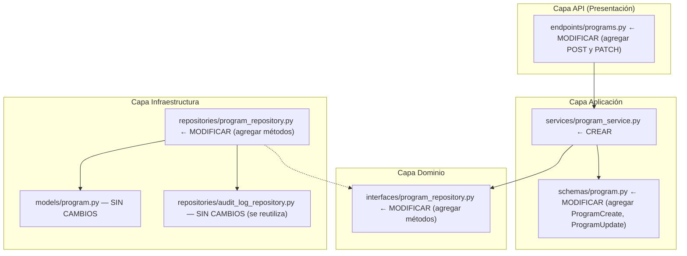
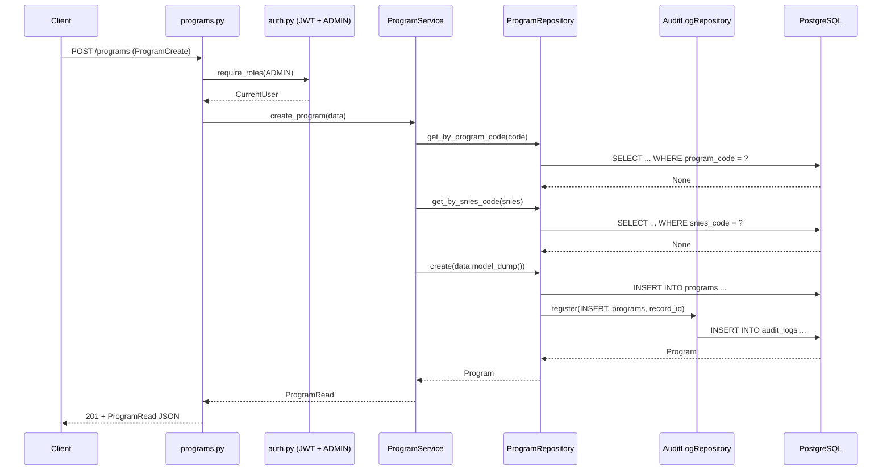
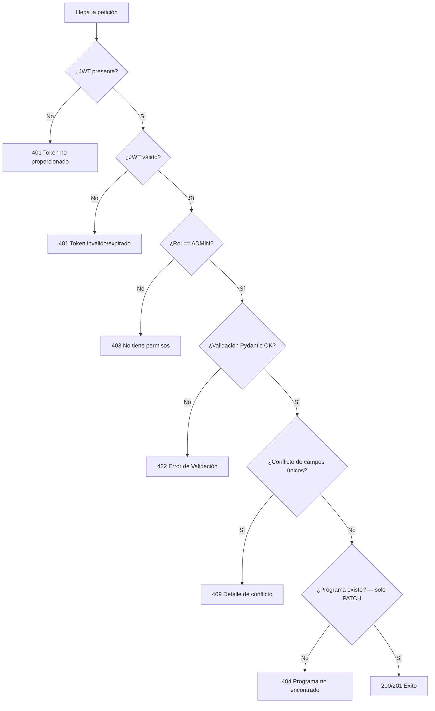

# Documento de Diseño — Endpoints CRUD de Programas (CREATE y UPDATE)

## Resumen

Este diseño agrega los endpoints `POST /programs` y `PATCH /programs/{program_id}` al recurso de programas académicos existente. La implementación sigue el patrón de Clean Architecture establecido por el CRUD de usuarios: Interfaces de dominio → Repositorios de infraestructura → Servicios de aplicación → Endpoints API.

Los nuevos endpoints permiten a usuarios ADMIN crear y actualizar parcialmente programas académicos, con validación de unicidad en `program_code` y `snies_code`, registro atómico de auditoría por cada operación de escritura, y autenticación JWT con restricción de rol.

### Decisiones de Diseño

1. **Seguir los patrones existentes**: Replicar la arquitectura de `UserService` / `UserRepository` / `users.py` para mantener consistencia y reducir carga cognitiva.
2. **Extender, no reemplazar**: Los componentes existentes `IProgramRepository`, `ProgramRepository` y `programs.py` ya manejan operaciones de lectura. Se extienden con métodos de creación y actualización.
3. **Validación en capa de servicio**: Las verificaciones de unicidad (`program_code`, `snies_code`) ocurren en `ProgramService`, no en el repositorio ni en el endpoint, siguiendo el mismo patrón de `UserService.create_user` que valida unicidad de email.
4. **Auditoría atómica**: Cada operación de escritura (INSERT/UPDATE) registra una entrada `AuditLog` en la misma sesión de base de datos, usando el `AuditLogRepository` existente.

## Arquitectura

El sistema sigue Clean Architecture con tres capas. Los cambios afectan las capas de Dominio (interfaz), Infraestructura (repositorio) y Aplicación (servicio + schemas), además de la capa API (nuevos endpoints):



### Flujo de Datos — POST /programs



### Responsabilidades por Capa

| Capa | Componente | Responsabilidad |
|------|-----------|-----------------|
| **API** | `programs.py` | Ruteo HTTP, serialización request/response, inyección de dependencias |
| **Auth** | `auth.py` | Extracción JWT, enforcement de rol (solo ADMIN) |
| **Aplicación** | `ProgramService` | Lógica de negocio: validación de unicidad, orquestación |
| **Aplicación** | `ProgramCreate`, `ProgramUpdate`, `ProgramRead` | Schemas Pydantic v2 para validación de entrada y serialización de salida |
| **Dominio** | `IProgramRepository` | Interfaz abstracta que define el contrato del repositorio |
| **Infraestructura** | `ProgramRepository` | Queries async SQLAlchemy, registro de audit log |
| **Infraestructura** | `Program` (SQLModel) | Modelo ORM mapeado a la tabla `programs` |

## Componentes e Interfaces

### Componentes a Crear

| Capa | Archivo | Componente |
|------|---------|------------|
| Aplicación / Servicios | `app/application/services/program_service.py` | Clase `ProgramService` |

### Componentes a Modificar

#### 1. Schemas Pydantic (`app/application/schemas/program.py`)

**Estado actual**: Solo existe `ProgramRead`.

**Estado objetivo**: Se agregan `ProgramCreate` y `ProgramUpdate`:

```python
class ProgramCreate(BaseModel):
    """Schema de entrada para POST /programs. Todos los campos requeridos."""
    institution: str = Field(..., description="Institución (ej. USBCO)")
    degree_type: str = Field(..., description="Grado (ej. PREG)")
    program_code: str = Field(..., description="Código del programa (ej. M0200)")
    program_name: str = Field(..., description="Nombre del programa académico")
    academic_group: str = Field(..., description="Grupo académico (ej. MFPSI)")
    location: str = Field(..., description="Ubicación del programa (ej. SAN BENITO)")
    snies_code: int = Field(..., description="Código SNIES del Ministerio de Educación")

class ProgramUpdate(BaseModel):
    """Schema de entrada para PATCH /programs/{program_id}. Todos los campos opcionales."""
    institution: str | None = None
    degree_type: str | None = None
    program_code: str | None = None
    program_name: str | None = None
    academic_group: str | None = None
    location: str | None = None
    snies_code: int | None = None
```

El schema `ProgramRead` existente permanece sin cambios — ya tiene `model_config = {"from_attributes": True}` y todos los campos de salida.

#### 2. Interfaz de Dominio (`app/domain/interfaces/program_repository.py`)

**Estado actual**: Define `get_by_id`, `list_all`, `count_all`.

**Estado objetivo**: Se agregan 4 métodos abstractos nuevos:

```python
class IProgramRepository(ABC):
    # --- Métodos existentes (sin cambios) ---
    @abstractmethod
    async def get_by_id(self, program_id: UUID) -> Program | None: ...

    @abstractmethod
    async def list_all(self, skip: int, limit: int) -> list[Program]: ...

    @abstractmethod
    async def count_all(self) -> int: ...

    # --- Métodos nuevos ---
    @abstractmethod
    async def create(self, data: dict) -> Program: ...

    @abstractmethod
    async def update(self, program_id: UUID, data: ProgramUpdate) -> Program | None: ...

    @abstractmethod
    async def get_by_program_code(self, program_code: str) -> Program | None: ...

    @abstractmethod
    async def get_by_snies_code(self, snies_code: int) -> Program | None: ...
```

#### 3. Repositorio de Infraestructura (`app/infrastructure/repositories/program_repository.py`)

**Estado actual**: Implementa `get_by_id`, `list_all`, `count_all`.

**Estado objetivo**: Se agrega soporte de auditoría y 4 métodos nuevos. Cada operación de escritura registra un `AuditLog` atómicamente en la misma sesión, siguiendo el patrón de `UserRepository`.

```python
class ProgramRepository(IProgramRepository):
    def __init__(self, session: AsyncSession) -> None:
        self._session = session
        self._audit = AuditLogRepository(session)  # NUEVO: soporte de auditoría

    # --- Métodos existentes (sin cambios) ---
    # get_by_id, list_all, count_all ...

    # --- Métodos nuevos ---

    async def create(self, data: dict) -> Program:
        """
        Persiste un nuevo Program y registra un audit log INSERT.
        Pseudocódigo:
          1. program = Program(**data)
          2. session.add(program)
          3. session.flush() + refresh()
          4. audit.register(INSERT, "programs", program.id, new_data=data)
          5. return program
        """
        ...

    async def update(self, program_id: UUID, data: ProgramUpdate) -> Program | None:
        """
        Aplica actualización parcial y registra un audit log UPDATE.
        Pseudocódigo:
          1. program = get_by_id(program_id)
          2. if None → return None
          3. previous = snapshot de los campos actuales
          4. updates = data.model_dump(exclude_unset=True)
          5. for field, value in updates: setattr(program, field, value)
          6. session.add(program) + flush() + refresh()
          7. audit.register(UPDATE, "programs", program_id, previous, updates)
          8. return program
        """
        ...

    async def get_by_program_code(self, program_code: str) -> Program | None:
        """SELECT ... WHERE program_code = :code"""
        ...

    async def get_by_snies_code(self, snies_code: int) -> Program | None:
        """SELECT ... WHERE snies_code = :snies"""
        ...
```

#### 4. Servicio de Aplicación (`app/application/services/program_service.py`)

**Archivo nuevo**. Encapsula la lógica de negocio de programas, recibiendo `IProgramRepository` por inyección de constructor (DIP):

```python
class ProgramService:
    """
    Lógica de negocio para operaciones CRUD de programas.
    Recibe IProgramRepository vía inyección de constructor (DIP).
    """

    def __init__(self, repo: IProgramRepository) -> None:
        self._repo = repo

    async def create_program(self, data: ProgramCreate) -> ProgramRead:
        """
        Crea un nuevo programa con validación de unicidad.
        Pseudocódigo:
          1. existing = repo.get_by_program_code(data.program_code)
             if existing → raise HTTPException(409, "El program_code ya está registrado")
          2. existing = repo.get_by_snies_code(data.snies_code)
             if existing → raise HTTPException(409, "El snies_code ya está registrado")
          3. program = repo.create(data.model_dump())
          4. return ProgramRead.model_validate(program)
        """
        ...

    async def update_program(self, program_id: UUID, data: ProgramUpdate) -> ProgramRead:
        """
        Actualiza parcialmente un programa con validación de unicidad.
        Pseudocódigo:
          1. if data.program_code está definido:
               existing = repo.get_by_program_code(data.program_code)
               if existing and existing.id != program_id:
                 raise HTTPException(409, "El program_code ya está registrado")
          2. if data.snies_code está definido:
               existing = repo.get_by_snies_code(data.snies_code)
               if existing and existing.id != program_id:
                 raise HTTPException(409, "El snies_code ya está registrado")
          3. program = repo.update(program_id, data)
             if None → raise HTTPException(404, "Programa no encontrado")
          4. return ProgramRead.model_validate(program)
        """
        ...
```

#### 5. Endpoints API (`app/api/v1/endpoints/programs.py`)

**Estado actual**: Solo tiene `GET /programs/{program_id}/courses`.

**Estado objetivo**: Se agrega helper de dependencia y dos endpoints nuevos:

```python
def _get_service(session: AsyncSession = Depends(get_session)) -> ProgramService:
    return ProgramService(ProgramRepository(session))

@router.post(
    "/programs",
    response_model=ProgramRead,
    status_code=201,
    summary="Crear un programa académico",
    description="Crea un nuevo programa académico. Requiere rol ADMIN. "
                "Valida unicidad de program_code y snies_code.",
    tags=["Programas"],
)
async def create_program(
    body: ProgramCreate,
    current_user: CurrentUser = Depends(require_roles(RoleEnum.ADMIN)),
    service: ProgramService = Depends(_get_service),
) -> ProgramRead:
    return await service.create_program(body)

@router.patch(
    "/programs/{program_id}",
    response_model=ProgramRead,
    status_code=200,
    summary="Actualizar parcialmente un programa académico",
    description="Actualiza los campos proporcionados de un programa existente. "
                "Requiere rol ADMIN. Valida unicidad de program_code y snies_code.",
    tags=["Programas"],
)
async def update_program(
    program_id: UUID,
    body: ProgramUpdate,
    current_user: CurrentUser = Depends(require_roles(RoleEnum.ADMIN)),
    service: ProgramService = Depends(_get_service),
) -> ProgramRead:
    return await service.update_program(program_id, body)
```

## Modelos de Datos

### Modelo Program Existente (sin cambios)

El modelo `Program` de SQLModel ya define todas las columnas necesarias con las restricciones correctas:

```python
class Program(SQLModel, table=True):
    __tablename__ = "programs"

    id: uuid.UUID = Field(default_factory=uuid.uuid4, primary_key=True)
    institution: str = Field(nullable=False)
    degree_type: str = Field(nullable=False)
    program_code: str = Field(unique=True, nullable=False, index=True)
    program_name: str = Field(nullable=False)
    academic_group: str = Field(nullable=False)
    location: str = Field(nullable=False)
    snies_code: int = Field(unique=True, nullable=False, index=True)
    created_at: datetime = Field(
        default_factory=lambda: datetime.now(timezone.utc),
        sa_column=sa.Column(sa.DateTime(timezone=True), nullable=False),
    )
```

Restricciones ya existentes:
- `program_code`: `unique=True`, `index=True`
- `snies_code`: `unique=True`, `index=True`
- **No se requiere migración de base de datos** — el esquema de la tabla no cambia.

### Entradas de AuditLog

Para operaciones de **creación**:
```json
{
  "table_name": "programs",
  "operation": "INSERT",
  "record_id": "<uuid_del_nuevo_programa>",
  "previous_data": null,
  "new_data": { "institution": "...", "program_code": "...", ... }
}
```

Para operaciones de **actualización**:
```json
{
  "table_name": "programs",
  "operation": "UPDATE",
  "record_id": "<uuid_del_programa>",
  "previous_data": { "program_name": "Nombre Anterior", ... },
  "new_data": { "program_name": "Nombre Nuevo" }
}
```

## Propiedades de Correctitud

*Una propiedad es una característica o comportamiento que debe cumplirse en todas las ejecuciones válidas de un sistema — esencialmente, una declaración formal sobre lo que el sistema debe hacer. Las propiedades sirven como puente entre especificaciones legibles por humanos y garantías de correctitud verificables por máquina.*

### Propiedad 1: ProgramCreate rechaza entrada incompleta

*Para cualquier* diccionario al que le falte uno o más de los campos requeridos (`institution`, `degree_type`, `program_code`, `program_name`, `academic_group`, `location`, `snies_code`), construir una instancia de `ProgramCreate` debe lanzar un `ValidationError`.

**Valida: Requerimientos 1.1, 1.2**

### Propiedad 2: Actualización parcial preserva campos omitidos

*Para cualquier* programa existente y *cualquier* subconjunto no vacío de campos de `ProgramUpdate`, llamar a `update_program` debe modificar solo los campos proporcionados y dejar todos los campos omitidos sin cambios.

**Valida: Requerimientos 2.2, 4.3**

### Propiedad 3: Creación registra audit log INSERT

*Para cualquier* dato de programa válido, llamar a `ProgramRepository.create` debe registrar una entrada `AuditLog` con `operation=INSERT`, `table_name="programs"`, y `new_data` coincidiendo con los datos de entrada.

**Valida: Requerimientos 4.2**

### Propiedad 4: Actualización registra audit log UPDATE con datos previos y nuevos

*Para cualquier* programa existente y *cualquier* subconjunto no vacío de campos de actualización, llamar a `ProgramRepository.update` debe registrar una entrada `AuditLog` con `operation=UPDATE`, `previous_data` conteniendo los valores anteriores, y `new_data` conteniendo los valores nuevos.

**Valida: Requerimientos 4.4**

### Propiedad 5: Round-trip de búsqueda por campos únicos

*Para cualquier* programa persistido vía `create`, buscarlo por `get_by_program_code(program.program_code)` debe retornar un programa con el mismo `id`, y buscarlo por `get_by_snies_code(program.snies_code)` debe retornar un programa con el mismo `id`.

**Valida: Requerimientos 4.6, 4.7**

### Propiedad 6: Creación rechaza campos únicos duplicados

*Para cualquier* `program_code` o `snies_code` que ya pertenezca a un programa existente, llamar a `create_program` con ese mismo valor debe lanzar un `HTTPException` con código de estado 409.

**Valida: Requerimientos 5.2, 5.3, 5.4, 5.5, 8.1, 8.2**

### Propiedad 7: Actualización rechaza campos únicos pertenecientes a otro programa

*Para cualesquiera* dos programas distintos A y B, llamar a `update_program(A.id, ProgramUpdate(program_code=B.program_code))` o `update_program(A.id, ProgramUpdate(snies_code=B.snies_code))` debe lanzar un `HTTPException` con código de estado 409.

**Valida: Requerimientos 5.7, 5.8, 8.3, 8.4**

### Propiedad 8: Auto-actualización con campos únicos propios tiene éxito

*Para cualquier* programa existente, llamar a `update_program(program.id, ProgramUpdate(program_code=program.program_code))` o `update_program(program.id, ProgramUpdate(snies_code=program.snies_code))` debe tener éxito sin lanzar un error de conflicto.

**Valida: Requerimientos 5.9, 8.5**

### Propiedad 9: Rechazo de rol no-ADMIN

*Para cualquier* usuario autenticado cuyo rol no sea `ADMIN`, enviar una petición `POST /programs` o `PATCH /programs/{id}` debe retornar un código de estado 403.

**Valida: Requerimientos 6.4, 6.6, 7.5, 7.7**

## Manejo de Errores

### Errores de la API

| Escenario | Código HTTP | Mensaje | Capa |
|-----------|-------------|---------|------|
| Campo requerido faltante en `ProgramCreate` | 422 | Error de validación Pydantic (automático) | API (FastAPI) |
| Sin token JWT Bearer | 401 | "Token no proporcionado" | Dependencia Auth |
| Token JWT expirado o inválido | 401 | "Token expirado" / "Token inválido" | Dependencia Auth |
| Usuario autenticado no es ADMIN | 403 | "No tiene permisos para esta acción" | Dependencia Auth |
| `program_code` duplicado en creación o actualización | 409 | "El program_code ya está registrado" | ProgramService |
| `snies_code` duplicado en creación o actualización | 409 | "El snies_code ya está registrado" | ProgramService |
| Programa no encontrado en actualización | 404 | "Programa no encontrado" | ProgramService |
| Fallo de conexión a base de datos | 500 | Internal Server Error (no manejado) | Infraestructura |

### Flujo de Errores



## Estrategia de Testing

### Enfoque Dual: Tests Unitarios + Tests de Propiedades

El proyecto usa **Hypothesis** como librería de property-based testing (ya configurada, evidenciado por el directorio `.hypothesis/` y los tests existentes en `tests/property/`).

### Tests de Propiedades (PBT)

Cada propiedad del documento de diseño se implementará como un test basado en propiedades usando Hypothesis:

- **Mínimo 100 iteraciones** por test de propiedad
- Cada test debe referenciar la propiedad del documento de diseño
- Formato de tag: **Feature: program-crud-endpoints, Property {número}: {texto}**
- Archivo: `tests/property/test_program_crud_property.py`

| Propiedad | Estrategia de Generación |
|-----------|--------------------------|
| P1: Schema rechaza entrada incompleta | Generar subconjuntos aleatorios de campos requeridos, verificar `ValidationError` |
| P2: Actualización parcial preserva omitidos | Mock de repo, generar programas aleatorios + subconjuntos aleatorios de campos |
| P3: Audit log de creación | Mock de session + audit repo, verificar `register` llamado con INSERT |
| P4: Audit log de actualización | Mock de session + audit repo, verificar `register` llamado con UPDATE + datos previos/nuevos |
| P5: Round-trip de búsqueda | SQLite en memoria, crear y luego buscar por code/snies |
| P6: Creación rechaza duplicados | Mock de repo retornando programa existente, verificar 409 |
| P7: Actualización rechaza únicos de otro | Mock de repo retornando programa diferente para búsqueda, verificar 409 |
| P8: Auto-actualización tiene éxito | Mock de repo retornando mismo programa para búsqueda, verificar sin error |
| P9: Rechazo de no-ADMIN | Generar roles no-ADMIN, enviar peticiones, verificar 403 |

### Tests Unitarios

- **Archivo**: `tests/unit/test_program_service.py`
- `test_create_program_success` — camino feliz con datos válidos
- `test_create_program_duplicate_program_code_returns_409` — verificación exacta del mensaje de error
- `test_create_program_duplicate_snies_code_returns_409` — verificación exacta del mensaje de error
- `test_update_program_not_found_returns_404` — ID de programa inexistente
- `test_update_program_success` — camino feliz de actualización parcial
- `test_update_program_duplicate_program_code_different_program_returns_409`
- `test_update_program_duplicate_snies_code_different_program_returns_409`
- `test_update_program_same_codes_no_conflict` — caso de auto-actualización

### Tests de Integración

- **Archivo**: `tests/integration/test_program_endpoints.py`
- `test_post_programs_returns_201` — creación válida con auth ADMIN
- `test_patch_programs_returns_200` — actualización válida con auth ADMIN
- `test_post_programs_no_auth_returns_401` — JWT faltante
- `test_post_programs_non_admin_returns_403` — rol STUDENT/PROFESSOR
- `test_patch_programs_not_found_returns_404` — programa inexistente
- `test_post_programs_duplicate_program_code_returns_409`
- `test_post_programs_missing_field_returns_422`

### Dependencias de Testing

- **Hypothesis** — generación de tests basados en propiedades (ya en el proyecto)
- **pytest-anyio** — soporte de tests async (ya en el proyecto)
- **unittest.mock / AsyncMock** — mocking para tests unitarios (stdlib)
- **httpx.AsyncClient** — cliente HTTP para tests de integración (ya en el proyecto)
- **SQLite en memoria** — para tests de propiedades a nivel de repositorio (ya usado en `test_uniqueness.py`)
