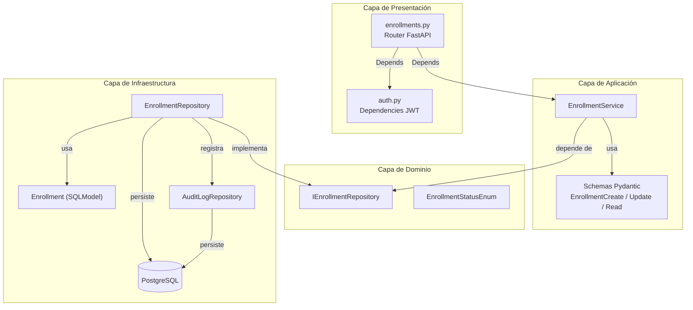
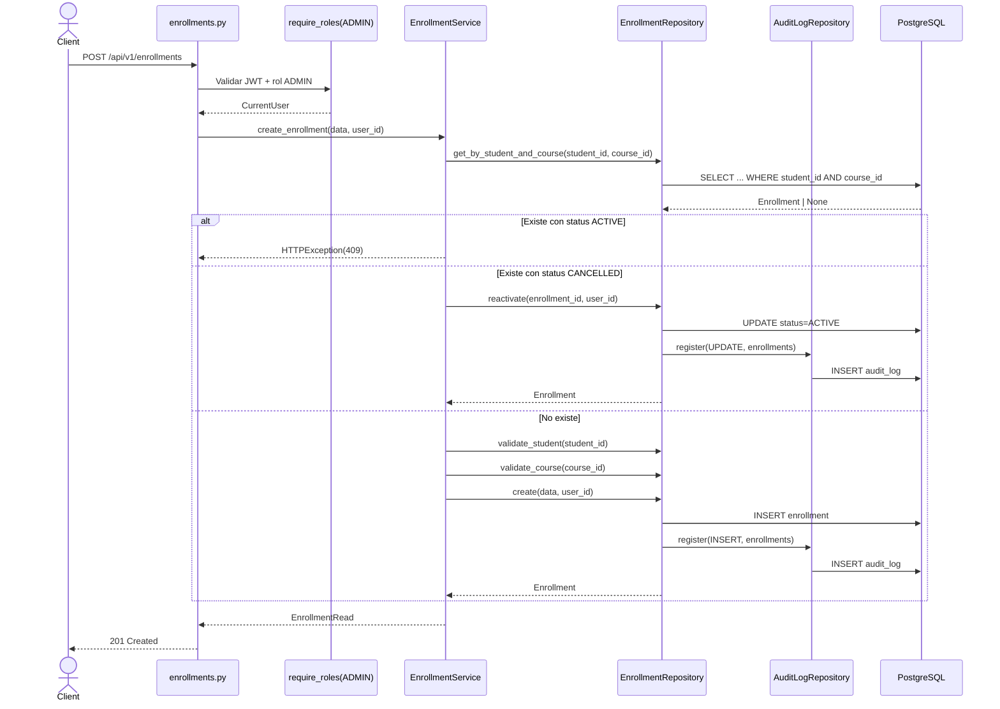
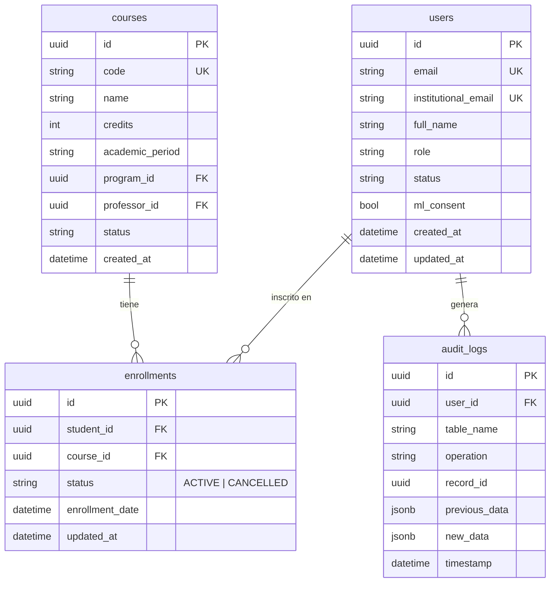

# Documento de Diseño — CRUD de Inscripciones de Estudiantes

## Overview

Este documento describe el diseño técnico para completar las operaciones CRUD del módulo de inscripciones (enrollments) de estudiantes en cursos. El sistema actual cuenta con el modelo `Enrollment` y un endpoint GET para listar estudiantes inscritos en un curso. Se necesitan endpoints para **crear**, **actualizar** (cambio de curso), **cancelar** (borrado lógico) y **consultar** inscripciones.

El diseño sigue la Clean Architecture existente del proyecto (Domain → Application → Infrastructure) y los patrones ya establecidos en el CRUD de cursos (`CourseService`, `CourseRepository`, `ICourseRepository`). Todas las operaciones de escritura registran logs de auditoría y el acceso se controla mediante JWT con roles (ADMIN, PROFESSOR, STUDENT).

### Cambios principales

1. **Modelo Enrollment**: Agregar campo `status` (ACTIVE/CANCELLED) y `updated_at` para soportar borrado lógico.
2. **Migración Alembic**: `0010_add_enrollment_status.py` para agregar la columna `status` con default ACTIVE.
3. **Enum**: Agregar `EnrollmentStatusEnum` a `app/domain/enums.py`.
4. **Capa de dominio**: Nueva interfaz `IEnrollmentRepository`.
5. **Capa de infraestructura**: Nuevo `EnrollmentRepository` con audit logging.
6. **Capa de aplicación**: Nuevo `EnrollmentService` + schemas Pydantic (`EnrollmentCreate`, `EnrollmentUpdate`, `EnrollmentRead`).
7. **Capa de presentación**: Nuevo router `enrollments.py` con 5 endpoints.

---

## Architecture

### Diagrama de componentes



### Diagrama de secuencia — Crear inscripción (POST)



### Diagrama ER actualizado (enrollments)



---

## Components and Interfaces

### 1. Enum: `EnrollmentStatusEnum`

**Archivo:** `app/domain/enums.py`

```python
class EnrollmentStatusEnum(str, Enum):
    ACTIVE = "ACTIVE"
    CANCELLED = "CANCELLED"
```

### 2. Interfaz: `IEnrollmentRepository`

**Archivo:** `app/domain/interfaces/enrollment_repository.py`

Sigue el patrón de `ICourseRepository` con métodos abstractos:

```python
class IEnrollmentRepository(ABC):
    async def create(self, data: dict, user_id: UUID) -> Enrollment: ...
    async def get_by_id(self, enrollment_id: UUID) -> Enrollment | None: ...
    async def get_by_student_and_course(self, student_id: UUID, course_id: UUID) -> Enrollment | None: ...
    async def update_course(self, enrollment_id: UUID, new_course_id: UUID, user_id: UUID) -> Enrollment | None: ...
    async def update_status(self, enrollment_id: UUID, status: EnrollmentStatusEnum, user_id: UUID) -> Enrollment | None: ...
    async def list_by_student(self, student_id: UUID, status: EnrollmentStatusEnum | None = None) -> list[Enrollment]: ...
    async def list_by_student_filtered_by_professor(self, student_id: UUID, professor_id: UUID) -> list[Enrollment]: ...
```

### 3. Repositorio: `EnrollmentRepository`

**Archivo:** `app/infrastructure/repositories/enrollment_repository.py`

Implementa `IEnrollmentRepository`. Cada operación de escritura registra un `AuditLog` en la misma sesión (patrón idéntico a `CourseRepository`).

Métodos clave:
- `create()`: INSERT + audit log INSERT
- `get_by_id()`: SELECT por ID
- `get_by_student_and_course()`: SELECT por (student_id, course_id) — sin filtro de status para detectar registros CANCELLED
- `update_course()`: UPDATE course_id + audit log UPDATE con previous_data y new_data
- `update_status()`: UPDATE status + audit log UPDATE
- `list_by_student()`: SELECT con filtro de status (default ACTIVE)
- `list_by_student_filtered_by_professor()`: SELECT con JOIN a courses WHERE courses.professor_id = professor_id AND enrollments.status = ACTIVE

### 4. Servicio: `EnrollmentService`

**Archivo:** `app/application/services/enrollment_service.py`

Recibe `IEnrollmentRepository` vía inyección de constructor (DIP), igual que `CourseService`. Además recibe la sesión para consultas auxiliares (validar estudiante, validar curso).

Métodos:

| Método | Descripción | Validaciones |
|--------|-------------|--------------|
| `create_enrollment(data, user_id)` | Crea o reactiva inscripción | Estudiante existe + rol STUDENT, curso existe + ACTIVE, no duplicado ACTIVE |
| `update_enrollment(enrollment_id, data, user_id)` | Cambia curso de inscripción | Inscripción existe, curso destino existe + ACTIVE, no duplicado en destino |
| `cancel_enrollment(enrollment_id, user_id)` | Borrado lógico (CANCELLED) | Inscripción existe |
| `get_enrollment(enrollment_id)` | Obtiene detalle | Inscripción existe |
| `list_student_enrollments(student_id, current_user)` | Lista inscripciones de un estudiante | Filtra por RB-04 si PROFESSOR |

### 5. Schemas Pydantic

**Archivo:** `app/application/schemas/enrollment.py`

### 6. Endpoints

**Archivo:** `app/api/v1/endpoints/enrollments.py`

| Método | Ruta | Rol requerido | Status | Descripción |
|--------|------|---------------|--------|-------------|
| POST | `/api/v1/enrollments` | ADMIN | 201 | Inscribir estudiante en curso |
| PATCH | `/api/v1/enrollments/{enrollment_id}` | ADMIN | 200 | Cambiar curso de inscripción |
| PATCH | `/api/v1/enrollments/{enrollment_id}/status` | ADMIN | 200 | Cancelar inscripción (borrado lógico) |
| GET | `/api/v1/enrollments/{enrollment_id}` | ADMIN | 200 | Detalle de inscripción |
| GET | `/api/v1/students/{student_id}/enrollments` | ADMIN, PROFESSOR | 200 | Listar inscripciones de un estudiante |

---

## Data Models

### Modelo Enrollment actualizado

**Archivo:** `app/infrastructure/models/enrollment.py`

```python
class Enrollment(SQLModel, table=True):
    __tablename__ = "enrollments"
    __table_args__ = (UniqueConstraint("student_id", "course_id"),)

    id: uuid.UUID = Field(default_factory=uuid.uuid4, primary_key=True)
    student_id: uuid.UUID = Field(foreign_key="users.id", nullable=False, index=True)
    course_id: uuid.UUID = Field(foreign_key="courses.id", nullable=False, index=True)
    status: EnrollmentStatusEnum = Field(
        default=EnrollmentStatusEnum.ACTIVE,
        nullable=False,
        sa_column_kwargs={"server_default": "ACTIVE"},
    )
    enrollment_date: datetime = Field(
        default_factory=lambda: datetime.now(timezone.utc),
        sa_column=sa.Column(sa.DateTime(timezone=True), nullable=False),
    )
    updated_at: datetime = Field(
        default_factory=lambda: datetime.now(timezone.utc),
        sa_column=sa.Column(sa.DateTime(timezone=True), nullable=False),
    )
```

**Cambios respecto al modelo actual:**
- Agregar campo `status` (`EnrollmentStatusEnum`, default ACTIVE)
- Agregar campo `updated_at` (datetime con timezone)
- Agregar `index=True` a `student_id` y `course_id` para optimizar consultas
- Cambiar `enrollment_date` a usar `datetime.now(timezone.utc)` con timezone-aware (consistente con otros modelos)

**Nota sobre UniqueConstraint:** Se mantiene `UniqueConstraint("student_id", "course_id")` a nivel de tabla. La lógica de reactivación de inscripciones CANCELLED se maneja en la capa de servicio: si ya existe un registro con la misma combinación pero status CANCELLED, se reactiva en lugar de crear uno nuevo.

### Schemas Pydantic

```python
# EnrollmentCreate — POST /api/v1/enrollments
class EnrollmentCreate(BaseModel):
    student_id: UUID = Field(..., description="ID del estudiante a inscribir")
    course_id: UUID = Field(..., description="ID del curso en el que se inscribe")

# EnrollmentUpdate — PATCH /api/v1/enrollments/{enrollment_id}
class EnrollmentUpdate(BaseModel):
    course_id: UUID = Field(..., description="ID del nuevo curso destino")

# EnrollmentStatusUpdate — PATCH /api/v1/enrollments/{enrollment_id}/status
class EnrollmentStatusUpdate(BaseModel):
    status: EnrollmentStatusEnum = Field(..., description="Nuevo estado (ACTIVE o CANCELLED)")

# EnrollmentRead — Response model
class EnrollmentRead(BaseModel):
    id: UUID
    student_id: UUID
    course_id: UUID
    status: EnrollmentStatusEnum
    enrollment_date: datetime
    updated_at: datetime

    model_config = {"from_attributes": True}
```

### Migración Alembic

**Archivo:** `alembic/versions/0010_add_enrollment_status.py`

```python
def upgrade() -> None:
    op.execute("CREATE TYPE enrollmentstatusenum AS ENUM ('ACTIVE', 'CANCELLED')")
    op.add_column(
        "enrollments",
        sa.Column(
            "status",
            sa.Enum("ACTIVE", "CANCELLED", name="enrollmentstatusenum"),
            nullable=False,
            server_default="ACTIVE",
        ),
    )
    op.add_column(
        "enrollments",
        sa.Column(
            "updated_at",
            sa.DateTime(timezone=True),
            nullable=False,
            server_default=sa.func.now(),
        ),
    )
    # Índices para optimizar consultas frecuentes
    op.create_index("ix_enrollments_student_id", "enrollments", ["student_id"])
    op.create_index("ix_enrollments_course_id", "enrollments", ["course_id"])

def downgrade() -> None:
    op.drop_index("ix_enrollments_course_id")
    op.drop_index("ix_enrollments_student_id")
    op.drop_column("enrollments", "updated_at")
    op.drop_column("enrollments", "status")
    op.execute("DROP TYPE IF EXISTS enrollmentstatusenum")
```

**Decisión de diseño:** La migración usa `server_default="ACTIVE"` para que los registros existentes en la tabla `enrollments` reciban automáticamente el estado ACTIVE, manteniendo compatibilidad con los datos actuales.

---

## Correctness Properties

*A property is a characteristic or behavior that should hold true across all valid executions of a system — essentially, a formal statement about what the system should do. Properties serve as the bridge between human-readable specifications and machine-verifiable correctness guarantees.*

### Property 1: Enrollment creation round-trip

*For any* valid student (user with role STUDENT) and any valid course (with status ACTIVE), creating an enrollment and then querying it by ID should return an enrollment with the same `student_id`, `course_id`, status ACTIVE, and a non-null `enrollment_date`.

**Validates: Requirements 1.1, 6.4**

### Property 2: Entity validation on write operations

*For any* enrollment creation or update request, if the `student_id` does not correspond to an existing user with role STUDENT, or the `course_id` does not correspond to an existing course with status ACTIVE, the system should reject the operation with the appropriate error (422 for invalid student, 404 for invalid course).

**Validates: Requirements 1.2, 1.3, 2.3**

### Property 3: Active enrollment uniqueness invariant

*For any* student and course combination, there can be at most one enrollment with status ACTIVE. Attempting to create a duplicate active enrollment (via POST or PATCH to a course where the student is already active) should be rejected with 409.

**Validates: Requirements 1.6, 2.5**

### Property 4: Cancelled enrollment reactivation

*For any* enrollment that has been cancelled, re-enrolling the same student in the same course should reactivate the existing record (setting status back to ACTIVE) rather than creating a new record. The total count of enrollment records for that (student_id, course_id) pair should remain 1.

**Validates: Requirements 1.7**

### Property 5: Audit trail on all write operations

*For any* successful write operation (create, update, cancel) on enrollments, an audit log entry should be registered with the correct `operation` (INSERT or UPDATE), `table_name` ("enrollments"), `record_id` matching the enrollment ID, and appropriate `previous_data`/`new_data`.

**Validates: Requirements 1.8, 2.6, 3.3**

### Property 6: Role-based access control

*For any* user with a role other than ADMIN, write operations (create, update, cancel) on enrollments should be rejected with 403. For list operations, only ADMIN and PROFESSOR roles should have access. For detail operations, only ADMIN should have access.

**Validates: Requirements 1.9, 2.7, 3.4, 4.3, 5.3**

### Property 7: Update changes course correctly

*For any* active enrollment and any valid destination course (ACTIVE, different from current), updating the enrollment should change the `course_id` to the new value while preserving the `student_id` and `enrollment_date`.

**Validates: Requirements 2.1**

### Property 8: Soft delete preserves record

*For any* active enrollment, cancelling it should set the status to CANCELLED while the record remains in the database. The enrollment should still be retrievable by ID with status CANCELLED.

**Validates: Requirements 3.1, 3.5**

### Property 9: List returns only ACTIVE enrollments

*For any* student with a mix of ACTIVE and CANCELLED enrollments, listing their enrollments should return only those with status ACTIVE. The count of returned enrollments should equal the count of ACTIVE enrollments for that student.

**Validates: Requirements 4.1**

### Property 10: Professor RB-04 visibility filter

*For any* professor, listing a student's enrollments should return only enrollments in courses assigned to that professor. Enrollments in courses assigned to other professors should not be visible.

**Validates: Requirements 4.4**

---

## Error Handling

Todas las respuestas de error siguen el formato estándar de FastAPI con `HTTPException`:

```json
{"detail": "Mensaje descriptivo en español"}
```

### Tabla de errores por endpoint

| Endpoint | Código | Condición | Mensaje |
|----------|--------|-----------|---------|
| POST /enrollments | 422 | student_id no es STUDENT o no existe | "El usuario indicado no existe o no tiene rol de estudiante" |
| POST /enrollments | 404 | course_id no existe o no está ACTIVE | "Curso no encontrado" |
| POST /enrollments | 409 | Inscripción ACTIVE duplicada | "El estudiante ya está inscrito en este curso" |
| PATCH /enrollments/{id} | 404 | enrollment_id no existe | "Inscripción no encontrada" |
| PATCH /enrollments/{id} | 404 | Curso destino no existe o no ACTIVE | "Curso no encontrado" |
| PATCH /enrollments/{id} | 409 | Duplicado en curso destino | "El estudiante ya está inscrito en el curso destino" |
| PATCH /enrollments/{id}/status | 404 | enrollment_id no existe | "Inscripción no encontrada" |
| GET /enrollments/{id} | 404 | enrollment_id no existe | "Inscripción no encontrada" |
| Todos (escritura) | 401 | Token ausente o inválido | "Token no proporcionado" / "Token inválido" |
| Todos (escritura) | 403 | Rol insuficiente | "No tiene permisos para esta acción" |
| Todos | 422 | Validación Pydantic (UUID inválido, campo faltante) | Detalle automático de Pydantic |

### Estrategia de manejo de errores

- Las validaciones de negocio se realizan en `EnrollmentService` (capa de aplicación), lanzando `HTTPException` con el código y mensaje apropiado.
- Las validaciones de formato (UUID, campos requeridos) las maneja Pydantic automáticamente con 422.
- La autorización se maneja en la capa de presentación con `require_roles()` y `get_current_user()`.
- Los errores de base de datos (IntegrityError por UniqueConstraint) se capturan en el repositorio como fallback, aunque la validación previa en el servicio debería prevenirlos.

---

## Testing Strategy

### Enfoque dual: Unit Tests + Property-Based Tests

El proyecto usa **Hypothesis** como librería de property-based testing (ya configurada en el proyecto). Los tests se organizan según la estructura existente:

```
tests/
├── unit/
│   └── test_enrollment_service.py      # Tests unitarios del servicio
├── integration/
│   └── test_enrollment_repository.py   # Tests de integración del repositorio
└── property/
    └── test_enrollment_property.py     # Tests de propiedades (Hypothesis)
```

### Unit Tests (tests/unit/)

Tests unitarios con mocks para `EnrollmentRepository` y sesión de BD:

- **Casos positivos**: Crear inscripción, actualizar curso, cancelar, listar, obtener detalle
- **Casos de error**: Estudiante no existe, curso no existe, duplicado, inscripción no encontrada
- **Autorización**: Verificar que cada endpoint requiere el rol correcto
- **Reactivación**: Verificar que inscripción CANCELLED se reactiva correctamente

### Property-Based Tests (tests/property/)

Cada propiedad del diseño se implementa como un test de Hypothesis con mínimo 100 iteraciones:

| Property | Test | Estrategia de generación |
|----------|------|--------------------------|
| P1: Creation round-trip | Generar student_id + course_id válidos, crear, consultar, verificar datos | `st.uuids()` para IDs, mock de repo |
| P2: Entity validation | Generar usuarios con roles aleatorios y cursos con status aleatorio, verificar rechazo/aceptación | `st.sampled_from(RoleEnum)`, `st.sampled_from(CourseStatusEnum)` |
| P3: Uniqueness invariant | Generar pares (student, course), crear dos veces, verificar 409 en segundo intento | `st.uuids()` para pares |
| P4: Reactivation | Generar enrollment, cancelar, re-crear, verificar mismo ID y status ACTIVE | `st.uuids()` |
| P5: Audit trail | Generar operaciones de escritura aleatorias, verificar audit log generado | `st.sampled_from(["create", "update", "cancel"])` |
| P6: RBAC | Generar usuarios con roles aleatorios, verificar acceso/rechazo por endpoint | `st.sampled_from(RoleEnum)` |
| P7: Update course | Generar enrollment + nuevo course_id, actualizar, verificar course_id cambiado y student_id preservado | `st.uuids()` |
| P8: Soft delete | Generar enrollment, cancelar, verificar status CANCELLED y registro existe | `st.uuids()` |
| P9: List ACTIVE only | Generar lista de enrollments con status aleatorio, listar, verificar solo ACTIVE retornados | `st.lists(st.sampled_from(EnrollmentStatusEnum))` |
| P10: RB-04 filter | Generar profesor con cursos asignados, estudiante con enrollments en varios cursos, verificar filtro | `st.lists(st.uuids())` para cursos |

### Configuración de Hypothesis

```python
from hypothesis import given, settings, strategies as st

@settings(max_examples=100)
@given(...)
def test_property_name(...):
    # Feature: student-enrollment-crud, Property N: description
    ...
```

### Integration Tests (tests/integration/)

Tests con sesión de BD real (o mock de sesión async) para validar:
- Persistencia correcta del modelo Enrollment con el nuevo campo `status`
- Audit log se registra en la misma transacción
- UniqueConstraint funciona correctamente a nivel de BD
- Migración Alembic aplica y revierte correctamente
