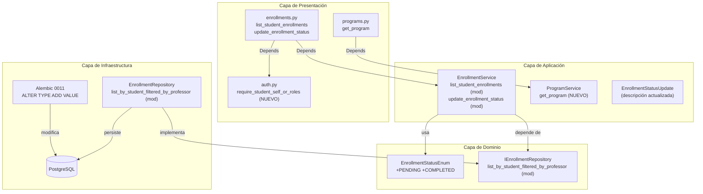
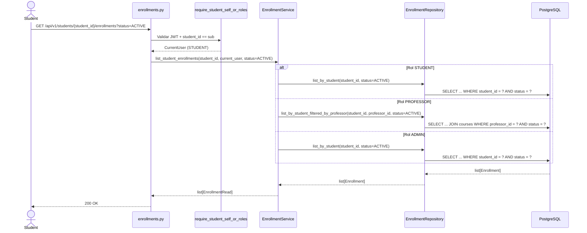
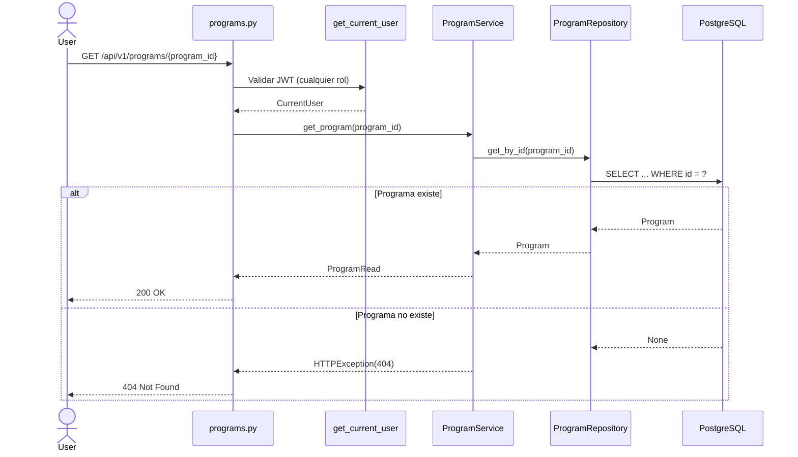
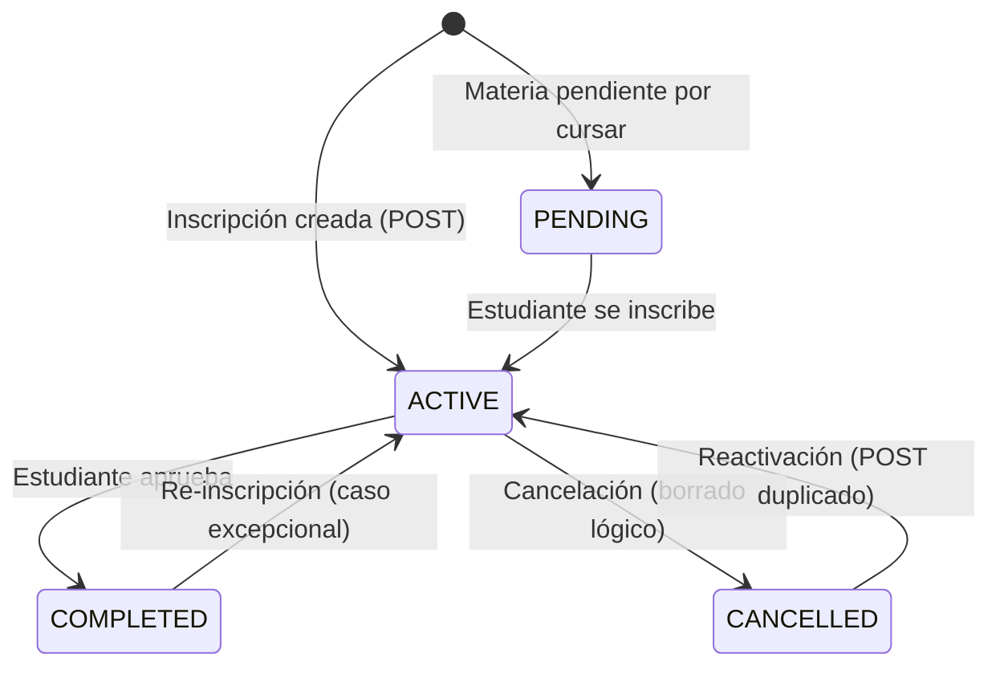
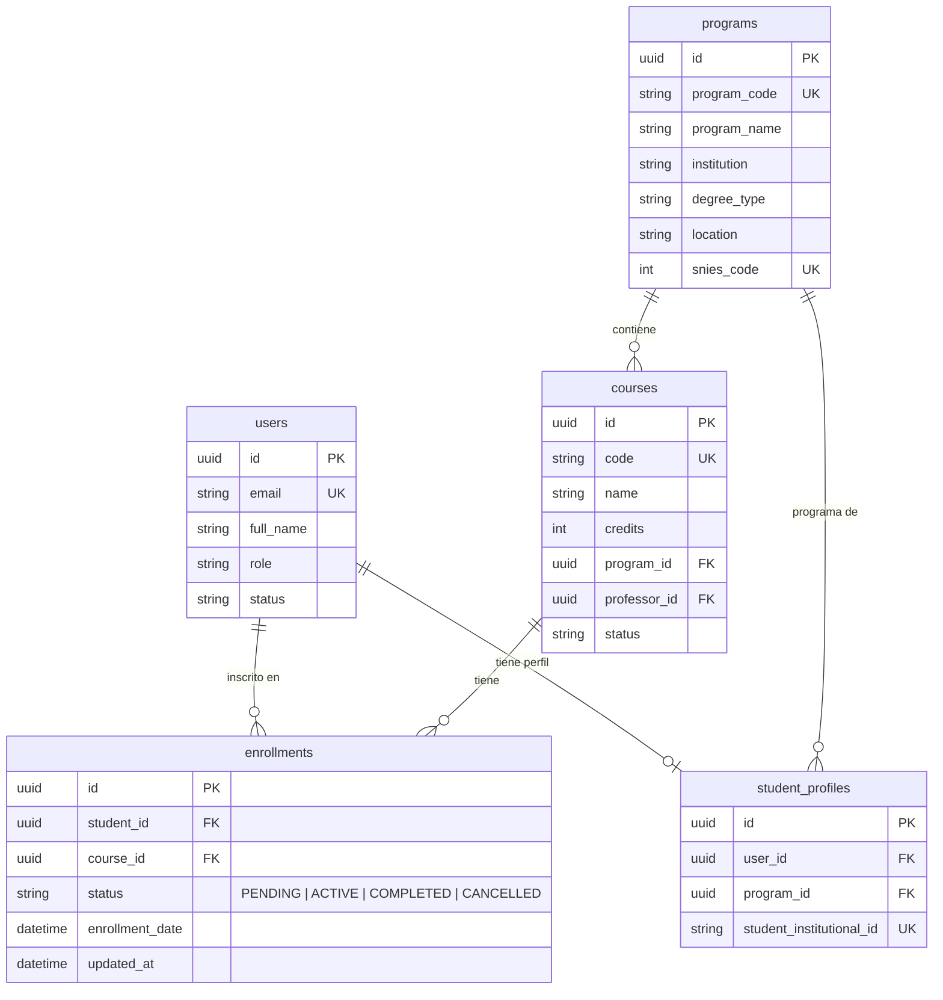

# Documento de Diseño — Vista "Mi Progreso" del Estudiante (Backend)

## Overview

Este documento describe el diseño técnico de los cambios backend necesarios para soportar la vista "Mi Progreso" del estudiante. El objetivo es permitir que un estudiante consulte sus propias inscripciones (auto-acceso), distinguir entre cursos completados, activos, pendientes y cancelados, filtrar inscripciones por estado, y obtener los datos de su programa académico.

### Contexto actual

- El endpoint `GET /api/v1/students/{student_id}/enrollments` solo permite acceso a ADMIN y PROFESSOR.
- `EnrollmentStatusEnum` solo tiene ACTIVE y CANCELLED.
- No existe un endpoint GET para obtener un programa individual por ID.
- La dependencia `require_self_or_roles` lee `user_id` del path, pero el endpoint de inscripciones usa `student_id`.

### Cambios principales

1. **Auth dependency**: Nueva dependencia `require_student_self_or_roles` que lee `student_id` del path y permite auto-acceso al estudiante, acceso total al ADMIN, y acceso filtrado por RB-04 al PROFESSOR.
2. **EnrollmentStatusEnum**: Agregar PENDING y COMPLETED al enum de dominio y a PostgreSQL vía migración Alembic.
3. **Endpoint de inscripciones**: Modificar `list_student_enrollments` para aceptar rol STUDENT (auto-acceso) y query param `status` opcional.
4. **Endpoint de status**: Actualizar `cancel_enrollment` → `update_enrollment_status` para aceptar cualquier estado válido (PENDING, ACTIVE, COMPLETED, CANCELLED).
5. **Endpoint de programa**: Nuevo `GET /api/v1/programs/{program_id}` accesible a cualquier usuario autenticado.
6. **Repository**: Agregar soporte de filtro `status` al método `list_by_student_filtered_by_professor`.

### Decisiones de diseño clave

- **Reutilización del patrón `require_self_or_roles`**: Se crea una nueva dependencia `require_student_self_or_roles` en lugar de modificar la existente, porque la existente lee `user_id` del path y la nueva necesita leer `student_id`. Modificar la existente rompería los endpoints que ya la usan.
- **Comportamiento por defecto del listado por rol**: Cuando no se pasa filtro `status`, ADMIN ve todas las ACTIVE (comportamiento actual preservado), PROFESSOR ve filtradas por sus cursos (RB-04, actualmente hardcoded a ACTIVE), y STUDENT ve todas sin filtro de estado (para mostrar progreso completo).
- **Migración Alembic con ALTER TYPE**: PostgreSQL no permite agregar valores a un enum dentro de una transacción, por lo que la migración usa `op.execute()` con `ALTER TYPE ... ADD VALUE` fuera de transacción (`autocommit=True` en el contexto de Alembic).

---

## Architecture

### Diagrama de componentes afectados



### Diagrama de secuencia — Estudiante consulta sus inscripciones



### Diagrama de secuencia — GET programa por ID



### Diagrama de estados — EnrollmentStatusEnum actualizado



---

## Components and Interfaces

### 1. Nueva dependencia: `require_student_self_or_roles`

**Archivo:** `app/api/v1/dependencies/auth.py`

Nueva dependencia que sigue el patrón de `require_self_or_roles` pero lee `student_id` del path en lugar de `user_id`:

```python
async def require_student_self_or_roles(
    student_id: UUID = Path(...),
    current_user: CurrentUser = Depends(get_current_user),
    session: AsyncSession = Depends(get_session),
) -> CurrentUser:
```

**Lógica de autorización:**
- Si `current_user.role == STUDENT` y `current_user.id == student_id` → permitir (auto-acceso)
- Si `current_user.role == STUDENT` y `current_user.id != student_id` → 403
- Si `current_user.role == ADMIN` → permitir siempre
- Si `current_user.role == PROFESSOR` → permitir solo si el estudiante está inscrito en algún curso del profesor (RB-04, misma query que `require_self_or_roles`)
- Cualquier otro caso → 403

**Decisión:** Se crea como dependencia directa (no factory) porque el patrón de auto-acceso + RB-04 es específico y no necesita parametrización.

### 2. Enum actualizado: `EnrollmentStatusEnum`

**Archivo:** `app/domain/enums.py`

```python
class EnrollmentStatusEnum(str, Enum):
    PENDING = "PENDING"
    ACTIVE = "ACTIVE"
    COMPLETED = "COMPLETED"
    CANCELLED = "CANCELLED"
```

### 3. Interfaz actualizada: `IEnrollmentRepository`

**Archivo:** `app/domain/interfaces/enrollment_repository.py`

Cambio en la firma de `list_by_student_filtered_by_professor` para aceptar filtro de status opcional:

```python
@abstractmethod
async def list_by_student_filtered_by_professor(
    self, student_id: UUID, professor_id: UUID,
    status: EnrollmentStatusEnum | None = None,
) -> list[Enrollment]: ...
```

### 4. Repositorio actualizado: `EnrollmentRepository`

**Archivo:** `app/infrastructure/repositories/enrollment_repository.py`

Cambio en `list_by_student_filtered_by_professor`:
- Actualmente hardcodea `Enrollment.status == EnrollmentStatusEnum.ACTIVE`
- Se modifica para aceptar `status: EnrollmentStatusEnum | None = None`
- Si `status` es None, no aplica filtro de estado (retorna todos los estados)
- Si `status` tiene valor, filtra por ese estado específico

### 5. Servicio actualizado: `EnrollmentService`

**Archivo:** `app/application/services/enrollment_service.py`

**Cambios en `list_student_enrollments`:**
- Nuevo parámetro `status: EnrollmentStatusEnum | None = None`
- Lógica por rol:
  - **STUDENT**: `list_by_student(student_id, status)` — si status es None, retorna todas las inscripciones (todos los estados)
  - **PROFESSOR**: `list_by_student_filtered_by_professor(student_id, professor_id, status)` — aplica RB-04 + filtro de estado
  - **ADMIN**: `list_by_student(student_id, status)` — si status es None, retorna todas las ACTIVE (comportamiento actual preservado)

**Cambios en `cancel_enrollment` → `update_enrollment_status`:**
- Renombrar método para reflejar que ahora acepta cualquier estado válido
- Recibir el status del body (`EnrollmentStatusUpdate`) en lugar de hardcodear CANCELLED
- La validación de que el status es válido la hace Pydantic automáticamente

**Nuevo método `get_program` en `ProgramService`:**

```python
async def get_program(self, program_id: UUID) -> ProgramRead:
    program = await self._repo.get_by_id(program_id)
    if program is None:
        raise HTTPException(status_code=404, detail="Programa no encontrado")
    return ProgramRead.model_validate(program)
```

### 6. Endpoints modificados y nuevos

**Archivo:** `app/api/v1/endpoints/enrollments.py`

| Endpoint | Cambio | Detalle |
|----------|--------|---------|
| `GET /students/{student_id}/enrollments` | Modificado | Auth: `require_student_self_or_roles`. Nuevo query param `status: EnrollmentStatusEnum \| None = None` |
| `PATCH /enrollments/{enrollment_id}/status` | Modificado | Acepta cualquier estado válido (no solo CANCELLED). Descripción actualizada |

**Archivo:** `app/api/v1/endpoints/programs.py`

| Endpoint | Cambio | Detalle |
|----------|--------|---------|
| `GET /programs/{program_id}` | Nuevo | Auth: `get_current_user` (cualquier usuario autenticado). Retorna `ProgramRead` |

---

## Data Models

### EnrollmentStatusEnum actualizado

```python
class EnrollmentStatusEnum(str, Enum):
    PENDING = "PENDING"      # Materia pendiente por cursar
    ACTIVE = "ACTIVE"        # Inscripción activa (cursando)
    COMPLETED = "COMPLETED"  # Materia aprobada
    CANCELLED = "CANCELLED"  # Inscripción cancelada
```

### Schema actualizado: `EnrollmentStatusUpdate`

```python
class EnrollmentStatusUpdate(BaseModel):
    status: EnrollmentStatusEnum = Field(
        ..., description="Nuevo estado: PENDING, ACTIVE, COMPLETED o CANCELLED"
    )
```

No se requieren cambios en `EnrollmentRead`, `EnrollmentCreate` ni `EnrollmentUpdate` — ya usan `EnrollmentStatusEnum` que se actualiza automáticamente al agregar los nuevos valores.

### Migración Alembic: `0011_add_pending_completed_enrollment_status.py`

```python
"""add_pending_completed_enrollment_status

Revision ID: 0011
Revises: 0010
"""

def upgrade() -> None:
    # PostgreSQL requiere ALTER TYPE ... ADD VALUE fuera de transacción
    op.execute("ALTER TYPE enrollmentstatusenum ADD VALUE IF NOT EXISTS 'PENDING'")
    op.execute("ALTER TYPE enrollmentstatusenum ADD VALUE IF NOT EXISTS 'COMPLETED'")

def downgrade() -> None:
    # PostgreSQL no soporta DROP VALUE de un enum.
    # Downgrade requiere recrear el tipo. Se documenta como no-reversible
    # para evitar pérdida de datos en registros con PENDING o COMPLETED.
    pass
```

**Decisión de diseño:** `ALTER TYPE ... ADD VALUE` no puede ejecutarse dentro de una transacción en PostgreSQL. Alembic maneja esto con el contexto `autocommit` cuando se detecta `ALTER TYPE`. Los registros existentes con ACTIVE y CANCELLED no se modifican. El downgrade se deja como no-op porque eliminar valores de un enum en PostgreSQL requiere recrear el tipo completo, lo cual es destructivo.

### Diagrama ER actualizado



