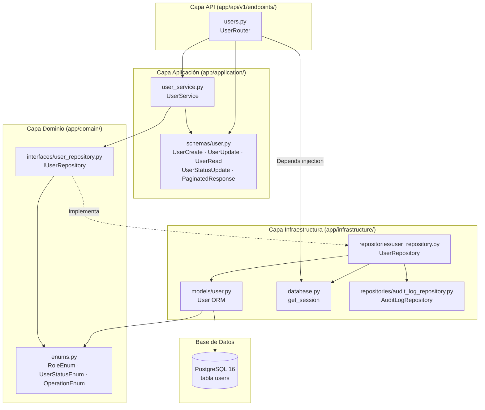
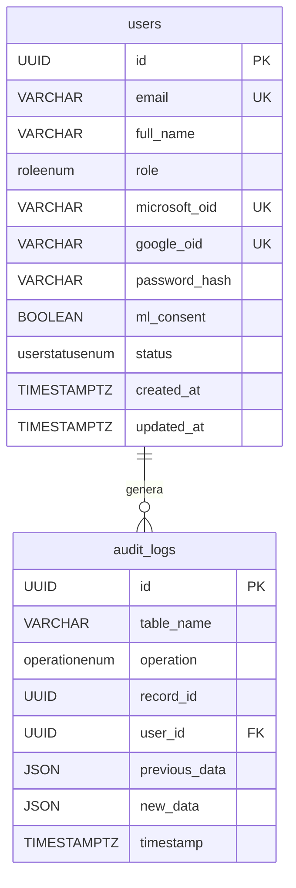

# Documento de Diseño Técnico — user-crud-endpoints

## Visión General

Este documento describe el diseño técnico para habilitar los endpoints CRUD completos de la entidad `User` en el backend FastAPI del MPRA. La feature introduce cinco endpoints REST bajo `/api/v1/users`, una nueva columna `status` en la tabla `users` con su migración Alembic correspondiente, y una capa de servicio `UserService` que orquesta la lógica de negocio entre el router y el repositorio.

El diseño respeta estrictamente la Clean Architecture ya establecida en el proyecto (Dominio → Aplicación → Infraestructura → API), las prácticas RESTful del proyecto y las reglas de negocio vigentes (RB-04, RNF-02, RNF-03).

---

## Arquitectura

### Diagrama de capas



### Flujo de datos por endpoint

```
Cliente HTTP
    │
    ▼
UserRouter  (validación Pydantic, HTTP status, response_model)
    │
    ▼
UserService  (lógica de negocio: 404, 409, filtros, paginación)
    │
    ▼
IUserRepository  (contrato abstracto de dominio)
    │
    ▼
UserRepository  (SQL async + audit log en misma transacción)
    │
    ▼
PostgreSQL 16
```

---

## Componentes e Interfaces

### 1. `UserStatusEnum` — `app/domain/enums.py`

Nuevo enum que representa el estado lógico de un usuario. Se agrega al módulo de enums existente.

```python
class UserStatusEnum(str, Enum):
    ACTIVE = "ACTIVE"
    INACTIVE = "INACTIVE"
```

**Decisión de diseño:** Se define en la capa de dominio (no en infraestructura) porque es una regla de negocio — el concepto de usuario activo/inactivo pertenece al dominio, no a la persistencia.

---

### 2. Modelo ORM `User` — `app/infrastructure/models/user.py`

Se agrega el campo `status` al modelo existente:

```python
status: UserStatusEnum = Field(
    default=UserStatusEnum.ACTIVE,
    nullable=False,
    sa_column_kwargs={"server_default": "ACTIVE"},
)
```

**Decisión de diseño:** `server_default="ACTIVE"` garantiza que los registros existentes en la BD reciban el valor correcto al aplicar la migración, sin necesidad de un `UPDATE` masivo separado.

---

### 3. Migración Alembic — `alembic/versions/0002_add_user_status.py`

```python
revision = "0002"
down_revision = "0001"

def upgrade():
    # 1. Crear el tipo ENUM en PostgreSQL
    op.execute("CREATE TYPE userstatusenum AS ENUM ('ACTIVE', 'INACTIVE')")
    # 2. Agregar columna con server_default para registros existentes
    op.add_column(
        "users",
        sa.Column(
            "status",
            sa.Enum("ACTIVE", "INACTIVE", name="userstatusenum"),
            nullable=False,
            server_default="ACTIVE",
        ),
    )

def downgrade():
    op.drop_column("users", "status")
    op.execute("DROP TYPE IF EXISTS userstatusenum")
```

**Decisión de diseño:** Se usa `server_default` en lugar de `nullable=True` + migración de datos para mantener la restricción `NOT NULL` desde el primer momento y evitar una migración en dos pasos.

---

### 4. Schemas Pydantic — `app/application/schemas/user.py`

#### `UserRead` (actualizado)
Agrega el campo `status: UserStatusEnum`. Nunca expone `password_hash`.

#### `UserStatusUpdate` (nuevo)
Schema de un solo campo para el endpoint `PATCH /users/{id}/status`:
```python
class UserStatusUpdate(BaseModel):
    status: UserStatusEnum
```

#### `PaginatedResponse[T]` (nuevo, genérico)
```python
class PaginatedResponse(BaseModel, Generic[T]):
    data: list[T]
    total: int
    skip: int
    limit: int
```

**Decisión de diseño:** `PaginatedResponse` es genérico (`Generic[T]`) para que pueda reutilizarse en otros recursos del proyecto (cursos, inscripciones, etc.) sin duplicar código. FastAPI resuelve correctamente el `response_model` con tipos genéricos en Pydantic v2.

---

### 5. Interfaz `IUserRepository` — `app/domain/interfaces/user_repository.py`

Se agregan dos métodos abstractos a la interfaz existente:

```python
@abstractmethod
async def count(
    self,
    role: RoleEnum | None,
    professor_id: UUID | None,
    status: UserStatusEnum | None,
) -> int: ...

@abstractmethod
async def update_status(
    self,
    id: UUID,
    status: UserStatusEnum,
) -> User | None: ...
```

También se actualiza la firma de `list` para aceptar el filtro `status`:

```python
@abstractmethod
async def list(
    self,
    role: RoleEnum | None,
    professor_id: UUID | None,
    status: UserStatusEnum | None,
    skip: int,
    limit: int,
) -> list[User]: ...
```

---

### 6. `UserRepository` — `app/infrastructure/repositories/user_repository.py`

#### `list` (actualizado)
Se agrega el filtro `status`. Cuando `status` es `None`, se aplica el default `ACTIVE` (comportamiento definido en `UserService`, no en el repositorio — el repositorio es agnóstico al default).

#### `count` (nuevo)
Replica exactamente los mismos filtros de `list` pero usa `SELECT COUNT(*)` sin `OFFSET`/`LIMIT`:

```python
async def count(self, role, professor_id, status) -> int:
    stmt = select(func.count()).select_from(User)
    # mismos filtros que list()
    result = await self._session.execute(stmt)
    return result.scalar_one()
```

**Decisión de diseño:** `count` y `list` comparten la misma lógica de filtrado. Se extrae un método privado `_build_filter_stmt` para evitar duplicación y garantizar consistencia entre ambos (el total paginado siempre corresponde a los mismos filtros que la página).

#### `update_status` (nuevo)
Actualiza únicamente el campo `status` y registra audit log `UPDATE`:

```python
async def update_status(self, id: UUID, status: UserStatusEnum) -> User | None:
    user = await self.get_by_id(id)
    if user is None:
        return None
    previous = {"status": user.status}
    user.status = status
    user.updated_at = datetime.now(timezone.utc)
    self._session.add(user)
    await self._session.flush()
    await self._session.refresh(user)
    await self._audit.register(AuditLogCreate(
        table_name="users",
        operation=OperationEnum.UPDATE,
        record_id=id,
        previous_data=previous,
        new_data={"status": status},
    ))
    return user
```

---

### 7. `UserService` — `app/application/services/user_service.py`

Capa de aplicación nueva. Recibe una instancia de `IUserRepository` por inyección de dependencias (no instancia el repositorio directamente — respeta la inversión de dependencias).

**Decisión de diseño:** Se introduce `UserService` como intermediario entre el router y el repositorio por tres razones:
1. El router no debe conocer detalles de persistencia (violación de SRP si el router llama directamente al repositorio).
2. La lógica de negocio (verificar email duplicado, aplicar default de `status=ACTIVE`, construir `PaginatedResponse`) no pertenece ni al router ni al repositorio.
3. Facilita el testing unitario: se puede mockear `IUserRepository` sin levantar base de datos.

#### Métodos

| Método | Responsabilidad |
|--------|----------------|
| `list_users(role, professor_id, status, skip, limit)` | Aplica `status=ACTIVE` como default cuando `status` es `None`; llama a `repo.list` y `repo.count` en paralelo; retorna `PaginatedResponse[UserRead]` |
| `create_user(data: UserCreate)` | Verifica email duplicado → `HTTPException(409)`; delega a `repo.create`; retorna `UserRead` |
| `get_user(id: UUID)` | Llama a `repo.get_by_id`; lanza `HTTPException(404)` si `None`; retorna `UserRead` |
| `update_user(id: UUID, data: UserUpdate)` | Llama a `repo.update`; lanza `HTTPException(404)` si `None`; retorna `UserRead` |
| `update_user_status(id: UUID, status: UserStatusEnum)` | Llama a `repo.update_status`; lanza `HTTPException(404)` si `None`; retorna `UserRead` |

**Decisión de diseño sobre `list_users`:** El default `status=ACTIVE` se aplica en `UserService`, no en el router ni en el repositorio. El router expone el parámetro como `Optional[UserStatusEnum] = None` para que el cliente pueda solicitar explícitamente usuarios `INACTIVE`. El servicio interpreta `None` como "mostrar solo activos" — esta es una regla de negocio, no una convención de API.

---

### 8. `UserRouter` — `app/api/v1/endpoints/users.py`

Router FastAPI con cinco endpoints. Usa `Depends(get_session)` para inyectar la sesión y construye `UserService(UserRepository(session))` en cada handler.

#### Endpoints

| Método | Ruta | Body | Response | Status |
|--------|------|------|----------|--------|
| `GET` | `/users` | — | `PaginatedResponse[UserRead]` | 200 |
| `POST` | `/users` | `UserCreate` | `UserRead` | 201 |
| `GET` | `/users/{user_id}` | — | `UserRead` | 200 |
| `PATCH` | `/users/{user_id}` | `UserUpdate` | `UserRead` | 200 |
| `PATCH` | `/users/{user_id}/status` | `UserStatusUpdate` | `UserRead` | 200 |

#### Query params de `GET /users`

| Parámetro | Tipo | Default | Validación |
|-----------|------|---------|------------|
| `role` | `RoleEnum \| None` | `None` | Enum válido |
| `professor_id` | `UUID \| None` | `None` | UUID válido |
| `status` | `UserStatusEnum \| None` | `None` | Enum válido |
| `skip` | `int` | `0` | `ge=0` |
| `limit` | `int` | `20` | `ge=1, le=100` |

FastAPI valida `limit` automáticamente con `Query(ge=1, le=100)` y retorna 422 si se supera.

---

### 9. Registro en `main.py`

```python
from app.api.v1.endpoints import users

app.include_router(
    users.router,
    prefix="/api/v1",
    tags=["Usuarios"],
)
```

---

## Modelos de Datos

### Tabla `users` (estado final tras migración)

| Columna | Tipo PostgreSQL | Nullable | Default | Notas |
|---------|----------------|----------|---------|-------|
| `id` | `UUID` | NO | `uuid_generate_v4()` | PK |
| `email` | `VARCHAR` | NO | — | UNIQUE, INDEX |
| `full_name` | `VARCHAR` | NO | — | |
| `role` | `roleenum` | NO | — | STUDENT\|PROFESSOR\|ADMIN |
| `microsoft_oid` | `VARCHAR` | SÍ | NULL | UNIQUE |
| `google_oid` | `VARCHAR` | SÍ | NULL | UNIQUE |
| `password_hash` | `VARCHAR` | SÍ | NULL | Nunca en respuestas |
| `ml_consent` | `BOOLEAN` | NO | `false` | |
| `status` | `userstatusenum` | NO | `'ACTIVE'` | **NUEVO** — ACTIVE\|INACTIVE |
| `created_at` | `TIMESTAMPTZ` | NO | — | |
| `updated_at` | `TIMESTAMPTZ` | NO | — | Actualizado en cada write |

### Schema `PaginatedResponse[UserRead]` (ejemplo JSON)

```json
{
  "data": [
    {
      "id": "550e8400-e29b-41d4-a716-446655440000",
      "email": "usuario@ejemplo.com",
      "full_name": "Nombre Apellido",
      "role": "STUDENT",
      "status": "ACTIVE",
      "ml_consent": false,
      "created_at": "2025-01-01T00:00:00Z",
      "updated_at": "2025-01-01T00:00:00Z"
    }
  ],
  "total": 42,
  "skip": 0,
  "limit": 20
}
```

### Diagrama entidad-relación (fragmento relevante)




---

## Propiedades de Correctness

*Una propiedad es una característica o comportamiento que debe mantenerse verdadero en todas las ejecuciones válidas del sistema — esencialmente, una declaración formal sobre lo que el sistema debe hacer. Las propiedades sirven como puente entre las especificaciones legibles por humanos y las garantías de correctness verificables por máquina.*

Las propiedades a continuación se derivan del análisis de los criterios de aceptación. Se aplicó reflexión de propiedades para eliminar redundancias: los criterios 1.9, 2.5, 3.4, 4.6, 5.6 y 8.6 se consolidaron en P9; los criterios 2.1, 3.1 y 8.1 en P1; los criterios 3.2, 4.2, 5.2 y 8.5 en P8; los criterios 2.4, 4.4 y 5.5 en P10.

---

### Propiedad 1: Round-trip crear → recuperar

*Para cualquier* `UserCreate` válido generado aleatoriamente, crear el usuario vía `POST /api/v1/users` y luego recuperarlo vía `GET /api/v1/users/{user_id}` debe retornar exactamente los mismos valores de `email`, `full_name`, `role` y `status`.

**Valida: Requisitos 2.1, 3.1, 8.1**

---

### Propiedad 2: Idempotencia de lectura

*Para cualquier* usuario existente en la base de datos, múltiples llamadas consecutivas a `GET /api/v1/users/{user_id}` con el mismo UUID, sin modificaciones intermedias, deben retornar siempre la misma respuesta.

**Valida: Requisito 8.2**

---

### Propiedad 3: Filtrado por rol es exhaustivo y exclusivo

*Para cualquier* conjunto de usuarios con roles heterogéneos y cualquier valor de `RoleEnum`, al llamar `GET /api/v1/users?role={r}` todos los elementos del campo `data` deben tener exactamente `role == r`, y el campo `total` debe coincidir con `len(data)` cuando `skip=0` y `limit >= total`.

**Valida: Requisitos 1.2, 1.5**

---

### Propiedad 4: Soft delete — usuarios INACTIVE excluidos del listado por defecto

*Para cualquier* usuario desactivado vía `PATCH /api/v1/users/{user_id}/status` con `{"status": "INACTIVE"}`, una llamada posterior a `GET /api/v1/users` sin el parámetro `status` no debe incluir ese usuario en el campo `data`.

**Valida: Requisitos 1.4, 5.1, 8.7**

---

### Propiedad 5: Reactivación — usuarios ACTIVE incluidos en listado por defecto

*Para cualquier* usuario previamente desactivado (`INACTIVE`) y luego reactivado vía `PATCH /api/v1/users/{user_id}/status` con `{"status": "ACTIVE"}`, una llamada posterior a `GET /api/v1/users` sin el parámetro `status` debe incluir ese usuario en el campo `data`.

**Valida: Requisitos 1.4, 1.5, 5.1, 8.8**

---

### Propiedad 6: Paginación metamórfica — unión de páginas equivale a consulta completa

*Para cualquier* conjunto de N usuarios activos y cualquier valor de `limit = k` donde `1 ≤ k < N`, la concatenación de los campos `data` de todas las páginas obtenidas iterando con `skip = 0, k, 2k, ...` debe contener exactamente los mismos elementos (sin importar el orden) que el campo `data` de una consulta con `limit = N` y `skip = 0`.

**Valida: Requisito 8.3**

---

### Propiedad 7: Consistencia del total paginado

*Para cualquier* conjunto de N usuarios activos y cualquier valor de `limit = k`, el campo `total` reportado en cualquier página de la respuesta debe ser igual a N, independientemente del valor de `skip`.

**Valida: Requisito 8.4**

---

### Propiedad 8: HTTP 404 para UUID inexistente

*Para cualquier* UUID generado aleatoriamente que no corresponda a ningún usuario en la base de datos, las llamadas a `GET /api/v1/users/{user_id}`, `PATCH /api/v1/users/{user_id}` y `PATCH /api/v1/users/{user_id}/status` deben retornar siempre HTTP 404.

**Valida: Requisitos 3.2, 4.2, 5.2, 8.5**

---

### Propiedad 9: `password_hash` nunca aparece en ninguna respuesta

*Para cualquier* combinación válida de datos de entrada generados aleatoriamente (incluyendo usuarios con `password_hash` no nulo), ninguna respuesta de los endpoints `GET /users`, `POST /users`, `GET /users/{id}`, `PATCH /users/{id}` ni `PATCH /users/{id}/status` debe contener el campo `password_hash` en el cuerpo JSON.

**Valida: Requisitos 1.9, 2.5, 3.4, 4.6, 5.6, 8.6**

---

### Propiedad 10: Audit log registrado en cada operación de escritura

*Para cualquier* operación de escritura exitosa (`POST /users`, `PATCH /users/{id}`, `PATCH /users/{id}/status`), debe existir exactamente un registro en `audit_logs` con el `record_id` del usuario afectado y la `operation` correspondiente (`INSERT` o `UPDATE`), creado en la misma transacción.

**Valida: Requisitos 2.4, 4.4, 5.5**

---

### Propiedad 11: Email duplicado retorna HTTP 409

*Para cualquier* email que ya exista en la base de datos, un intento de `POST /api/v1/users` con ese mismo email debe retornar siempre HTTP 409, sin crear ningún registro nuevo ni audit log.

**Valida: Requisito 2.2**

---

## Manejo de Errores

### Tabla de errores por endpoint

| Situación | Código HTTP | Mensaje |
|-----------|-------------|---------|
| Email duplicado en `POST /users` | 409 | `"El email ya está registrado"` |
| `user_id` no existe en `GET`, `PATCH` | 404 | `"Usuario no encontrado"` |
| `user_id` con formato inválido | 422 | (detalle Pydantic automático) |
| `limit > 100` en `GET /users` | 422 | (detalle Pydantic automático) |
| `skip < 0` en `GET /users` | 422 | (detalle Pydantic automático) |
| Valor de enum inválido en body/query | 422 | (detalle Pydantic automático) |
| Campo requerido ausente en body | 422 | (detalle Pydantic automático) |
| Error de base de datos | 500 | (manejado por middleware global) |

### Estrategia de manejo

- **Errores de validación (422):** FastAPI los genera automáticamente a partir de los schemas Pydantic v2. No se requiere código adicional.
- **Errores de negocio (404, 409):** Se lanzan como `HTTPException` desde `UserService`. El router no contiene lógica de negocio.
- **Rollback de transacción:** `get_session()` ya implementa rollback automático ante cualquier excepción no capturada. Si el audit log falla, toda la transacción se revierte (atomicidad garantizada).
- **Errores 500:** No se exponen detalles internos al cliente. El middleware de FastAPI retorna `{"detail": "Internal Server Error"}`.

### Flujo de error en `create_user`

```
POST /users
    │
    ▼
UserRouter — valida UserCreate (Pydantic) → 422 si inválido
    │
    ▼
UserService.create_user()
    │
    ├─ repo.get_by_email(email) → existe → HTTPException(409)
    │
    └─ repo.create(data) → éxito → UserRead
```

---

## Estrategia de Testing

### Enfoque dual: tests unitarios + tests de propiedades

Los tests unitarios y los tests de propiedades son complementarios. Los unitarios verifican ejemplos concretos y casos borde; los de propiedades verifican invariantes universales con cientos de inputs generados aleatoriamente.

### Tests unitarios (`tests/test_users.py`)

Cubren casos concretos y de integración:

- Crear usuario con datos válidos → HTTP 201, respuesta contiene `id`, `email`, `status=ACTIVE`
- Crear usuario con email duplicado → HTTP 409
- Obtener usuario existente → HTTP 200
- Obtener usuario inexistente → HTTP 404
- Actualizar usuario parcialmente → solo los campos enviados cambian
- Cambiar status a INACTIVE → `status` en respuesta es `INACTIVE`
- `GET /users` sin parámetros → solo retorna usuarios ACTIVE
- `GET /users?status=INACTIVE` → retorna usuarios INACTIVE
- `limit=101` → HTTP 422
- `skip=-1` → HTTP 422
- Respuesta nunca contiene `password_hash`

### Tests de propiedades (`tests/test_users_properties.py`)

Librería: **Hypothesis** (ya presente en el proyecto, evidenciado por `.hypothesis/` en el repositorio).

Cada test de propiedad debe ejecutarse con mínimo **100 iteraciones** (`settings.max_examples=100`).

Cada test debe incluir un comentario de trazabilidad con el formato:
`# Feature: user-crud-endpoints, Propiedad N: <texto>`

#### Mapeo propiedad → test

| Propiedad | Nombre del test | Estrategia Hypothesis |
|-----------|----------------|----------------------|
| P1 — Round-trip | `test_create_get_roundtrip` | `st.builds(UserCreate, email=st.emails(), full_name=st.text(min_size=1), role=st.sampled_from(RoleEnum))` |
| P2 — Idempotencia lectura | `test_get_idempotent` | Usuario existente, múltiples GET |
| P3 — Filtrado por rol | `test_filter_by_role_exhaustive` | `st.lists(UserCreate, min_size=1)` + `st.sampled_from(RoleEnum)` |
| P4 — Soft delete | `test_inactive_excluded_from_default_list` | Usuario creado, desactivado, verificar ausencia |
| P5 — Reactivación | `test_reactivated_appears_in_default_list` | Usuario INACTIVE reactivado, verificar presencia |
| P6 — Paginación metamórfica | `test_pagination_metamorphic` | `st.lists(UserCreate, min_size=2, max_size=10)` + `st.integers(min_value=1)` |
| P7 — Total paginado | `test_pagination_total_consistent` | Mismo setup que P6 |
| P8 — 404 UUID inexistente | `test_nonexistent_uuid_returns_404` | `st.uuids()` filtrados para no existir en BD |
| P9 — Sin password_hash | `test_password_hash_never_in_response` | `st.builds(UserCreate, ...)` con `password_hash` no nulo |
| P10 — Audit log | `test_write_operations_create_audit_log` | Operaciones de escritura aleatorias |
| P11 — Email duplicado 409 | `test_duplicate_email_returns_409` | `st.emails()` usados dos veces |

#### Configuración de Hypothesis

```python
from hypothesis import given, settings, HealthCheck
from hypothesis import strategies as st

@settings(max_examples=100, suppress_health_check=[HealthCheck.function_scoped_fixture])
@given(...)
async def test_...(client, ...):
    ...
```

#### Fixture de base de datos para tests

Los tests de propiedades requieren una base de datos de test aislada. Se recomienda usar `pytest-asyncio` con una base de datos PostgreSQL de test (o SQLite en modo async para tests unitarios) con rollback por test para garantizar aislamiento.

```python
# conftest.py
@pytest.fixture
async def client(db_session):
    # Inyectar sesión de test en la app
    app.dependency_overrides[get_session] = lambda: db_session
    async with AsyncClient(app=app, base_url="http://test") as c:
        yield c
```
