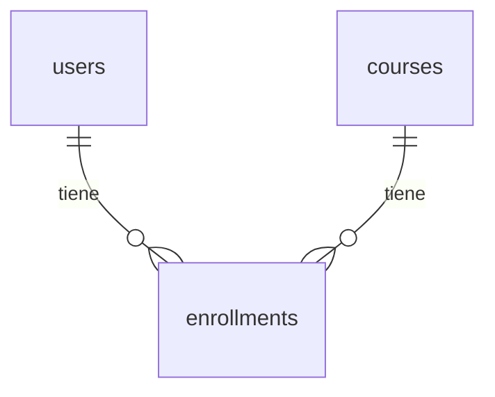

# Documentation Maintenance

## Regla General
Cada vez que se agregue, modifique o elimine una característica del proyecto, se debe actualizar la documentación correspondiente **en el mismo cambio**. No se considera completa una tarea si la documentación no está al día.

## README.md
Actualizar `README.md` cuando:
- Se agreguen nuevos endpoints o recursos
- Cambien los requisitos de instalación o dependencias
- Se modifique el flujo de autenticación
- Se agreguen nuevas variables de entorno (también actualizar `env.example`)
- Cambie la estructura del proyecto
- Se agreguen nuevos comandos útiles

## Documentación de Endpoints (Swagger / OpenAPI)
Todo endpoint debe tener en su decorador:
- `summary` — descripción corta de una línea
- `description` — explicación detallada si el comportamiento no es obvio
- `response_model` — siempre definido
- `status_code` — siempre explícito
- `tags` — agrupación lógica por recurso (ej. `["users"]`, `["predictions"]`)

Ejemplo:
```python
@router.post(
    "/users",
    response_model=UserResponse,
    status_code=201,
    summary="Create a new user",
    description="Registers a new user in the system. Requires unique email.",
    tags=["users"],
)
async def create_user(...):
    ...
```

## Schemas Pydantic
- Usar `Field(description="...")` en los campos de los schemas para que aparezcan documentados en Swagger
- Ejemplo:
```python
class UserCreate(BaseModel):
    email: str = Field(..., description="Correo institucional del usuario")
    role: RoleEnum = Field(..., description="Rol asignado: student, professor, admin")
```

## Checklist al completar una tarea
- [ ] ¿Se actualizó el README si cambió algo visible para el desarrollador?
- [ ] ¿Todos los endpoints nuevos tienen `summary`, `tags` y `response_model`?
- [ ] ¿Los schemas tienen `Field(description=...)` en campos no obvios?
- [ ] ¿Se actualizó `env.example` si se agregaron variables de entorno?
- [ ] ¿Los diagramas nuevos o actualizados están en formato Mermaid?

## Diagramas
Todos los diagramas del proyecto deben escribirse en [Mermaid](https://mermaid.js.org/). No usar imágenes, ASCII art ni otros formatos.

Tipos de diagrama recomendados según el caso:
- Relaciones de BD → `erDiagram`
- Flujos y procesos → `flowchart LR` o `flowchart TD`
- Secuencias de llamadas → `sequenceDiagram`
- Estados de entidades → `stateDiagram-v2`

Ejemplo:

