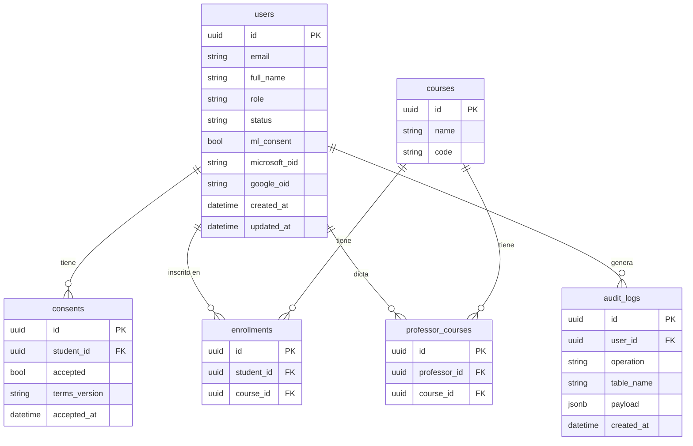

# Academic Risk Predictor Backend (MPRA)

Sistema de predicción de riesgo académico basado en Machine Learning para la detección temprana de deserción universitaria.

## Tabla de Contenidos
- [Descripción](#descripción)
- [Arquitectura](#arquitectura)
- [Estructura del Proyecto](#estructura-del-proyecto)
- [Requisitos](#requisitos)
- [Instalación](#instalación)
- [Variables de Entorno](#variables-de-entorno)
- [Base de Datos](#base-de-datos)
- [Ejecución](#ejecución)
- [Endpoints](#endpoints)
- [Despliegue](#despliegue)

---

## Descripción

El **MPRA** utiliza un modelo de **Regresión Logística** (scikit-learn) para transformar variables académicas en una probabilidad de riesgo (0–1), permitiendo intervenciones pedagógicas tempranas.

**Stack:**
- Python 3.12 + FastAPI (async) + uvicorn
- PostgreSQL 16 (persistencia relacional)
- SQLAlchemy async + SQLModel (ORM)
- Alembic (migraciones)
- scikit-learn + joblib (ML)
- Pydantic v2 + pydantic-settings

---

## Arquitectura

El proyecto sigue **Clean Architecture** con tres capas bien definidas:

```
┌──────────────────────────────────────────┐
│         Capa de Presentación             │
│   app/api/v1/endpoints/                  │
│   Manejo HTTP, validación Pydantic       │
└──────────────────────────────────────────┘
                    ↓
┌──────────────────────────────────────────┐
│         Capa de Aplicación               │
│   app/application/services/             │
│   app/application/schemas/              │
│   Lógica de negocio, DTOs               │
└──────────────────────────────────────────┘
                    ↓
┌──────────────────────────────────────────┐
│         Capa de Dominio                  │
│   app/domain/interfaces/                │
│   app/domain/enums.py                   │
│   Contratos (interfaces), enums         │
└──────────────────────────────────────────┘
                    ↓
┌──────────────────────────────────────────┐
│         Capa de Infraestructura          │
│   app/infrastructure/models/            │
│   app/infrastructure/repositories/     │
│   ORM models, implementaciones de repo  │
└──────────────────────────────────────────┘
```

---

## Estructura del Proyecto

```
academic-risk-predictor-backend/
├── app/
│   ├── main.py                          # Entry point FastAPI
│   ├── api/v1/endpoints/
│   │   ├── health.py                    # GET /health
│   │   ├── prediction.py                # POST /api/v1/predict, /chat
│   │   └── users.py                     # CRUD /api/v1/users
│   ├── application/
│   │   ├── schemas/                     # DTOs Pydantic
│   │   │   ├── user.py
│   │   │   ├── consent.py
│   │   │   ├── course.py
│   │   │   └── audit_log.py
│   │   └── services/                    # Lógica de negocio
│   │       ├── user_service.py
│   │       ├── consent_service.py
│   │       └── ml_service.py
│   ├── core/
│   │   ├── config.py                    # Settings (pydantic-settings)
│   │   └── security.py
│   ├── domain/
│   │   ├── enums.py                     # RoleEnum, UserStatusEnum, OperationEnum
│   │   └── interfaces/                  # Contratos de repositorios
│   ├── infrastructure/
│   │   ├── database.py                  # Engine async + get_session
│   │   ├── models/                      # ORM SQLModel
│   │   └── repositories/               # Implementaciones de repositorios
│   └── schemas/
│       └── student.py                   # DTOs ML (StudentInput, PredictionOutput)
├── alembic/                             # Migraciones de base de datos
│   └── versions/
│       ├── 0001_initial_schema.py
│       └── 0002_add_user_status.py
├── datasets/                            # Dataset de entrenamiento (.csv)
├── ml_models/                           # Artefactos ML (.joblib, generados)
├── tests/
├── main.py                              # Wrapper raíz (compatibilidad despliegue)
├── requirements.txt
├── Procfile
├── alembic.ini
└── env.example
```

---

## Requisitos

- Python 3.12+
- PostgreSQL 16
- pip

---

## Instalación

```bash
# 1. Clonar el repositorio
git clone <repository-url>
cd academic-risk-predictor-backend

# 2. Crear entorno virtual
python3 -m venv venv
source venv/bin/activate  # Windows: venv\Scripts\activate

# 3. Instalar dependencias
pip3 install -r requirements.txt

# 4. Configurar variables de entorno
cp env.example .env
# Editar .env con tus valores
```

---

## Variables de Entorno

Copia `env.example` a `.env` y ajusta los valores:

| Variable | Default | Descripción |
|---|---|---|
| `HOST` | `0.0.0.0` | Host del servidor |
| `PORT` | `8000` | Puerto del servidor |
| `CORS_ORIGINS` | `*` | Orígenes CORS permitidos |
| `DB_USER` | `mpra_user` | Usuario PostgreSQL |
| `DB_PASSWORD` | `mpra_secret` | Contraseña PostgreSQL |
| `DB_HOST` | `localhost` | Host PostgreSQL |
| `DB_PORT` | `5432` | Puerto PostgreSQL |
| `DB_NAME` | `mpra_db` | Nombre de la base de datos |
| `DATABASE_URL` | _(auto)_ | URL completa (sobreescribe DB_*) |
| `DB_POOL_MIN` | `5` | Tamaño mínimo del pool |
| `DB_POOL_MAX` | `20` | Tamaño máximo del pool |
| `DB_ECHO` | `false` | Logging SQL de SQLAlchemy |
| `MODEL_PATH` | `ml_models/modelo_logistico.joblib` | Ruta al modelo ML |
| `SCALER_PATH` | `ml_models/scaler.joblib` | Ruta al scaler |
| `DATASET_PATH` | `datasets/dataset_estudiantes_decimal.csv` | Dataset de entrenamiento |
| `UMBRAL_RIESGO_ALTO` | `0.7` | Umbral riesgo alto |
| `UMBRAL_RIESGO_MEDIO` | `0.4` | Umbral riesgo medio |

---

## Base de Datos

El proyecto usa **Alembic** para gestionar migraciones. Asegúrate de que PostgreSQL esté corriendo y la base de datos exista antes de migrar.

```bash
# Aplicar todas las migraciones
alembic upgrade head

# Crear una nueva migración
alembic revision --autogenerate -m "descripcion_del_cambio"

# Ver historial
alembic history
```

### Diagrama ER



---

## Ejecución

```bash
# Desarrollo (con reload)
task dev

# Producción (multi-worker)
task start

# Tests con cobertura
task test

# Aplicar migraciones
task migrate
```

O directamente con uvicorn:
```bash
python3 -m uvicorn app.main:app --reload --host 0.0.0.0 --port 8000
```

### Docker

```bash
docker build -t academic-risk-predictor .
docker run -p 8000:8000 --env-file .env academic-risk-predictor
```

### Documentación interactiva (servidor corriendo)

- Swagger UI: http://localhost:8000/docs
- ReDoc: http://localhost:8000/redoc

---

## Endpoints

### Health

| Método | Ruta | Descripción |
|---|---|---|
| GET | `/health` | Estado del servicio, DB y modelo ML |

Respuesta `200 healthy`:
```json
{
  "status": "healthy",
  "database": "connected",
  "modelo_cargado": true,
  "scaler_cargado": true,
  "promedio_aprobados_cargado": true,
  "version": "1.0.0"
}
```

---

### Predicción ML

| Método | Ruta | Descripción |
|---|---|---|
| POST | `/api/v1/predict` | Predicción de riesgo académico |
| POST | `/api/v1/chat` | Chat con consejero académico virtual |

#### `POST /api/v1/predict`

Variables mínimas obligatorias (RB-01):

```json
{
  "promedio_asistencia": 78.5,
  "promedio_seguimiento": 3.1,
  "nota_parcial_1": 2.8,
  "inicios_sesion_plataforma": 45,
  "uso_tutorias": 2
}
```

Query param opcional: `?student_id=<uuid>` — si se provee, verifica consentimiento ML (RB-02).

Respuesta:
```json
{
  "probabilidad_riesgo": 0.65,
  "porcentaje_riesgo": 65.0,
  "nivel_riesgo": "MEDIO",
  "analisis_ia": "...",
  "datos_radar": { "labels": [...], "estudiante": [...], "promedio_aprobado": [...] },
  "detalles_matematicos": { "formula_logit": "...", "valor_z": 0.619, "coeficientes": [...] }
}
```

Umbrales de riesgo (RB-03):
- Bajo: `< 0.4`
- Medio: `0.4 – 0.7`
- Alto: `> 0.7`

---

### Usuarios

| Método | Ruta | Descripción |
|---|---|---|
| GET | `/api/v1/users` | Listar usuarios (filtros + paginación) |
| POST | `/api/v1/users` | Crear usuario |
| GET | `/api/v1/users/{user_id}` | Obtener usuario por ID |
| PATCH | `/api/v1/users/{user_id}` | Actualizar usuario (parcial) |
| PATCH | `/api/v1/users/{user_id}/status` | Cambiar estado (ACTIVE/INACTIVE) |

Query params para `GET /api/v1/users`: `role`, `professor_id`, `status`, `skip` (default 0), `limit` (default 20, max 100).

Roles disponibles: `STUDENT`, `PROFESSOR`, `ADMIN`

Respuesta paginada:
```json
{
  "data": [...],
  "total": 42,
  "skip": 0,
  "limit": 20
}
```

---

## Modelo ML

- Artefactos en `ml_models/` (`.joblib`)
- Al iniciar: si existen se cargan; si no, se entrena automáticamente desde el dataset CSV
- Modelo cargado en memoria al inicio (RNF-05) — sin I/O por petición
- Orden de features estricto: `promedio_asistencia`, `promedio_seguimiento`, `nota_parcial_1`, `inicios_sesion_plataforma`, `uso_tutorias`

---

## Tests

```bash
task test
# equivalente a: python3 -m pytest tests/ -v --cov=app
```

---

## Despliegue

### Plataformas PaaS

Soportado en Railway, Render y Heroku. Ver `Procfile`, `railway.json`, `render.yaml`.

```bash
# Procfile
web: uvicorn app.main:app --host 0.0.0.0 --port $PORT
```

Asegúrate de configurar las variables de entorno en el panel del servicio, especialmente `DATABASE_URL`.

### Despliegue en Azure con CI/CD (GitHub Actions)

El proyecto cuenta con pipelines de **Integración Continua (CI)** y **Despliegue Continuo (CD)** automatizados mediante GitHub Actions. Se utilizan dos workflows separados:

| Workflow | Archivo | Propósito |
|----------|---------|-----------|
| **CI** | `.github/workflows/ci.yml` | Ejecuta tests, cobertura de código y validación de la plantilla Bicep en cada Pull Request contra `main` o `develop` |
| **CD** | `.github/workflows/cd.yml` | Despliega automáticamente a Azure Container Apps al fusionar código a `develop` (entorno dev) o `main` (entorno prod) |

**Estrategia de ramas:**
- Merge a `develop` → despliegue automático a **dev**
- Merge a `main` → despliegue automático a **prod** (con ejecución de tests previos)

> 📖 Para documentación detallada sobre CI/CD, configuración de GitHub Secrets, creación del Service Principal de Azure y ejecución manual de workflows, consulta [`infra/README.md`](infra/README.md).
