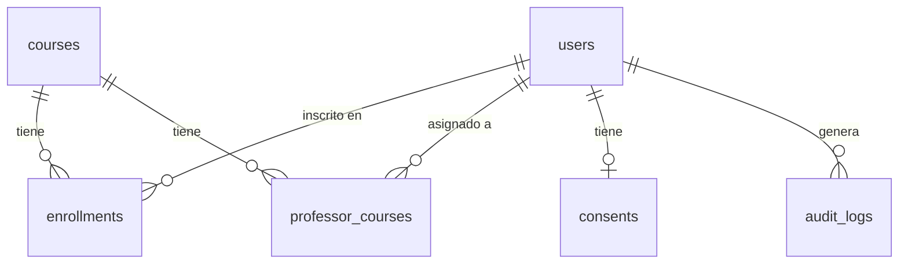

# Database — Tablas y Relaciones

## Diagrama de Relaciones

---

## Tablas

### `users`
Entidad central del sistema. Representa estudiantes, docentes y administradores.

| Columna | Tipo | Restricciones | Descripción |
|---|---|---|---|
| `id` | UUID | PK | Identificador único generado automáticamente |
| `email` | VARCHAR | UNIQUE, NOT NULL, INDEX | Correo institucional |
| `full_name` | VARCHAR | NOT NULL | Nombre completo |
| `role` | `roleenum` | NOT NULL | `STUDENT`, `PROFESSOR`, `ADMIN` |
| `microsoft_oid` | VARCHAR | UNIQUE, nullable | Object ID de Microsoft Entra |
| `google_oid` | VARCHAR | UNIQUE, nullable | Object ID de Google |
| `password_hash` | VARCHAR | nullable | Hash de contraseña (auth local) |
| `ml_consent` | BOOLEAN | NOT NULL, default `false` | Consentimiento para motor ML |
| `status` | `userstatusenum` | NOT NULL, default `ACTIVE` | `ACTIVE`, `INACTIVE` |
| `created_at` | TIMESTAMP | NOT NULL | Fecha de creación (UTC) |
| `updated_at` | TIMESTAMP | NOT NULL | Última modificación (UTC) |

---

### `courses`
Asignaturas del sistema académico.

| Columna | Tipo | Restricciones | Descripción |
|---|---|---|---|
| `id` | UUID | PK | Identificador único |
| `code` | VARCHAR | UNIQUE, NOT NULL, INDEX | Código de la asignatura (ej. `MAT101`) |
| `name` | VARCHAR | NOT NULL | Nombre de la asignatura |
| `credits` | INTEGER | NOT NULL | Número de créditos |
| `academic_period` | VARCHAR | NOT NULL | Período académico (ej. `2026-1`) |
| `created_at` | TIMESTAMP | NOT NULL | Fecha de creación (UTC) |

---

### `enrollments`
Relación N:M entre estudiantes y asignaturas.

| Columna | Tipo | Restricciones | Descripción |
|---|---|---|---|
| `id` | UUID | PK | Identificador único |
| `student_id` | UUID | FK → `users.id`, NOT NULL | Estudiante inscrito |
| `course_id` | UUID | FK → `courses.id`, NOT NULL | Asignatura |
| `enrollment_date` | TIMESTAMP | NOT NULL | Fecha de inscripción (UTC) |

Restricción: `UNIQUE(student_id, course_id)` — un estudiante no puede inscribirse dos veces a la misma asignatura.

---

### `professor_courses`
Relación N:M entre docentes y asignaturas (RB-04: visibilidad de datos).

| Columna | Tipo | Restricciones | Descripción |
|---|---|---|---|
| `id` | UUID | PK | Identificador único |
| `professor_id` | UUID | FK → `users.id`, NOT NULL | Docente asignado |
| `course_id` | UUID | FK → `courses.id`, NOT NULL | Asignatura |

Restricción: `UNIQUE(professor_id, course_id)` — un docente no puede estar asignado dos veces a la misma asignatura.

---

### `consents`
Registro del consentimiento explícito del estudiante para el motor ML (RB-02).

| Columna | Tipo | Restricciones | Descripción |
|---|---|---|---|
| `id` | UUID | PK | Identificador único |
| `student_id` | UUID | FK → `users.id`, UNIQUE, NOT NULL | Estudiante (1:1 con users) |
| `accepted` | BOOLEAN | NOT NULL | Si aceptó o rechazó |
| `terms_version` | VARCHAR | NOT NULL | Versión de los términos aceptados |
| `accepted_at` | TIMESTAMP | NOT NULL | Fecha de aceptación (UTC) |

---

### `audit_logs`
Trazabilidad de todas las operaciones de escritura en la base de datos.

| Columna | Tipo | Restricciones | Descripción |
|---|---|---|---|
| `id` | UUID | PK | Identificador único |
| `table_name` | VARCHAR | NOT NULL | Tabla afectada (ej. `users`) |
| `operation` | `operationenum` | NOT NULL | `INSERT`, `UPDATE`, `DELETE` |
| `record_id` | UUID | NOT NULL | ID del registro afectado |
| `user_id` | UUID | FK → `users.id`, nullable | Usuario que realizó la operación |
| `previous_data` | JSON | nullable | Estado anterior del registro |
| `new_data` | JSON | nullable | Estado nuevo del registro |
| `timestamp` | TIMESTAMP | NOT NULL, INDEX | Momento de la operación (UTC) |

---

## Enums PostgreSQL

| Enum | Valores |
|---|---|
| `roleenum` | `STUDENT`, `PROFESSOR`, `ADMIN` |
| `userstatusenum` | `ACTIVE`, `INACTIVE` |
| `operationenum` | `INSERT`, `UPDATE`, `DELETE` |
