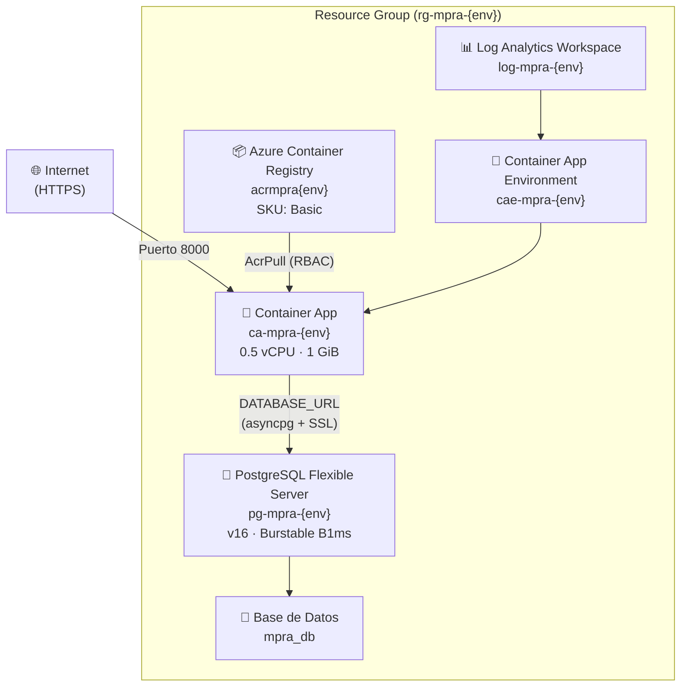
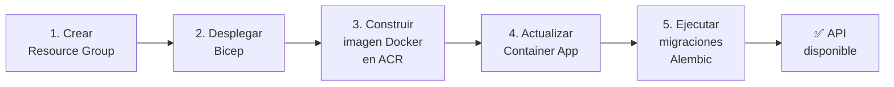
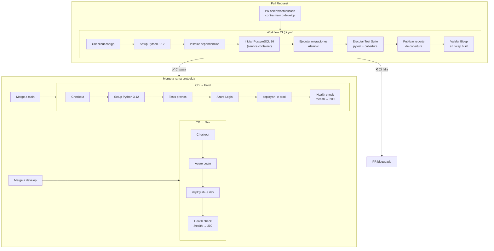

# 🚀 Despliegue en Azure — MPRA

Guía completa para desplegar el **Modelo Predictivo de Riesgo Académico (MPRA)** en Microsoft Azure usando Infraestructura como Código (IaC) con Bicep y Azure CLI.

## Arquitectura



### Flujo del despliegue



## Prerrequisitos

| Herramienta | Versión mínima | Instalación |
|-------------|---------------|-------------|
| **Azure CLI** | ≥ 2.50 | [Instalar Azure CLI](https://docs.microsoft.com/cli/azure/install-azure-cli) |
| **Suscripción de Azure** | — | [Crear cuenta gratuita](https://azure.microsoft.com/free/) |
| **Docker** | ≥ 20.10 | [Instalar Docker](https://docs.docker.com/get-docker/) (solo para desarrollo local) |

Verifica que Azure CLI está instalado y actualizado:

```bash
az version
# Debe mostrar "azure-cli": "2.50.0" o superior

az bicep version
# Si no está instalado: az bicep install
```

## Despliegue paso a paso

### 1. Iniciar sesión en Azure

```bash
az login
```

Se abrirá el navegador para autenticarte. Verifica la suscripción activa:

```bash
az account show --query '{nombre: name, id: id}' -o table
```

Si necesitas cambiar de suscripción:

```bash
az account set --subscription "NOMBRE_O_ID_DE_SUSCRIPCION"
```

### 2. Ejecutar el script de despliegue

Desde la raíz del repositorio:

```bash
./infra/deploy.sh \
  -e dev \
  -r eastus \
  -p 'MiPasswordSegura123!' \
  -j 'mi-clave-jwt-secreta-larga-y-segura'
```

**Parámetros:**

| Flag | Largo | Requerido | Descripción |
|------|-------|-----------|-------------|
| `-e` | `--env` | Sí | Nombre del entorno (`dev`, `staging`, `prod`) |
| `-r` | `--region` | Sí (deploy) | Región de Azure (ej: `eastus`, `westeurope`, `brazilsouth`) |
| `-p` | `--db-password` | Sí (deploy) | Contraseña del administrador de PostgreSQL |
| `-j` | `--jwt-secret` | Sí (deploy) | Clave secreta para firmar tokens JWT |
| | `--destroy` | No | Eliminar todos los recursos del entorno |
| `-h` | `--help` | No | Mostrar ayuda del script |

> **Nota sobre la contraseña de PostgreSQL:** Debe cumplir los requisitos de complejidad de Azure (mínimo 8 caracteres, incluir mayúsculas, minúsculas, números y caracteres especiales).

El script ejecutará automáticamente:

1. Creación del Resource Group `rg-mpra-{env}`
2. Despliegue de la plantilla Bicep con todos los recursos
3. Construcción de la imagen Docker en Azure Container Registry
4. Actualización del Container App con la imagen nueva
5. Ejecución de migraciones Alembic contra la base de datos

### 3. Verificar el despliegue

Al finalizar, el script mostrará la URL pública. Verifica que la API responde:

```bash
# Health check
curl https://<FQDN>/health

# Respuesta esperada:
# {"status": "healthy", "modelo_cargado": true, "scaler_cargado": true}
```

También puedes acceder a la documentación interactiva:

```
https://<FQDN>/docs      # Swagger UI
https://<FQDN>/redoc     # ReDoc
```

### Recursos creados

| Recurso | Nombre | Descripción |
|---------|--------|-------------|
| Resource Group | `rg-mpra-{env}` | Contenedor lógico de todos los recursos |
| Container Registry | `acrmpra{env}` | Registro privado de imágenes Docker |
| Log Analytics | `log-mpra-{env}` | Workspace de logs y monitoreo |
| Container App Environment | `cae-mpra-{env}` | Entorno de ejecución de contenedores |
| Container App | `ca-mpra-{env}` | Contenedor del backend FastAPI |
| PostgreSQL Server | `pg-mpra-{env}` | Servidor de base de datos gestionado |
| Base de Datos | `mpra_db` | Base de datos de la aplicación |

## Variables de entorno

El Container App se configura con las siguientes variables de entorno. Los valores por defecto coinciden con los definidos en `app/core/config.py`:

| Variable | Valor por defecto | Tipo | Descripción |
|----------|-------------------|------|-------------|
| `HOST` | `0.0.0.0` | Configuración | Host de escucha del servidor |
| `PORT` | `8000` | Configuración | Puerto de escucha del servidor |
| `LOG_LEVEL` | `info` | Configuración | Nivel de logging (`debug`, `info`, `warning`, `error`) |
| `CORS_ORIGINS` | `*` | Configuración | Orígenes permitidos para CORS (separados por coma) |
| `MODEL_PATH` | `ml_models/modelo_logistico.joblib` | Configuración | Ruta al archivo del modelo ML |
| `SCALER_PATH` | `ml_models/scaler.joblib` | Configuración | Ruta al archivo del scaler |
| `DATASET_PATH` | `datasets/dataset_estudiantes_decimal.csv` | Configuración | Ruta al dataset de entrenamiento |
| `DATABASE_URL` | *(construida automáticamente)* | Secreto | URL de conexión PostgreSQL (`postgresql+asyncpg://...`) |
| `JWT_SECRET_KEY` | *(proporcionada en despliegue)* | Secreto | Clave secreta para firmar tokens JWT |

> **Secretos:** `DATABASE_URL` y `JWT_SECRET_KEY` se almacenan como secretos del Container App y nunca se exponen en logs ni outputs. La `DATABASE_URL` se construye automáticamente con el formato `postgresql+asyncpg://{user}:{pass}@{host}:5432/mpra_db?sslmode=require`.

## Limpieza de recursos

Para eliminar **todos** los recursos de Azure de un entorno y evitar costos innecesarios:

```bash
./infra/deploy.sh -e dev --destroy
```

El script:

1. Verificará que el Resource Group existe
2. Mostrará la lista de recursos que serán eliminados
3. Pedirá confirmación interactiva (escribir `sí` o `si`)
4. Eliminará el Resource Group completo y todos los recursos contenidos

> **⚠️ Esta operación es irreversible.** Todos los datos de la base de datos, imágenes del registro y configuraciones se perderán permanentemente.

Para verificar que los recursos fueron eliminados:

```bash
az group exists --name rg-mpra-dev
# Debe retornar "false"
```

## Estimación de costos mensuales

Estimación para la configuración base en la región `East US` (precios aproximados en USD, sujetos a cambios):

| Recurso | SKU / Tier | Costo estimado/mes |
|---------|-----------|-------------------|
| **Azure Container Apps** | Consumo (0.5 vCPU, 1 GiB) | ~$0 – $15 ¹ |
| **PostgreSQL Flexible Server** | Burstable B1ms (1 vCore, 2 GiB RAM) | ~$12 – $15 |
| **Azure Container Registry** | Basic (10 GiB almacenamiento) | ~$5 |
| **Log Analytics Workspace** | PerGB2018 (primeros 5 GB gratis) | ~$0 – $2 |
| | | |
| **Total estimado** | | **~$17 – $37 /mes** |

¹ Container Apps con plan de consumo cobra por uso real de vCPU y memoria. Con escalado a cero (`minReplicas: 0`), el costo puede ser $0 cuando no hay tráfico.

> **Consejo:** Para entornos de desarrollo o pruebas, usa `--destroy` al terminar la sesión de trabajo para evitar costos. El despliegue completo toma aproximadamente 5-10 minutos.

### Optimización de costos

- **Escalado a cero:** El Container App está configurado con `minReplicas: 0`, lo que significa que no genera costos de cómputo cuando no hay tráfico.
- **PostgreSQL Burstable:** El SKU B1ms es el más económico y suficiente para desarrollo y cargas bajas de producción.
- **ACR Basic:** El tier Basic incluye 10 GiB de almacenamiento, suficiente para las imágenes del proyecto.
- **Destruir entornos efímeros:** Usa `--destroy` para eliminar entornos de dev/staging cuando no estén en uso.

## Referencia rápida de comandos

```bash
# Despliegue completo
./infra/deploy.sh -e dev -r eastus -p 'Password123!' -j 'jwt-secret'

# Destruir recursos
./infra/deploy.sh -e dev --destroy

# Mostrar ayuda
./infra/deploy.sh --help

# Validar plantilla Bicep (sin desplegar)
az bicep build --file infra/main.bicep

# Ver estado del Resource Group
az group show --name rg-mpra-dev --query 'properties.provisioningState' -o tsv

# Ver logs del Container App
az containerapp logs show --name ca-mpra-dev --resource-group rg-mpra-dev --follow

# Ejecutar migraciones manualmente
az containerapp exec --name ca-mpra-dev --resource-group rg-mpra-dev --command "alembic upgrade head"
```

## Solución de problemas

### El script falla con "Azure CLI no está instalado"

Instala Azure CLI siguiendo la [guía oficial](https://docs.microsoft.com/cli/azure/install-azure-cli) para tu sistema operativo.

### El script falla con "No hay una sesión activa"

Ejecuta `az login` para iniciar sesión en Azure.

### La construcción de la imagen Docker falla

- Verifica que el `Dockerfile` existe en la raíz del repositorio
- Revisa los logs de construcción en la salida del script
- Prueba construir localmente: `docker build -t mpra-backend .`

### Las migraciones de Alembic fallan

Las migraciones se ejecutan como advertencia (no detienen el despliegue). Para ejecutarlas manualmente:

```bash
az containerapp exec \
  --name ca-mpra-dev \
  --resource-group rg-mpra-dev \
  --command "alembic upgrade head"
```

### El Container App no responde

1. Verifica que el Container App está corriendo:
   ```bash
   az containerapp show --name ca-mpra-dev --resource-group rg-mpra-dev \
     --query 'properties.runningStatus' -o tsv
   ```
2. Revisa los logs:
   ```bash
   az containerapp logs show --name ca-mpra-dev --resource-group rg-mpra-dev
   ```
3. Verifica que el health probe (`/health`) responde correctamente.

## Archivos de infraestructura

| Archivo | Descripción |
|---------|-------------|
| `infra/main.bicep` | Plantilla Bicep con todos los recursos de Azure |
| `infra/deploy.sh` | Script Bash que orquesta el despliegue completo |
| `infra/README.md` | Esta documentación |

## Integración Continua y Despliegue Continuo (CI/CD)

El proyecto utiliza **GitHub Actions** para automatizar la validación de código y el despliegue a Azure. Se implementan dos workflows separados con responsabilidades claras:

- **CI (`ci.yml`):** Valida la calidad del código en cada Pull Request.
- **CD (`cd.yml`):** Despliega automáticamente a Azure Container Apps al fusionar código a ramas protegidas.

### Diagrama de flujo CI/CD



### GitHub Secrets requeridos

Los workflows requieren los siguientes secretos configurados en **Settings → Secrets and variables → Actions** del repositorio de GitHub. **No incluir valores reales en el código fuente ni en la documentación.**

| Secreto | Descripción | Formato esperado |
|---------|-------------|------------------|
| `AZURE_CREDENTIALS` | Credenciales del Service Principal de Azure en formato JSON | `{"clientId":"...","clientSecret":"...","subscriptionId":"...","tenantId":"..."}` |
| `AZURE_REGION` | Región de Azure donde se despliegan los recursos | String (ej: `eastus`, `westeurope`, `brazilsouth`) |
| `DB_PASSWORD_DEV` | Contraseña del administrador de PostgreSQL para el entorno dev | String con requisitos de complejidad de Azure (mín. 8 caracteres, mayúsculas, minúsculas, números y caracteres especiales) |
| `DB_PASSWORD_PROD` | Contraseña del administrador de PostgreSQL para el entorno prod | String con requisitos de complejidad de Azure (mín. 8 caracteres, mayúsculas, minúsculas, números y caracteres especiales) |
| `JWT_SECRET_DEV` | Clave secreta para firmar tokens JWT en el entorno dev | String largo y aleatorio (≥ 32 caracteres) |
| `JWT_SECRET_PROD` | Clave secreta para firmar tokens JWT en el entorno prod | String largo y aleatorio (≥ 32 caracteres) |

### Crear el Service Principal de Azure

Para que GitHub Actions pueda autenticarse contra Azure, es necesario crear un **Service Principal** con permisos de Contributor sobre la suscripción:

1. Iniciar sesión en Azure CLI:

   ```bash
   az login
   ```

2. Crear el Service Principal con rol de Contributor:

   ```bash
   az ad sp create-for-rbac \
     --name "github-actions-mpra" \
     --role Contributor \
     --scopes /subscriptions/<SUBSCRIPTION_ID> \
     --sdk-auth
   ```

   > Reemplazar `<SUBSCRIPTION_ID>` con el ID de tu suscripción de Azure. Puedes obtenerlo con `az account show --query id -o tsv`.

3. El comando anterior genera una salida JSON similar a:

   ```json
   {
     "clientId": "xxxxxxxx-xxxx-xxxx-xxxx-xxxxxxxxxxxx",
     "clientSecret": "xxxxxxxxxxxxxxxxxxxxxxxxxxxxxxxxxx",
     "subscriptionId": "xxxxxxxx-xxxx-xxxx-xxxx-xxxxxxxxxxxx",
     "tenantId": "xxxxxxxx-xxxx-xxxx-xxxx-xxxxxxxxxxxx",
     "activeDirectoryEndpointUrl": "https://login.microsoftonline.com",
     "resourceManagerEndpointUrl": "https://management.azure.com/",
     ...
   }
   ```

4. Copiar **toda** la salida JSON y agregarla como secreto en GitHub:
   - Ir a **Settings → Secrets and variables → Actions → New repository secret**
   - Nombre: `AZURE_CREDENTIALS`
   - Valor: pegar el JSON completo generado en el paso anterior

5. Repetir el proceso para los demás secretos (`AZURE_REGION`, `DB_PASSWORD_DEV`, `DB_PASSWORD_PROD`, `JWT_SECRET_DEV`, `JWT_SECRET_PROD`) con sus valores correspondientes.

### Estrategia de ramas

El CI/CD sigue la estrategia **Gitflow** del proyecto. La rama determina el entorno de despliegue:

| Rama | Entorno | Secreto BD | Secreto JWT | Acción |
|------|---------|------------|-------------|--------|
| `develop` | **dev** | `DB_PASSWORD_DEV` | `JWT_SECRET_DEV` | Despliegue automático al fusionar |
| `main` | **prod** | `DB_PASSWORD_PROD` | `JWT_SECRET_PROD` | Despliegue automático al fusionar (con tests previos) |

**Flujo típico:**

1. El desarrollador crea una rama `feature/xxx` desde `develop`.
2. Abre un **Pull Request** hacia `develop` → se ejecuta el **workflow CI** automáticamente.
3. Si CI pasa y el PR es aprobado, se fusiona a `develop` → se ejecuta el **workflow CD** y despliega a **dev**.
4. Cuando el código está listo para producción, se fusiona `develop` a `main` → se ejecuta el **workflow CD** con tests previos y despliega a **prod**.

> **Nota:** El despliegue a producción (`main`) ejecuta la suite de tests completa como paso previo al despliegue, como capa adicional de seguridad.

### Ejecución manual de workflows (workflow_dispatch)

Ambos workflows soportan ejecución manual desde la interfaz de GitHub:

#### Ejecutar CI manualmente

1. Ir a **Actions → CI** en el repositorio de GitHub.
2. Hacer clic en **Run workflow**.
3. Seleccionar la rama desde la cual ejecutar.
4. Hacer clic en **Run workflow** para iniciar.

#### Ejecutar CD manualmente

1. Ir a **Actions → CD** en el repositorio de GitHub.
2. Hacer clic en **Run workflow**.
3. Seleccionar la rama desde la cual ejecutar.
4. En el campo **Entorno de despliegue**, elegir `dev` o `prod`.
5. Hacer clic en **Run workflow** para iniciar el despliegue.

> **⚠️ Precaución:** La ejecución manual del CD con entorno `prod` desplegará directamente a producción. Asegúrate de que el código en la rama seleccionada ha sido validado previamente.

### Archivos de workflows

| Archivo | Descripción |
|---------|-------------|
| `.github/workflows/ci.yml` | Workflow de Integración Continua — tests, cobertura y validación Bicep |
| `.github/workflows/cd.yml` | Workflow de Despliegue Continuo — despliegue a Azure Container Apps |
